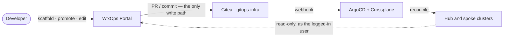

# W'xOps Portal

An Internal Developer Portal for Kubernetes-native platform teams: one login for every cluster, a
golden path from a form to a running service, and a safe place to debug — with Git as the only way
anything changes.

**Built for:** Kubernetes · Gitea · Pinniped · ArgoCD · Crossplane · Vault

## Why W'xOps IDP

- **Read-only by design.** The portal never writes to a Kubernetes API, and its Vault client can only
  create or update a secret — there is no code path that reads or deletes one.
- **Git is the only write path.** Scaffolding, promotion, config edits and Darlane all end as commits
  in `gitops-infra`, reconciled by ArgoCD. Promotion to staging and production is always a reviewed
  pull request, and every change is a revertible commit.
- **Your identity, your permissions.** One OIDC login through Pinniped Supervisor covers every
  cluster. The portal acts as you, with a short-lived credential, so you see exactly what Kubernetes
  RBAC allows — there is no second permission system to keep in sync.
- **Stateless and small.** No database: sessions are encrypted cookies and the catalog lives in Git.
  The whole portal ships as a single container image.
- **A golden path, not a form to fill and forget.** One wizard produces the repo, secrets, manifests,
  overlays, image automation and catalog entries together — and a service's lifecycle is derived from
  what is actually merged, not from a dropdown.
- **Darlane: debug beside production.** A parallel debug pod per environment that receives no traffic
  by default, with your local code synced into it in real time by `wxops darlane sync`.

## What's inside

| Area | What you get |
|---|---|
| **Service catalog** | Backstage-compatible entities (System, Component, API, Resource, Group, User, Doc) read from Git. Full-text search, a Ctrl+K command palette, dependency graphs, OpenAPI rendering, and RFC / ADR / runbook docs. → [Catalog guide](docs/catalog/catalog-user-guide.md) |
| **Scaffolding** | A wizard that commits XTenantApp, XTenantDatabase, ExternalSecrets, Kustomize base and overlays, an ArgoCD Image Updater CR and catalog entities to `gitops-infra`. Existing Gitea repos can be imported without re-scaffolding. → [Golden-path flow](docs/scaffolding/golden-path-git-flow.md) |
| **Lifecycle promotion** | `experimental` → `development` → `staging` → `production`, driven from the Component page. Developers promote to dev; managers and platform-team promote to staging and production. Includes deprecation. → [Promotion design](docs/scaffolding/cross-environment-promotion.md) |
| **Darlane & CLI** | Per-environment debug pods, plus the `wxops` CLI: `login`, `catalog`, `debug`, `update`, and `darlane` (`sync`, `push`, `logs`, `restart`, `status`, `exec`, `port-forward`). Usable in CI via `WXOPS_TOKEN`. → [Darlane](docs/darlane/darlane.md) · [CLI](docs/cli/cli.md) |
| **Runtime visibility** | ArgoCD sync/health and Crossplane status per environment, active alerts, and Grafana / Loki / Tempo links pre-scoped to the service. Plus CI runs, releases, container images and dependencies per entity. → [Observability](docs/platform/observability.md) |
| **Cluster views** | Pods, deployments, services and quotas scoped by your group membership — no cluster-admin needed — and kubeconfig download. → [Architecture](docs/concepts/architecture.md) |

## How it works



The portal writes to Git and reads from your clusters with *your* credential. ArgoCD and Crossplane do
the applying. See [Architecture](docs/concepts/architecture.md) for the auth flow and hub-spoke
topology, and the [Codebase overview](docs/development/codebase-overview.md) for how the code is laid
out.

## What it will never do

- Write to a cluster, or delete a Vault secret, or read one back.
- Show developers `gitops-infra` PR links — they see status, not the platform's internal repo.
- Offer delete actions to tenant developers (platform-team only).
- Replace the tools it links to: Gitea, ArgoCD, Grafana and Vault UI stay the source of truth for
  their own data.

These are properties of the code, not policy — see [Security assurance](docs/security/security-assurance.md)
for the evidence and how to check each claim yourself.

## Quick start

Run the portal locally against the bundled example catalog, with no identity provider:

```bash
cp backend/.env.example backend/.env
# In backend/.env, set:
#   DEV_BYPASS_AUTH=true                 # skip OIDC; log in automatically as a dev user
#   SESSION_SECRET=<output of: openssl rand -hex 32>

make dev-backend     # Go API on :8080, serving the example catalog
make dev-frontend    # Next.js on http://127.0.0.1:3000
```

The full setup — Docker Compose, static cluster config, a real Gitea catalog — is in
[Local development](docs/development/local-development.md).

## Deploy

The portal runs as a single image, installed with the Helm chart in [`charts/`](charts/README.md).
See the [Deployment guide](docs/getting-started/deployment.md) for the Pinniped, OIDC and RBAC
prerequisites and the [Environment variables](docs/getting-started/environment-variables.md)
reference.

## Documentation

Everything lives under [`docs/`](docs/README.md) — start with its index. Common entry points:

| | |
|---|---|
| Getting started | [Introduction](docs/getting-started/introduction.md) · [Deployment](docs/getting-started/deployment.md) · [Environment variables](docs/getting-started/environment-variables.md) |
| Concepts | [Architecture](docs/concepts/architecture.md) · [Platform engineering rationale](docs/concepts/platform-engineering-rationale.md) |
| Using the portal | [Catalog guide](docs/catalog/catalog-user-guide.md) · [Golden-path flow](docs/scaffolding/golden-path-git-flow.md) · [Darlane](docs/darlane/darlane.md) · [CLI](docs/cli/cli.md) · [API reference](docs/api/api-reference.md) |
| Security | [Security assurance](docs/security/security-assurance.md) · [Permissions](docs/security/permissions.md) |
| Contributing | [CONTRIBUTING.md](CONTRIBUTING.md) · [Local development](docs/development/local-development.md) · [Codebase overview](docs/development/codebase-overview.md) · [Release workflow](docs/development/release-workflow.md) |
| Direction | [ROADMAP.md](ROADMAP.md) — planned work and architecture decisions |

## Project

APIs and generated manifests can change between minor releases — the [changelog](CHANGELOG.md) and release notes call those out.

Report a security issue through [SECURITY.md](SECURITY.md), not a public issue.

Licensed under [Apache-2.0](LICENSE); please read the [Code of Conduct](CODE_OF_CONDUCT.md).
