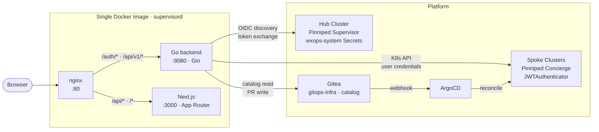
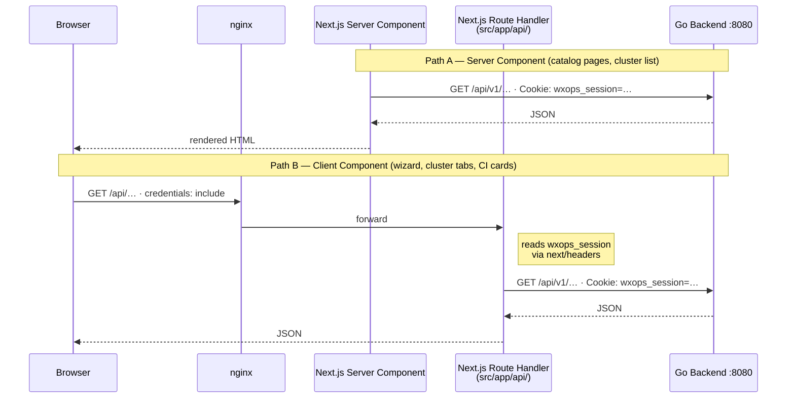

# W'xOps Portal

An Internal Developer Portal (IDP) for Kubernetes-native platform teams. One OIDC login via Pinniped Supervisor covers every spoke cluster. Golden-path scaffolding turns a form submission into a provisioned service — Gitea repo, Vault mount, XTenantApp CRD, Kustomize overlays, ArgoCD Image Updater — all committed to `gitops-infra` as a PR.

## What it does

- **Single sign-on across clusters** — log in once; every spoke cluster is accessible with the same Pinniped session. No per-cluster popups, no credential duplication.
- **Service catalog** — browse all platform services, APIs, and infrastructure dependencies. Relationship graphs, lifecycle filters, OpenAPI rendering, RFC/ADR/Runbook linking.
- **Golden-path scaffolding** — fill a wizard; the portal commits XTenantApp + XTenantDatabase + ExternalSecrets + Kustomize overlays + catalog entities to `gitops-infra`; ArgoCD + Crossplane provision namespace, database, Vault mount, and Gitea repo automatically.
- **Import existing repos** — register an existing Gitea project into the catalog without re-scaffolding.
- **Config edit via PR** — update XTenantApp platform features (replicas, ingress, secrets, probes) through a diff-review UI that creates a gitops-infra PR.
- **CI/CD and release visibility** — per-entity cards showing Gitea Actions runs, git releases, container images, and package dependencies (go.mod, package.json, requirements.txt, pyproject.toml).
- **Activity feed** — portal-managed PR history per team, filtered by role; lifecycle status per service.
- **Cluster views** — namespace-scoped pods and deployments derived from Pinniped group membership (no cluster-admin required); WhoAmI identity; reload without page refresh; kubeconfig download.
- **CLI** *(planned v0.5.0)* — `wxops` binary with the same API, usable in CI/CD pipelines.

## Architecture

### Request routing



All three processes run inside a **single Docker image** managed by supervisord. There is no separate frontend container — nginx, Go, and Next.js share one image and communicate on loopback.

### BFF Proxy pattern

The frontend uses a Backend-for-Frontend (BFF) proxy to bridge the gap between browser-side JavaScript and the Go backend:

- `BACKEND_URL` resolves to `http://127.0.0.1:8080` inside the container — the browser cannot reach this address directly
- The `wxops_session` cookie is `HttpOnly` — browser JavaScript cannot read it, so it cannot attach it to direct Go API calls
- `src/app/api/` contains Next.js Route Handlers that run server-side: they read the session cookie via `next/headers`, forward it to Go as a `Cookie:` header, and return the response. The browser only ever talks to Next.js.



Server Components (catalog pages, cluster list) bypass the BFF entirely — they run on the Next.js server and call `BACKEND_URL` directly at render time, forwarding the session cookie explicitly.

### Frontend stack

| Layer | Package | Role |
|---|---|---|
| Framework | Next.js 16 (App Router), React 19 | Server components, streaming, file-based routing |
| UI primitives | `@base-ui/react` | Unstyled, accessible headless components |
| Styling | Tailwind CSS v4 | All visual design — utility classes only, no CSS modules |
| Variants | `class-variance-authority` | `cva()` for button/badge size and color variants |
| Class merge | `clsx` + `tailwind-merge` → `cn()` | Safe Tailwind class composition |
| Icons | `lucide-react` | SVG icon set — icons only, not a component library |
| Toasts | `sonner` | Notification system |
| Theme | `next-themes` | System-aware light/dark mode |
| Fonts | Geist Sans + Geist Mono | Loaded via `next/font/google` |
| Diagrams | `mermaid` v11 | Dependency graphs, sequence diagrams |
| OpenAPI | `swagger-ui-dist` | Imperative UMD mount — no React wrapper or peer dep issues |
| Markdown | `react-markdown` + `remark-gfm` | Doc viewer, RFC/ADR rendering |
| YAML | `js-yaml` | OpenAPI spec parsing, edit-config YAML preview |

The `src/components/ui/` directory contains **source files owned by this repo** — they wrap Base UI primitives with Tailwind styling. Use `npx shadcn@latest add <component>` to generate additional ones (the `shadcn` CLI is not in `package.json`; run it with `npx`).

### Backend stack

| Layer | Package | Role |
|---|---|---|
| Framework | `gin-gonic/gin` v1.10 | HTTP router, middleware, request binding |
| OIDC / Auth | `coreos/go-oidc/v3` + `golang.org/x/oauth2` | PKCE flow with Pinniped Supervisor as the IdP |
| Session | Custom AES-256-GCM encrypted cookie | Stateless — no Redis, no database; key is `SESSION_SECRET` |
| Kubernetes | `k8s.io/client-go` v0.31 | Hub cluster Secret discovery + spoke cluster API calls |
| YAML | `gopkg.in/yaml.v3` | Manifest generation, catalog entity parsing |
| Config | `joho/godotenv` | `.env` file loader for local dev (real env vars win) |
| Swagger | `swaggo/gin-swagger` + `swaggo/swag` | Annotation-driven spec generation — disabled by default |

**Custom clients (no third-party SDK):**

| Client | Package | Notes |
|---|---|---|
| Gitea | `internal/gitea/` | Plain HTTP + JSON against the Gitea REST API |
| Vault | `internal/vault/` | KV v2 write-only — no Vault SDK; no reads or deletes |

**Internal packages:**

| Package | Responsibility |
|---|---|
| `internal/auth/` | OIDC client, AES-256-GCM session manager, `RequireSession` middleware |
| `internal/catalog/` | Entity store with 5-min in-process cache; local-dir and Gitea readers |
| `internal/cluster/` | Cluster registry (static JSON or K8s Secret discovery), Pinniped token exchange |
| `internal/config/` | All env var loading via `config.Load()` — single source of truth |
| `internal/gitea/` | Gitea API methods: repo CRUD, file commits, PR creation, CI/package queries |
| `internal/handlers/` | Gin route handlers: `auth.go`, `catalog.go`, `clusters.go`, `scaffold.go` |
| `internal/scaffold/` | Manifest generators: XTenantApp, XTenantDatabase, ExternalSecret, Kustomize overlays, Image Updater CR, catalog entities |
| `internal/server/` | Gin engine setup, route registration, CORS middleware |
| `internal/vault/` | Vault KV v2 HTTP client — create/update only |

## Quick Start

```bash
cp backend/.env.example backend/.env
# Set OIDC_ISSUER_URL, OIDC_CLIENT_SECRET, SESSION_SECRET
# For local dev without OIDC: DEV_BYPASS_AUTH=true

make up
# portal: http://localhost
```

For local catalog testing without Gitea:
```bash
CATALOG_LOCAL_DIR=./internal/catalog/examples
```

See [docs/local-development.md](docs/local-development.md) for the full setup.

## Documentation

| Topic | File |
|---|---|
| Architecture, auth sequence, hub-spoke topology | [docs/architecture.md](docs/architecture.md) |
| Production deployment (RBAC, OIDCClient, steps 1–6) | [docs/deployment.md](docs/deployment.md) |
| Environment variables reference | [docs/environment-variables.md](docs/environment-variables.md) |
| **Service catalog — YAML user guide (all kinds, annotations, link types)** | [docs/catalog-user-guide.md](docs/catalog-user-guide.md) |
| Service catalog — design rationale | [docs/service-catalog.md](docs/service-catalog.md) |
| Golden-path git flow (branches, CI, image tags) | [docs/golden-path-git-flow.md](docs/golden-path-git-flow.md) |
| Lifecycle webhook (CI in gitops-infra → portal) | [docs/lifecycle-webhook.md](docs/lifecycle-webhook.md) |
| Cross-environment promotion design | [docs/cross-environment-promotion.md](docs/cross-environment-promotion.md) |
| Cluster registry (K8s Secrets + clusters.json) | [docs/cluster-registry.md](docs/cluster-registry.md) |
| Documentation strategy (RFC, ADR, Runbook) | [docs/documentation-strategy.md](docs/documentation-strategy.md) |
| Local development | [docs/local-development.md](docs/local-development.md) |
| Container design (nginx, supervisord, Dockerfile) | [docs/container.md](docs/container.md) |
| API reference | [docs/api-reference.md](docs/api-reference.md) |
| Release workflow | [docs/release-workflow.md](docs/release-workflow.md) |
| Roadmap & architecture decisions | [docs/ROADMAP.md](docs/ROADMAP.md) |

## Roadmap

| Version | Goal | Status |
|---|---|---|
| v0.1.0 | Identity & multi-cluster SSO via Pinniped | `shipped` |
| v0.1.1–v0.1.2 | CI/CD pipeline, operations readiness | `shipped` |
| v0.1.3 | Full service catalog with relationship graphs | `shipped` |
| v0.1.4 | Catalog UI & visualization refinements | `shipped` |
| v0.2.0 | Golden-path scaffolding, CI/CD visibility, activity feed, cluster UX | `in progress` |
| v0.3.0 | Platform visibility — version comparison, catalog search, team ownership | `next` |
| v0.4.0 | Environment promotion UI, ArgoCD/Crossplane status | `planned` |
| v0.5.0 | `wxops` CLI binary | `planned` |

See [docs/ROADMAP.md](docs/ROADMAP.md) for the full feature list and architecture decisions.

## Portal Scope

**The portal owns:** authentication, cluster visibility, service catalog, project scaffolding, config management via PR, kubeconfig download.

**The portal links to, never replaces:** Gitea (source, docs, RFCs, ADRs), ArgoCD (deployment status), Grafana (metrics), Vault UI (secrets).

**The portal never does:** direct cluster writes, Vault secret reads, gitops-infra URL exposure to developers, delete operations for tenant users.
