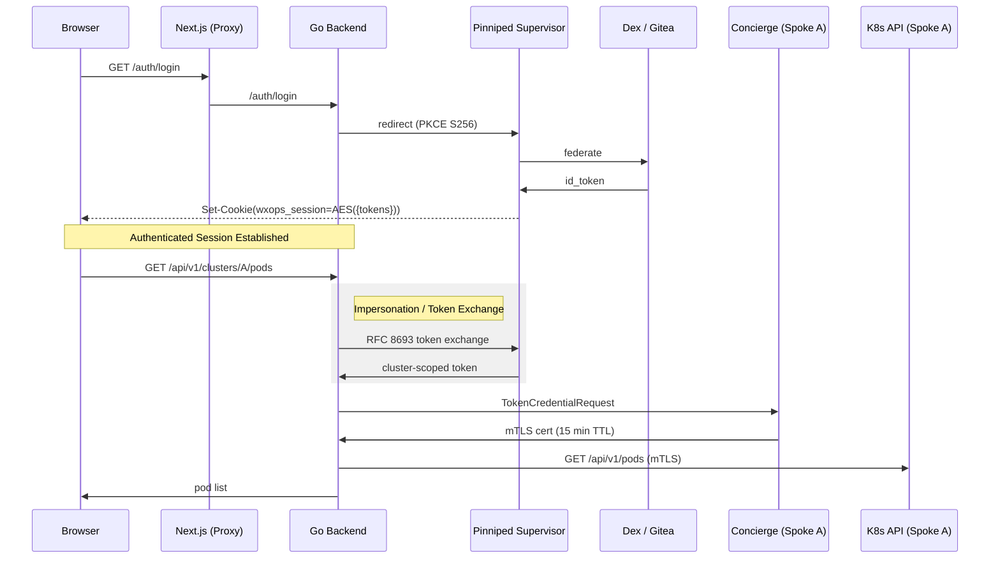
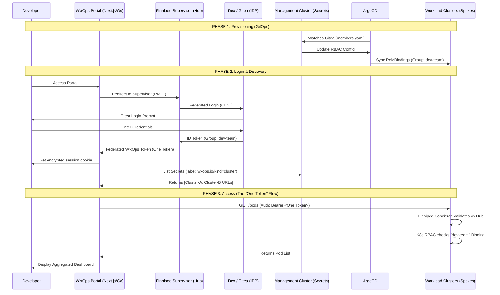
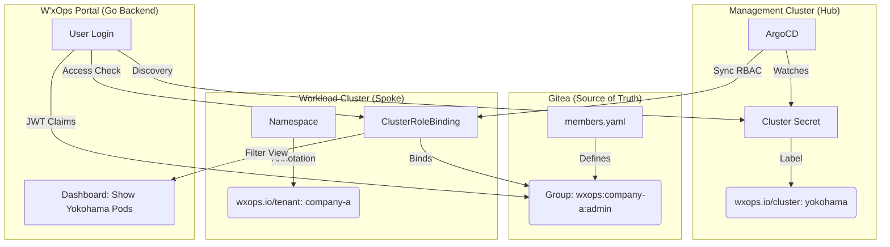

# IDP Portal

## Core Features

1. Centralised SSO authentication via OIDC/OAuth2 — **Pinniped Supervisor** is the single identity provider for both the portal session and all spoke clusters ("One Token" model)
2. Multi-cluster Kubernetes access — one login grants the user a Supervisor-issued id_token that Pinniped Concierge validates on every spoke cluster without any per-cluster popup or secondary auth
3. Cluster registry via **Kubernetes Secrets** — spoke clusters are registered as `Secret` objects in the hub cluster (label `wxops.io/kind=cluster`); no database required
4. GitOps-native — cluster registrations, RBAC bindings, and group memberships live in Git and are reconciled by ArgoCD; no side-channel mutations
5. Manage and create projects inside specific tenants with scaffold templates and software catalog
6. Build collaboration between members in a tenant for sharing secrets, dependency verification, and more
7. Increase developer productivity, ensure security, and manage end-result with Dev Space via Tunneling support

## Framework

1. **Frontend**: Next.js 15 (App Router), TypeScript, shadcn/ui, Tailwind CSS, `next-themes`
2. **Backend**: Go (Gin), OIDC via **Pinniped Supervisor** (federation to Dex/Gitea), AES-256-GCM encrypted session cookie, Kubernetes client-go for cluster discovery
3. **Identity Provider**: Pinniped Supervisor → Dex (connectable to LDAP, GitHub, Google, SAML, Gitea, etc.)
4. **Cluster Registry**: Kubernetes Secrets in the hub cluster (no SQLite, no relational DB)
5. **Deployment**: Separate Next.js frontend + Go backend containers behind a shared domain (Next.js proxies `/auth/*` and `/api/v1/*` to the backend)

---

## Authentication Architecture — "One Token" Hub-Spoke Model

The user logs in once to the Pinniped Supervisor.  The Supervisor federates upstream to Dex/Gitea and issues a single id_token.  This token is:

- Stored in an **AES-256-GCM encrypted HttpOnly cookie** (`wxops_session`) — browser JS cannot read it
- Exchanged (RFC 8693) for a **cluster-scoped token** whose `aud` claim matches the spoke cluster's `JWTAuthenticator`
- Presented to **Pinniped Concierge** via `TokenCredentialRequest` → Concierge returns a **short-lived mTLS client certificate** (~15 min)
- The mTLS cert is cached server-side (`sync.Map`, keyed by `sub:clusterID`) and reused while >2 minutes remain
- When the Supervisor access token expires, the backend silently refreshes it using the stored `refresh_token` — no re-login needed



**Key properties:**
- PKCE (`S256`) prevents authorization code interception
- CSRF state validated across the redirect
- `SESSION_SECRET` (32-byte AES key) lives only in the backend environment
- Next.js middleware (`proxy.ts`) redirects unauthenticated requests to `/login` before any page renders
- mTLS credentials are cached per-user per-cluster to avoid redundant Concierge round-trips
- Silent refresh: if the Supervisor access token expires, the backend retries with `refresh_token` transparently
- Identity via Pinniped `WhoAmIRequest` (not `SelfSubjectReview`) — reflects the upstream IDP username/UID/groups
- Kubeconfig download uses `pinniped login oidc --enable-concierge` exec plugin when cluster has Pinniped fields configured, producing a self-refreshing kubeconfig for `kubectl`

---

## Hub-Spoke Architecture (GitOps)



---

## Cluster Registration (GitOps)



Register a spoke cluster by creating a labelled Secret in the hub cluster's `wxops-system` namespace:

```yaml
apiVersion: v1
kind: Secret
metadata:
  name: cluster-production-a
  namespace: wxops-system          # CLUSTER_NAMESPACE env var
  labels:
    wxops.io/kind: cluster
  annotations:
    wxops.io/cluster-id:   cluster-production-a
    wxops.io/cluster-name: "Production A"
stringData:
  api-server: "https://api.production-a.example.com:6443"
  ca-bundle: |
    -----BEGIN CERTIFICATE-----
    ...
    -----END CERTIFICATE-----
```

Commit this to Git → ArgoCD syncs it → portal immediately discovers the cluster.

---

## API Routes

### Auth (no auth required)

| Method | Path | Description |
|--------|------|-------------|
| `GET` | `/auth/login` | Starts OIDC Authorization Code + PKCE flow against Pinniped Supervisor |
| `GET` | `/auth/callback` | Supervisor redirect handler — exchanges code, sets AES-encrypted session cookie |
| `GET` | `/auth/me` | Returns identity from session cookie (used by Next.js SSR) |
| `POST` | `/auth/logout` | Clears the session cookie |

### Protected (require `wxops_session` cookie)

| Method | Path | Description |
|--------|------|-------------|
| `GET` | `/api/v1/me` | Current user's identity + groups |
| `GET` | `/api/v1/clusters` | All registered spoke clusters (from hub Secrets) |
| `GET` | `/api/v1/clusters/:id` | Metadata for a single cluster |
| `GET` | `/api/v1/clusters/:id/namespaces` | Namespace list on a spoke cluster |
| `GET` | `/api/v1/clusters/:id/pods?namespace=X` | Pod list on a spoke cluster |
| `GET` | `/api/v1/clusters/:id/deployments?namespace=X` | Deployment list on a spoke cluster |
| `GET` | `/api/v1/clusters/:id/identity` | Pinniped `WhoAmIRequest` — user's upstream IDP identity on a spoke |
| `GET` | `/api/v1/clusters/:id/kubeconfig` | Pinniped CLI exec-credential kubeconfig (static bearer fallback) |

---

## Environment Variables

### Go Backend

| Variable | Default | Description |
|----------|---------|-------------|
| `PORT` | `8080` | HTTP listen port |
| `FRONTEND_URL` | `http://localhost:3000` | CORS allowed origin |
| `OIDC_ISSUER_URL` | — | **Pinniped Supervisor** FederationDomain issuer URL |
| `OIDC_CLIENT_ID` | `wxops-portal` | OIDC client ID registered with the Supervisor |
| `OIDC_CLIENT_SECRET` | — | OIDC client secret |
| `OIDC_REDIRECT_URI` | `http://localhost:3000/auth/callback` | OAuth2 redirect URI |
| `OIDC_SCOPES` | `openid,profile,email,groups,offline_access,pinniped:request-audience` | OIDC scopes |
| `SESSION_SECRET` | — | 64 hex chars (32 bytes) — generate with `openssl rand -hex 32` |
| `KUBECONFIG` | `""` (in-cluster) | Path to kubeconfig for hub cluster access |
| `CLUSTER_NAMESPACE` | `wxops-system` | Namespace where cluster Secrets are stored |
| `CLUSTERS_CONFIG_FILE` | `""` | Path to a `clusters.json` for static cluster registry (local dev, no hub cluster needed) |

### `clusters.json` — Static Cluster Registry Fields

Used when `CLUSTERS_CONFIG_FILE` is set. See `backend/clusters.example.json` for a full example.

| Field | Required | Description |
|-------|----------|-------------|
| `id` | ✅ | Unique cluster ID — appears in all API paths |
| `name` | | Display name (defaults to `id`) |
| `api_server` | ✅ | Spoke API server URL (or Concierge impersonation proxy URL) |
| `ca_bundle_file` | | Path to PEM CA cert for the spoke / Concierge TLS |
| `ca_bundle` | | Inline PEM CA cert (alternative to `ca_bundle_file`) |
| `audience` | ✅ | Must match `spec.audience` of the spoke's `JWTAuthenticator` |
| `jwt_authenticator_name` | ✅ | `metadata.name` of the spoke's `JWTAuthenticator` CR |
| `issuer_url` | | Pinniped Supervisor OIDC issuer — enables exec-credential kubeconfig |
| `concierge_endpoint` | | Pinniped Concierge endpoint — defaults to `api_server` |
| `upstream_idp_name` | | Supervisor upstream IDP name (`kubectl get oidcidentityproviders -n pinniped-supervisor`) |
| `upstream_idp_type` | | IDP type: `oidc` \| `ldap` \| `activedirectory` \| `github` |

### Next.js Frontend

| Variable | Default | Description |
|----------|---------|-------------|
| `BACKEND_URL` | `http://localhost:8080` | Internal URL of the Go backend (server-side only) |

---

## Local Development

```bash
# 1. Start Dex
docker run -p 5556:5556 \
  -v $PWD/dex-config.yaml:/etc/dex/config.yaml \
  ghcr.io/dexidp/dex:v2.44.0 dex serve /etc/dex/config.yaml

# 2. Start Pinniped Supervisor (see wxops-experiment/pinniped/)

# 3. Start Go backend
make dev-backend

# 4. Start Next.js frontend
make dev-frontend
```

Or with Docker Compose (all-in-one):

```bash
make up
```
