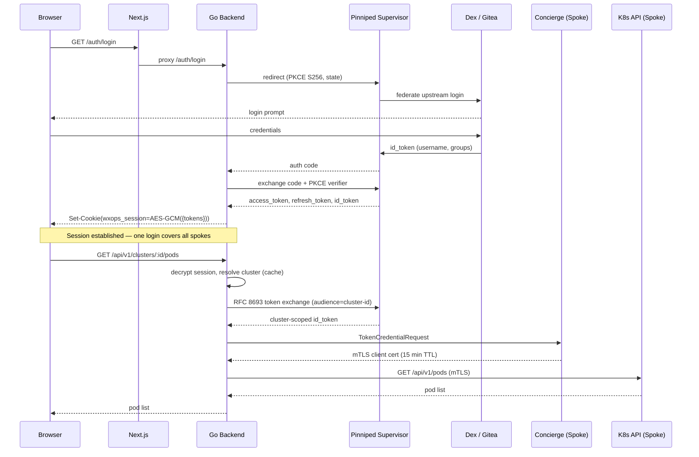

# Architecture

## The "One Token" Model

The user logs in once. Pinniped Supervisor federates to the upstream IDP (Dex, Gitea, LDAP, GitHub, SAML) and issues a single token. That token is used for both the portal session and every spoke cluster — no secondary auth, no per-cluster popups, no credential duplication.

```
Browser → Pinniped Supervisor (PKCE/OIDC) → AES-256-GCM encrypted session cookie
                                                         │
                                          ┌──────────────┴──────────────┐
                                          │  Per cluster API call        │
                                          │  (served from cache after    │
                                          │   first miss)                │
                                          │                              │
                                          │  RFC 8693 token exchange     │
                                          │  → cluster-scoped id_token   │
                                          │                              │
                                          │  TokenCredentialRequest      │
                                          │  → short-lived mTLS cert     │
                                          │    (5–15 min, cached)        │
                                          │                              │
                                          │  Spoke K8s API call (mTLS)   │
                                          └──────────────────────────────┘
```

**Security properties:**
- PKCE (`S256`) prevents authorization code interception
- CSRF state validated across the redirect
- Session cookie is `HttpOnly`, `SameSite=Lax`, AES-256-GCM encrypted — browser JS cannot read tokens
- Each cluster receives a token scoped to its `audience` — a token stolen from one cluster cannot be used on another
- mTLS certificates are short-lived (Concierge-issued) and cached per-user per-cluster
- Silent token refresh via `refresh_token` — no re-login on access token expiry

---

## Auth Sequence



---

## Hub-Spoke Topology

```
                        ┌─────────────────────────────┐
                        │         Hub Cluster          │
                        │                              │
                        │  Pinniped Supervisor         │
                        │  FederationDomain            │
                        │                              │
                        │  W'xOps Portal               │
                        │  (Go backend + Next.js)      │
                        │                              │
                        │  wxops-system namespace      │
                        │  └── Secrets (cluster list)  │
                        └──────────────┬───────────────┘
                                       │ discovers
                        ┌──────────────┴───────────────┐
               ┌────────┴───────┐           ┌──────────┴──────────┐
               │  Spoke A        │           │  Spoke B             │
               │                 │           │                      │
               │  Concierge      │           │  Concierge           │
               │  JWTAuthenticator│          │  JWTAuthenticator    │
               │  audience=A     │           │  audience=B          │
               └─────────────────┘           └──────────────────────┘
```

---

## Prerequisites

### Hub cluster

| Component | Purpose |
|-----------|---------|
| Pinniped Supervisor | Central OIDC hub — federates upstream IDP and issues tokens for all spokes |
| `FederationDomain` CR | Exposes the Supervisor as an OIDC issuer endpoint |
| `OIDCClient` CR | Registers the portal as an OAuth2 client with the Supervisor |
| Upstream IDP connector | Dex, Gitea, LDAP, GitHub, SAML — configured inside Dex or directly in Supervisor |

### Each spoke cluster

| Component | Purpose |
|-----------|---------|
| Pinniped Concierge | Validates cluster-scoped tokens and issues mTLS client certificates |
| `JWTAuthenticator` CR | Tells Concierge which Supervisor to trust and what `audience` to expect |
