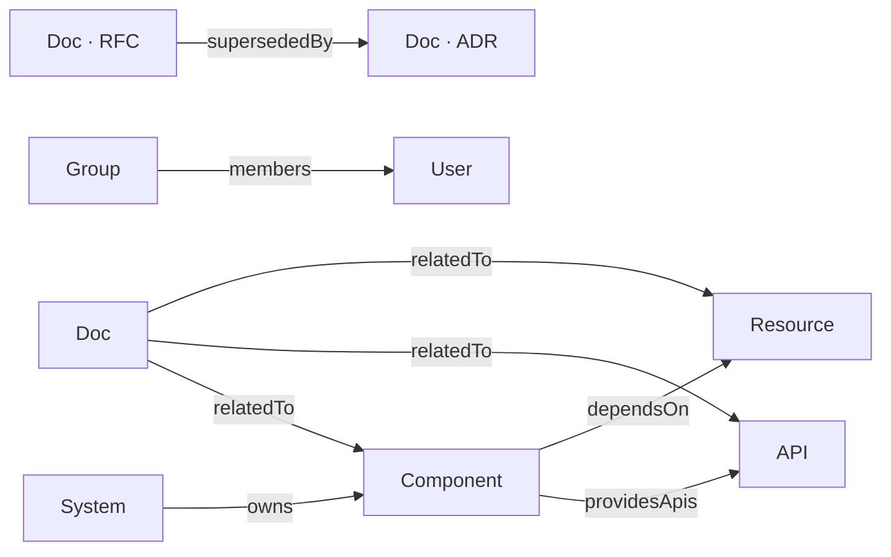

# Service Catalog

The service catalog is a registry of all services, APIs, databases, and teams in the platform. It answers the questions developers actually ask: *What exists? Who owns it? What does it depend on? Where is the runbook?*

Catalog data lives in `gitops-infra/catalog/` in Gitea. The portal reads it on a 5-minute TTL cache — no push required, no catalog server to run.

---

> **Writing catalog YAML?** See [catalog-user-guide.md](./catalog-user-guide.md) for the full field reference, all annotation keys, link types, and complete examples for every entity kind.

## Entity Kinds

The catalog supports seven entity kinds. Five follow the standard `backstage.io/v1alpha1` apiVersion; `Doc` uses `wxops.cloud/v1alpha1` to carry WxOps-specific spec fields.

| Kind | apiVersion | Represents | Example |
|---|---|---|---|
| `System` | `backstage.io/v1alpha1` | A bounded domain made of multiple services | `payments`, `identity`, `platform` |
| `Component` | `backstage.io/v1alpha1` | A single runnable service, website, or library | `payments-service`, `wxops-portal` |
| `API` | `backstage.io/v1alpha1` | An interface exposed or consumed by a component | `payments-api` (OpenAPI), `payments-events` (AsyncAPI) |
| `Resource` | `backstage.io/v1alpha1` | Infrastructure a component depends on | `payments-db`, `platform-vault` |
| `Group` | `backstage.io/v1alpha1` | A team that owns services | `payments-team`, `platform-team` |
| `User` | `backstage.io/v1alpha1` | A person on the platform | `alice`, `xeus` |
| `Doc` | `wxops.cloud/v1alpha1` | An RFC, ADR, or operational document | `rfc-001-kafka`, `adr-001-kafka`, `payments-runbook` |

### How they relate



The portal renders Component/API/Resource relationships as a per-system Mermaid graph. Edges are only drawn between entities within the same system — cross-system dependencies are shown as external references via `consumesApis`.

---

## Schema: Backstage-compatible YAML

Every entity file follows the `backstage.io/v1alpha1` envelope:

```yaml
apiVersion: backstage.io/v1alpha1
kind: Component
metadata:
  name: payments-service
  title: Payments Service
  description: Synchronous payment processing — REST/gRPC API, PostgreSQL, Redis, Vault.
  tags: [go, grpc, payments]
  annotations:
    gitea/source-location: platform/payments-service
    jira/project-key: PAY
  links:
    - url: https://gitea.example.com/platform/payments-service/src/branch/main/docs/runbook.md
      title: Runbook
      type: documentation
    - url: https://gitea.example.com/platform/architecture/rfcs/rfc-001-kafka.md
      title: "RFC-001: Kafka for Payments Events"
      type: rfc
    - url: https://gitea.example.com/platform/architecture/docs/adr/adr-001-kafka.md
      title: "ADR-001: Kafka for Payments Events"
      type: adr
spec:
  type: service
  lifecycle: production          # experimental | production | deprecated
  owner: group:payments-team
  system: payments
  providesApis:
    - api:default/payments-api
    - api:default/payments-events
  consumesApis:
    - api:default/user-api
    - api:default/metrics-api
  dependsOn:
    - resource:default/payments-db
    - resource:default/payments-cache
    - resource:default/payments-vault
    - resource:default/payments-queue
```

---

## Why the Backstage Schema — but Not Backstage

The entity format (`backstage.io/v1alpha1`) is borrowed from the [Backstage software catalog](https://backstage.io/docs/features/software-catalog/descriptor-format). The Go backend parses it with `gopkg.in/yaml.v3` — no Backstage runtime, no Node.js catalog server, no plugin ecosystem.

### Why use this schema at all

**The entity model is proven.** Component, API, System, Group, Resource covers every real-world catalog use case without needing to invent a new vocabulary. Teams know what a `Component` is.

**Public documentation reduces internal docs burden.** When a developer asks "what fields does `spec.consumesApis` accept?", the answer is in Backstage's public docs — not in internal wikis that drift. The schema is well-specified and stable.

**Future portability.** If the platform ever adds a Backstage instance alongside this portal, the existing catalog YAML files are already compatible — no migration. This is not a goal today, but the option costs nothing to preserve.

### Why not run Backstage

**Third runtime.** The portal is already Go (backend) + Node.js (Next.js). Adding a Backstage Node.js server would be a third runtime with its own dependency chain, plugin versioning, and operational surface.

**Over-scoped for the use case.** Backstage is a full developer portal framework with plugins, scaffolder, TechDocs rendering, and its own auth layer. This portal already owns auth (Pinniped), scaffolding (Phase 3), and documentation linking (entity links). Running Backstage alongside would create two portals competing for the same developer attention.

**Parse, don't run.** The catalog benefit is the *data model*, not the *runtime*. A Go YAML parser reading `backstage.io/v1alpha1` files captures all the structural value — entity kinds, ownership, relationships, links — in ~200 lines of typed Go structs (`backend/internal/catalog/entity.go`). Parse time is under 5ms for a catalog of 50 entities.

### The Go implementation

The catalog backend is three files:

| File | Responsibility |
|---|---|
| `backend/internal/catalog/entity.go` | Typed Go structs matching the Backstage schema. `Validate()` enforces required fields per kind. |
| `backend/internal/catalog/store.go` | `RepoReader` interface + `Store` with 5-minute TTL cache. Iterates kind directories, decodes multi-document YAML. |
| `backend/internal/catalog/local.go` | `LocalReader` — reads from local filesystem for dev/testing without a live Gitea connection. |

The production reader (`backend/internal/gitea/client.go`) fetches files via Gitea's REST API using `GITEA_TOKEN`. The `Store` is indifferent to which reader it uses.

---

## RFC and ADR Linking

RFCs and ADRs live in Gitea (`platform/architecture/rfcs/` and `platform/architecture/docs/adr/`), not in the catalog. The catalog entity links to them via `metadata.links` with a `type` field:

```yaml
links:
  - url: https://gitea.example.com/platform/architecture/rfcs/rfc-001-kafka.md
    title: "RFC-001: Kafka for Payments Events"
    type: rfc
  - url: https://gitea.example.com/platform/architecture/docs/adr/adr-001-kafka.md
    title: "ADR-001: Kafka for Payments Events"
    type: adr
```

The portal entity detail page groups links by type — **RFCs** (violet), **ADRs** (blue), **Documentation** (default) — making decision history discoverable without embedding document content in the catalog.

The RFC → ADR lifecycle:
1. Open an RFC as a PR to `platform/architecture/rfcs/` with a linked Jira epic
2. RFC is reviewed and accepted — PR merged
3. Write the ADR in `platform/architecture/docs/adr/` capturing only the final decision
4. Link both from the relevant catalog entity `metadata.links`

---

## Directory Layout in gitops-infra

The catalog is organised by **team**, with each team owning a subdirectory. This mirrors GitHub/Gitea code ownership and means CODEOWNERS rules can gate who can edit which team's entities.

```
catalog/
└── <team-name>/
    ├── systems/        ← System entities
    ├── components/     ← Component entities (services, websites, libraries)
    ├── apis/           ← API entities + committed OpenAPI/AsyncAPI spec files
    ├── resources/      ← Resource entities (databases, caches, vaults, queues)
    ├── groups/         ← Group entity for the team itself
    ├── users/          ← User entities for team members
    └── docs/           ← Doc entities (RFCs, ADRs, runbooks, guides)
```

**Example (two teams):**
```
catalog/
├── platform-team/
│   ├── systems/platform.yaml
│   ├── components/wxops-portal.yaml
│   ├── apis/portal-api.yaml
│   ├── apis/portal-openapi.json     ← committed static OpenAPI spec
│   ├── resources/gitops-infra-repo.yaml
│   ├── groups/platform-team.yaml
│   ├── users/xeus.yaml
│   └── docs/portal-architecture.yaml
└── rocket-team/
    ├── systems/payments.yaml
    ├── components/payments-service.yaml
    ├── apis/payments-api.yaml
    ├── resources/payments-db.yaml
    ├── groups/rocket-team.yaml
    ├── users/alice.yaml
    └── docs/
        ├── rfc-001-kafka-for-payments.yaml
        ├── adr-001-kafka-for-payments.yaml
        └── doc-001-payments-runbook.yaml
```

The portal scans each team's subdirectories for `*.yaml` files. Multi-document YAML (multiple entities in one file separated by `---`) is supported.

Set `GITEA_CATALOG_PATH=catalog` in the backend environment. For local development without Gitea, set `CATALOG_LOCAL_DIR=./internal/catalog/examples` — the examples directory mirrors this layout exactly.

---

## Cache Behaviour

The catalog store caches all entities in memory with a 5-minute TTL. This means:

- Adding a new entity file to `gitops-infra/catalog/` is visible in the portal within 5 minutes — no portal restart needed.
- Removing or renaming an entity is reflected within 5 minutes.
- On cache miss the store fetches all entity files from Gitea in one pass and rebuilds the in-memory index.

### Immediate cache invalidation

For zero-wait invalidation after a catalog commit, wire a Gitea push webhook on `gitops-infra`:

```
POST /api/v1/webhooks/catalog/refresh
Authorization: Bearer <WEBHOOK_TOKEN>
```

This flushes the in-memory cache on the next request. The same `WEBHOOK_TOKEN` used for lifecycle webhooks is reused — no new secret.

Doc entities created or updated via the portal trigger immediate invalidation automatically (the backend calls `store.InvalidateCache()` after every direct commit). Other entity kinds go through a PR — the cache refreshes when the PR merges and the Gitea webhook fires.

## Write Paths

Two write paths exist depending on entity kind:

| Action | Kind | Write Path |
|---|---|---|
| Register / update | `Doc` | Direct commit to `gitops-infra/catalog/` on `main` → immediate cache invalidation |
| Register / update | All others | Open PR to `gitops-infra` (requires platform review before merge) |

Doc entities use direct commit because they are living documents — authors iterate frequently and a PR gate adds friction without adding safety. The `spec.draft` flag lets authors control visibility without a merge gate.

### Draft visibility

| `spec.draft` | Who can see the entity |
|---|---|
| `true` | The author (matched by session username) and `platform-team` only |
| `false` or absent | All authenticated portal users |

When an author publishes (sets `draft: false`), the entity becomes visible to the entire platform.
