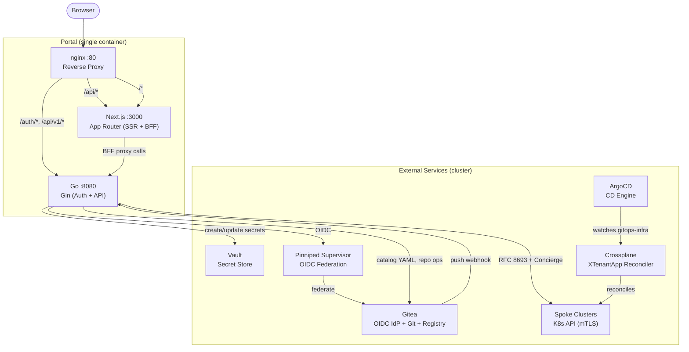
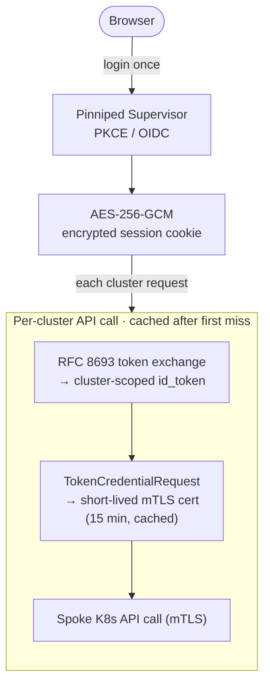
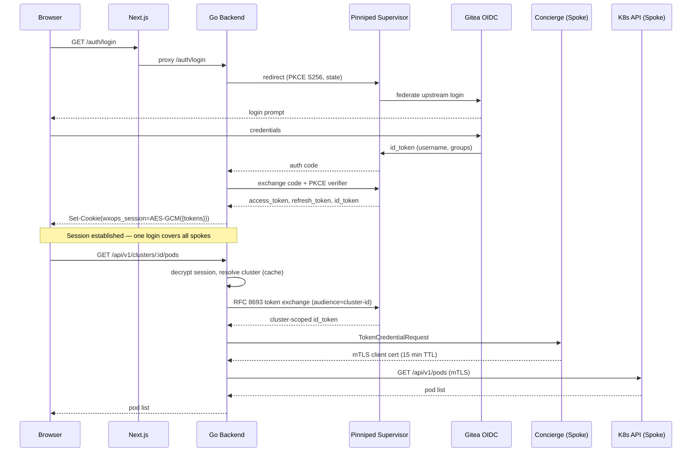
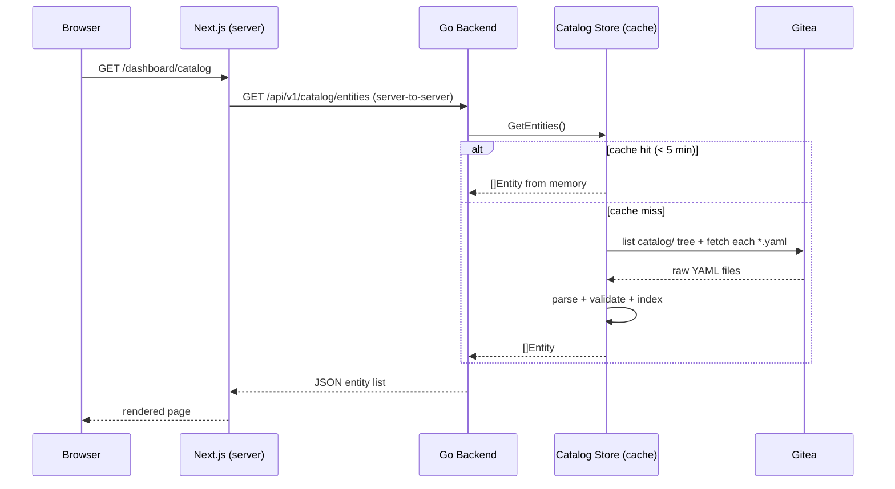
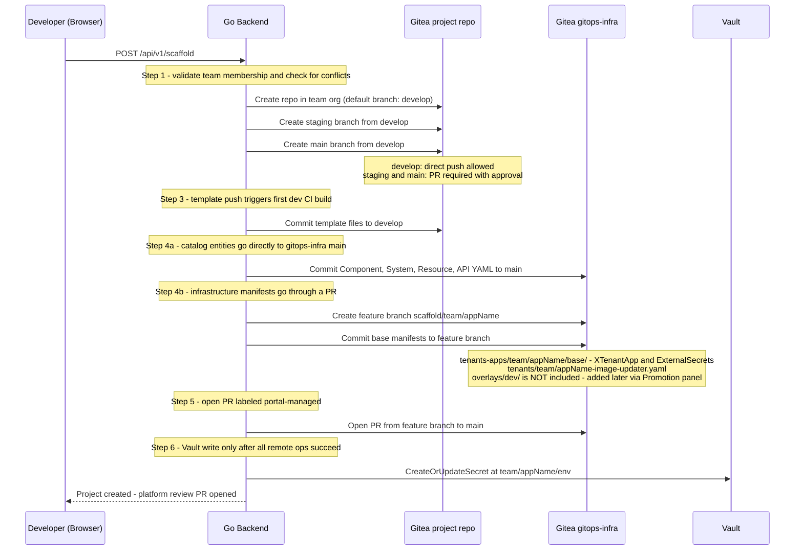
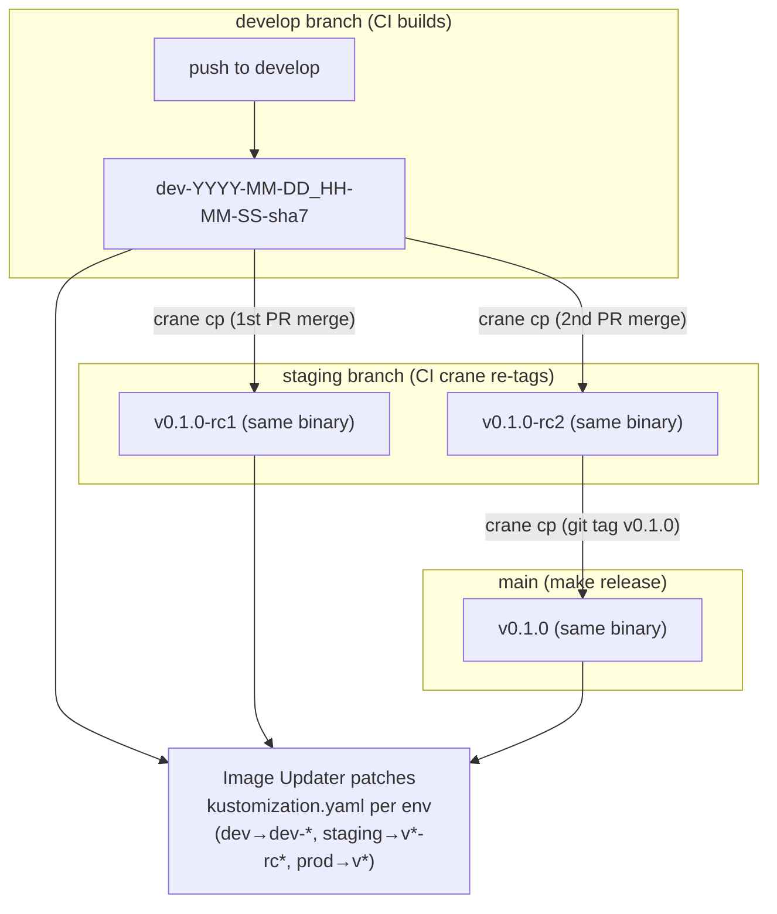
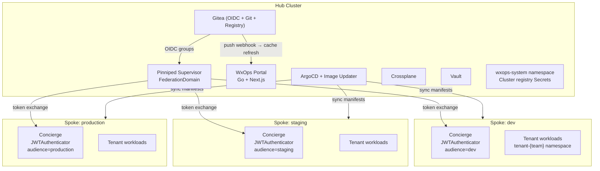

# Architecture

## System Overview

WxOps Portal is an Internal Developer Portal (IDP) built on Kubernetes-native tooling. It provides golden-path scaffolding, a service catalog, lifecycle promotion, environment visibility, and team self-service — without exposing cluster credentials or owning its own database.



---

## Component Responsibilities

| Component | Runs | Purpose |
|-----------|------|---------|
| **nginx** | container | TLS termination, path-based routing to Go or Next.js |
| **Go / Gin** | container | OIDC auth, session management, catalog API, scaffold API, cluster proxy, Vault writes |
| **Next.js** | container | SSR pages, BFF route handlers, React client components |
| **Gitea** | cluster | OIDC identity provider, Git host (project repos + gitops-infra), container registry |
| **Pinniped Supervisor** | hub cluster | Central OIDC federation point; issues tokens for all spoke clusters |
| **Vault** | cluster | KV secret store; portal creates/updates secrets, never reads or deletes |
| **ArgoCD** | hub cluster | Watches `gitops-infra`; reconciles tenant overlays onto spoke clusters |
| **ArgoCD Image Updater** | hub cluster | Watches registry; patches `kustomization.yaml` with latest image tag per environment |
| **Crossplane** | hub cluster | Interprets `XTenantApp` / `XTenantDatabase` CRs and provisions namespaces, RBAC, databases |
| **Pinniped Concierge** | each spoke | Validates Supervisor-issued tokens, issues short-lived mTLS client certs |

---

## Request Routing

nginx routes every request based on longest-prefix matching. Two `location` blocks are required — the `/api/v1/` block must appear before `/api/` (or nginx would route BFF calls to Go which only serves `/api/v1/`):

```
browser → nginx :80
  /auth/*       → Go :8080   OIDC callbacks, session management
  /api/v1/*     → Go :8080   catalog API, cluster proxy, scaffold, webhooks
  /api/*        → Next.js :3000   BFF route handlers (src/app/api/)
  /*            → Next.js :3000   pages, static assets
```

### BFF Proxy Pattern

Browser JavaScript cannot reach the Go backend directly (it's an internal loopback address inside the container), and cannot read the `wxops_session` cookie (it is `HttpOnly`). Two fetch paths handle this:

**Path A — Server Components:** Data fetched at render time, server-to-server on loopback. Session cookie forwarded in the `Cookie:` header.

```ts
// Inside an async server component
const BACKEND_URL = process.env.BACKEND_URL ?? "http://localhost:8080";
const session = (await cookies()).get("wxops_session")?.value ?? "";
const res = await fetch(`${BACKEND_URL}/api/v1/catalog/entities`, {
  headers: { Cookie: `wxops_session=${session}` },
  cache: "no-store",
});
```

**Path B — Client Components:** Fetch to a Next.js Route Handler in `src/app/api/`. The Route Handler runs on the server, reads the cookie from `next/headers`, and proxies to Go.

```
Browser → fetch("/api/catalog/entities")
  → src/app/api/catalog/entities/route.ts  (Next.js Route Handler, server-side)
  → Go :8080/api/v1/catalog/entities       (internal loopback)
```

---

## The "One Token" Auth Model

The user logs in once. Pinniped Supervisor federates to the upstream IDP (Gitea OIDC) and issues a single session. That session is used for both the portal and every spoke cluster — no secondary auth, no per-cluster popups.



**Security properties:**
- PKCE (`S256`) prevents authorization code interception
- CSRF state validated across the redirect
- Session cookie is `HttpOnly`, `SameSite=Lax`, AES-256-GCM encrypted
- Each spoke receives a token scoped to its `audience` — a token stolen from cluster A cannot be used on cluster B
- mTLS certs are Concierge-issued, short-lived, and cached per user per cluster
- Silent refresh via `refresh_token` — no re-login on access token expiry

### Auth Sequence



### Gitea OIDC Group Format

Gitea sends groups as exactly two levels: `orgName:teamName` (e.g., `wxops:rocket-team`).

| Convention | Rule |
|---|---|
| Namespace mapping | `orgName:teamName` → namespace `tenant-{orgName}` |
| RBAC subjects | ClusterRoleBindings on spoke clusters use the full `orgName:teamName` string |
| Platform check | If the part after `:` equals `platform-team`, the user has platform-wide access |
| Namespace listing | Never call `GET /api/v1/namespaces` for tenant users — derive from group membership |
| Top-level teams | Groups without a `:` (e.g., `rocket-team`) are team groups; groups with `:` are sub-teams (`rocket-team:Owners`, `rocket-team:Managers`) |

---

## Service Catalog

### Data Flow

The catalog reads entity YAML files from `gitops-infra/catalog/` in Gitea. A 5-minute TTL in-memory cache sits in front of every Gitea API call.



### Cache Invalidation

The cache expires naturally after 5 minutes. For immediate invalidation (e.g., after a catalog commit), the platform team can wire a Gitea push webhook on `gitops-infra` to:

```
POST /api/v1/webhooks/catalog/refresh
Authorization: Bearer <WEBHOOK_TOKEN>
```

See [performance.md](./performance.md) for the full cache layer map and scaling thresholds.

### Entity Kinds

| Kind | apiVersion | Represents |
|---|---|---|
| `System` | `backstage.io/v1alpha1` | A bounded domain — groups related components |
| `Component` | `backstage.io/v1alpha1` | A single runnable service, website, or library |
| `API` | `backstage.io/v1alpha1` | An interface exposed or consumed by a component |
| `Resource` | `backstage.io/v1alpha1` | Infrastructure a component depends on |
| `Group` | `backstage.io/v1alpha1` | A team that owns services |
| `User` | `backstage.io/v1alpha1` | A person on the platform |
| `Doc` | `wxops.cloud/v1alpha1` | An RFC, ADR, runbook, or any living document |

### Draft Visibility (Doc entities)

Doc entities support a `spec.draft: true` field that controls visibility:

| State | Who can see it |
|---|---|
| `draft: true` | Author only (`spec.author`) and `platform-team` |
| `draft: false` / absent | All authenticated users |

The author is matched against the session username (Gitea login). The platform team can always see all drafts.

### Write Paths

Two different write paths exist depending on entity kind:

| Action | Kind | Write Path |
|---|---|---|
| Register entity | `Doc` | Direct commit to `gitops-infra/catalog/` on `main` + immediate cache invalidation |
| Register entity | All others | Opens a PR to `gitops-infra` (requires platform review before merge) |
| Update entity | `Doc` | Direct commit to `gitops-infra/catalog/` on `main` + immediate cache invalidation |
| Update entity | All others | Opens a PR to `gitops-infra` |

Doc entities use direct commit because they are living documents — authors iterate frequently and the PR overhead is counterproductive. The draft/published toggle lets authors control visibility without needing a PR gate.

---

## Golden-Path Scaffolding

The scaffold wizard creates a complete developer environment in a single flow:



### Gitops-Infra Layout

The scaffold commits manifests to two separate locations:

```
gitops-infra/
├── tenants-apps/
│   └── {team}/{appName}/
│       ├── base/
│       │   ├── kustomization.yaml
│       │   ├── xtenant-app.yaml
│       │   ├── xtenant-database.yaml          # if database enabled
│       │   ├── external-secret-env.yaml       # if vault secrets enabled
│       │   └── external-secret-db.yaml        # if database enabled
│       └── overlays/dev/
│           ├── kustomization.yaml             # references ../../base
│           ├── image-transformer.yaml         # teaches kustomize to patch XTenantApp image field
│           └── patch-xtenant-app.yaml         # dev-specific: replicas, resources, ingress
│
├── tenants/
│   └── {team}/
│       └── {appName}-image-updater.yaml       # ArgoCD Image Updater CR
│
└── catalog/
    └── {team}/
        ├── systems/
        ├── components/
        ├── apis/
        ├── resources/
        ├── groups/
        ├── users/
        └── docs/
```

**Key constraints:**
- `images:` is NOT in the overlay `kustomization.yaml` — ArgoCD Image Updater owns that section and writes it back after each build. A static `images:` block causes a reset-to-`latest` fight on every reconcile.
- The `image-transformer.yaml` is required because Kustomize only patches standard `Deployment` specs by default — this config file tells it how to reach `spec/parameters/image` on the `XTenantApp` CRD.
- The Image Updater CR lives in `tenants/{team}/`, NOT in `tenants-apps/` — keeping it separate from the Kustomize tree gives a clean ArgoCD control-plane view.
- Image Updater `metadata.name` = `{team}-{appName}` (unique across teams in the shared `argocd` namespace).
- NamePatterns: `{team}-{appName}-dev`, `{team}-{appName}-staging`, `{team}-{appName}-production`.

### Image Lifecycle



---

## Lifecycle Promotion

Lifecycle is a first-class concept in the catalog. The `spec.lifecycle` field on a Component determines which environment overlays exist and which CI/CD flows are active.

```
experimental ──(dev overlay PR merged)──► development ──(platform/managers)──► staging ──(platform/managers)──► production
     │                                                                                                                │
     └──────────────── deprecated (opens removal PR; overlays preserved until platform approves) ───────────────────┘
```

### Transitions

| Transition | Who triggers | Mechanism |
|---|---|---|
| `experimental` → `development` | Automatic | gitops-infra PR with dev overlay merged → lifecycle webhook fires |
| `development` → `staging` | Platform-team or `{team}:Managers` | Promotion panel on entity detail page; creates staging overlay PR |
| `staging` → `production` | Platform-team or `{team}:Managers` | Same panel; creates production overlay PR |
| Any → `deprecated` | Platform-team or `{team}:Managers` | Deprecation form on entity detail; opens removal PR |

### Catalog Cache Refresh Webhook

`POST /api/v1/webhooks/catalog/refresh` — flushes the in-memory catalog TTL immediately
after a `gitops-infra` push. Authenticated with `WEBHOOK_TOKEN` via `Authorization: Bearer`.
Wire to a Gitea push webhook on `gitops-infra` for instant catalog updates.

> **v0.3.0:** `POST /api/v1/webhooks/promote/:kind/:name` was removed. Lifecycle
> promotion is now UI-driven via the Promotion panel — no CI webhook needed.
> See [lifecycle-webhook.md](../scaffolding/lifecycle-webhook.md).

---

## Vault Integration

The portal writes secrets to Vault on two occasions:

1. **Scaffold**: Creates initial app env secrets at `{team}/{appName}/env`.
2. **Update Secrets**: From the catalog entity page, updates secrets at the path from the entity's `wxops.cloud/vault-path` annotation.

**Hard constraints:**
- Portal can **create** and **update** — never reads back, never deletes.
- The Vault path is always derived from the `wxops.cloud/vault-path` annotation on the entity. The entity name (`{appName}-vault`) is NOT used for path construction.
- The remote Gitea repo and gitops config must exist before any Vault write is attempted.

---

## Security Model

These constraints are enforced at the backend — not just UI conventions.

| Constraint | Reason |
|---|---|
| **No cluster writes** | Config changes go through Gitea PR + ArgoCD reconcile. Never direct K8s API writes. |
| **Vault: no read, no delete** | Prevents secret exposure and accidental deletion. Create/update only. |
| **Delete is platform-team only** | Tenant developers cannot delete catalog entities or platform resources. |
| **gitops-infra PR URLs not exposed** | Tenant developers don't have access to `gitops-infra`. Return status text only. |
| **Lifecycle promotion role-gated** | `experimental` → `development` is automatic. `development` → `staging/production` requires `platform-team` or `{team}:Managers`. |
| **Draft visibility** | Draft Doc entities visible only to the author and `platform-team`. |
| **Namespace listing** | Never call `GET /api/v1/namespaces` for tenant users (returns all or 403). Derive namespaces from Pinniped group membership. |

---

## Hub-Spoke Topology



---

## Hub Cluster Prerequisites

### Hub cluster

| Component | Purpose |
|-----------|---------|
| Pinniped Supervisor | Central OIDC hub — federates Gitea OIDC and issues tokens for all spokes |
| `FederationDomain` CR | Exposes the Supervisor as an OIDC issuer endpoint |
| `OIDCClient` CR | Registers the portal as an OAuth2 client with the Supervisor |
| Gitea | OIDC provider + Git hosting + container registry |
| Vault | KV v2 secret store |
| ArgoCD | CD engine watching `gitops-infra` |
| ArgoCD Image Updater | Watches container registry, patches `kustomization.yaml` |
| Crossplane | Interprets `XTenantApp` / `XTenantDatabase` CRs |

### Each spoke cluster

| Component | Purpose |
|-----------|---------|
| Pinniped Concierge | Validates cluster-scoped tokens; issues mTLS client certs |
| `JWTAuthenticator` CR | Tells Concierge which Supervisor to trust and the expected `audience` |

---

## Key Design Decisions

| Decision | Resolution | Rationale |
|---|---|---|
| No cluster writes | Config changes via Gitea PR + ArgoCD | Audit trail, `git revert` rollback, no K8s RBAC creep |
| Vault: no read, no delete | Create/update only | Secret exposure risk; accidental deletion risk |
| One login for all clusters | Pinniped hub-spoke | No per-cluster credentials; user's RBAC scopes what they see |
| Namespace from groups | `orgName:teamName` → `tenant-{orgName}` | `GET /namespaces` is all-or-nothing; group-derived is RBAC-safe |
| BFF proxy pattern | Next.js route handlers proxy to Go | Keeps `BACKEND_URL` and `HttpOnly` session cookie out of the browser |
| No Backstage runtime | Borrow YAML schema, parse in Go | One less Node.js runtime; schema is stable and well-documented |
| Catalog source of truth | Git (Gitea), not a portal DB | GitOps discipline; audit trail via git history |
| Doc entities: direct commit | No PR gate for Docs | Authors iterate frequently; draft flag controls visibility |
| Draft visibility: author-only | Not team-level | Prevents half-finished docs from appearing in team's catalog view |
| Image Updater owns `images:` | Not in overlay `kustomization.yaml` | Prevents reset-to-`latest` fight on every ArgoCD reconcile |
| Image Updater CR name | `{team}-{appName}` | Unique across teams in the shared `argocd` namespace |
| gitops-infra URLs hidden | Status text returned, not PR links | Developers don't have gitops-infra access |
| Client-side catalog filtering | Full dataset from backend cache | Accurate filter counts; avoids pagination mismatch; backend cache makes full fetch fast |
| Notification: sessionStorage | Not a DB | No cross-session leakage; cleared on tab/session end |
