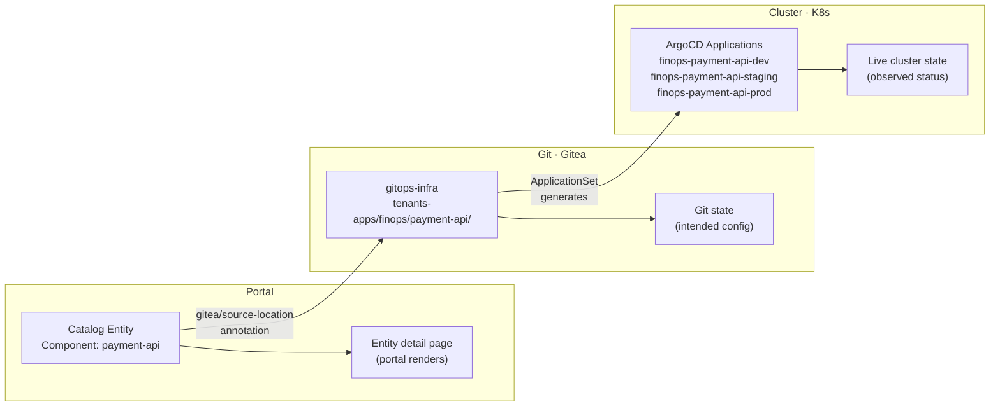
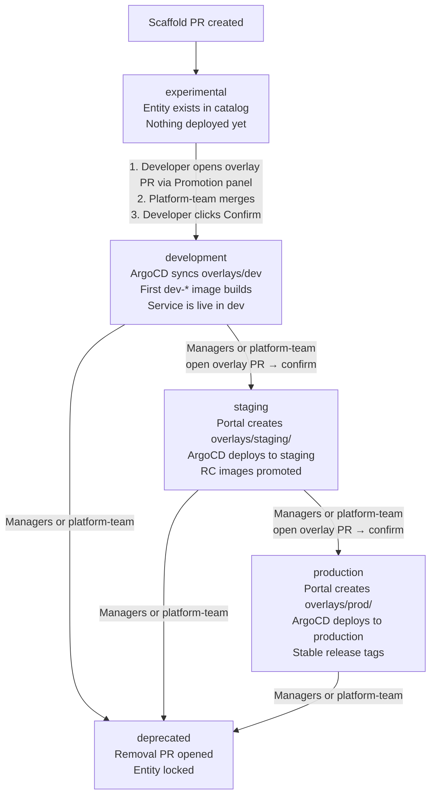

# Cross-Environment Promotion & Visualization

> **Status:** Shipped (v0.3.0).
> - Kustomize overlay structure (`base/` + per-environment `overlays/`) is generated by the portal Promotion panel; `overlays/dev/` is no longer created at scaffold time.
> - Lifecycle promotion UI (`experimental → development → staging → production`) shipped in v0.3.0.
> - ArgoCD status via Pinniped and full environment panel (Phase 2) are planned for v0.4.0.
>
> This document describes the full design. The "Migration Path" section maps phases to shipped vs planned work.

---

## Problem Statement

Today the portal scaffolds a flat `xtenant-app.yaml` per project. ArgoCD
ApplicationSet fans this out across environments, but the portal has **no
visibility** into that fan-out. It sees one catalog entity, not three deployments.

The portal cannot answer:

- What version is deployed on staging?
- How does prod config differ from dev?
- When was the last promotion from staging to prod?
- Is there config drift between environments?

To support enterprise use-cases (SOC2 audit trails, change management,
multi-environment dashboards), the environment must become a **first-class
object** in the gitops repo — not hidden inside ArgoCD ApplicationSet logic.

### The AI-Era Context

With AI-assisted development, a developer can scaffold and ship a service in
one day. The lifecycle moves faster than ever, which makes tracking MORE
important, not less. When iteration speed is measured in hours:

- **New team members** joining on day 2 need to see the full history of
  decisions, scaffolding choices, and promotion events — without a catch-up
  meeting that's already outdated by the time it happens.
- **Rapid changes** need automatic tracking. Manual documentation rots within
  days when the codebase changes hourly.
- **The golden path** captures every decision at creation time (template,
  runtime, features, architecture). RFCs and ADRs capture the WHY. The
  lifecycle model captures the WHEN and WHO of every promotion.

The portal becomes the institutional memory. Not Slack threads, not meeting
notes, not tribal knowledge — a living, queryable, team-scoped record of
everything that happened to every service, from idea to production.

---

## Design Principles

1. **Git is the source of truth.** The portal reads git, not clusters. If environment
   config lives in git, the portal can display it without cluster access.
2. **No cluster writes from the portal.** Promotion = git commit, not API call to ArgoCD.
3. **Kustomize over Helm.** The portal needs to read per-environment config as plain
   YAML. Kustomize overlays are readable without a rendering engine. Helm would
   require the backend to run `helm template`.
4. **Incremental adoption.** Existing flat-manifest projects continue to work. The
   overlay structure is opt-in per project (controlled by template).

---

## Gitops Repo Structure

### Current (v0.3.0+)

The scaffold generates `base/` manifests only. **No overlay is generated at scaffold time.** All overlays are created via the Promotion panel after scaffolding.

```
gitops-infra/
  tenants-apps/<team>/<app>/
    base/
      kustomization.yaml
      xtenant-app.yaml
      xtenant-database.yaml          # if database enabled
      external-secret-env.yaml       # if vault secrets enabled
      external-secret-db.yaml        # if database enabled
    overlays/dev/                    # created via Promotion panel (experimental → development)
      kustomization.yaml             # references ../../base
      image-transformer.yaml         # teaches kustomize to patch XTenantApp image field
      patch-xtenant-app.yaml         # dev-specific patches
    overlays/staging/                # created via Promotion panel (development → staging)
      kustomization.yaml
      patch-xtenant-app.yaml
    overlays/production/             # created via Promotion panel (staging → production)
      kustomization.yaml
      patch-xtenant-app.yaml
  tenants/<team>/
    <app>-image-updater.yaml         # ArgoCD Image Updater CR (NOT in tenants-apps/)
  catalog/<team>/
    components/<app>.yaml
    resources/<app>-db.yaml          # optional
    apis/<app>-api.yaml              # optional
```

ArgoCD ApplicationSet uses a directory generator matching `tenants-apps/*/*/overlays/*`. Each overlay directory produces one Application named `{team}-{appName}-{env}`.

### Enterprise (Kustomize Overlays)

```
gitops-infra/
  tenants-apps/<team>/<app>/
    base/
      kustomization.yaml
      xtenant-app.yaml
      xtenant-database.yaml
      external-secret-env.yaml
      external-secret-db.yaml
    overlays/
      dev/
        kustomization.yaml          # patches for dev
      staging/
        kustomization.yaml          # patches for staging
      prod/
        kustomization.yaml          # patches for prod
  service-catalog/
    ...                             # unchanged
```

ArgoCD ApplicationSet changes to a **matrix generator**: iterate teams × apps ×
environments. Each combination produces one Application pointing at
`tenants-apps/<team>/<app>/overlays/<env>/`.

---

## What Changes Per Environment

Not every field differs. The overlay patches target a well-known set:

| Field | Dev | Staging | Prod |
|-------|-----|---------|------|
| `replicas` | 1 | 2 | 3+ |
| `resources.cpu.request` | 50m | 100m | 250m+ |
| `resources.cpu.limit` | 200m | 500m | 1000m+ |
| `resources.memory.request` | 64Mi | 128Mi | 256Mi+ |
| `resources.memory.limit` | 256Mi | 512Mi | 1Gi+ |
| `ingress.host` | `app.dev.example.com` | `app.staging.example.com` | `app.example.com` |
| `metadata.name` (XTenantApp XR) | `{team}-{app}` | `{team}-{app}-staging` | `{team}-{app}-production` |
| `secretsFrom.app.secretName` | `app-env` | `app-env-staging` | `app-env-production` |
| `secretsFrom.database.secretName` | `app-db-creds` | `app-db-creds-staging` | `app-db-creds-production` |
| Vault path (ExternalSecret) | `{team}/{app}/dev/env` | `{team}/{app}/staging/env` | `{team}/{app}/production/env` |
| `image.tag` pattern | `dev-*` | `vX.Y.Z-rcN` | `vX.Y.Z` |
| `rollout.type` | `RollingUpdate` | `RollingUpdate` | `BlueGreen` (optional) |

### Example: base/xtenant-app.yaml

```yaml
apiVersion: platform.wxops.cloud/v1alpha1
kind: XTenantApp
metadata:
  name: team-payment-api
spec:
  parameters:
    appName: payment-api
    owner: finops
    namespace: tenant-finops
    containerPort: 8080
    replicas: 1
    image:
      repository: gitea.example.com/finops/payment-api
      tag: latest
    resources:
      cpu: { request: "50m", limit: "200m" }
      memory: { request: "64Mi", limit: "256Mi" }
    secretsFrom:
      app:
        enabled: true
      database:
        enabled: true
    ingress:
      enabled: true
      host: payment-api.dev.example.com
```

### Example: overlays/prod/kustomization.yaml

```yaml
apiVersion: kustomize.config.k8s.io/v1beta1
kind: Kustomization
resources:
  - ../../base

patches:
  - target:
      kind: XTenantApp
    patch: |
      - op: replace
        path: /spec/parameters/replicas
        value: 3
      - op: replace
        path: /spec/parameters/resources/cpu/request
        value: "250m"
      - op: replace
        path: /spec/parameters/resources/cpu/limit
        value: "1000m"
      - op: replace
        path: /spec/parameters/resources/memory/request
        value: "256Mi"
      - op: replace
        path: /spec/parameters/resources/memory/limit
        value: "1Gi"
      - op: replace
        path: /spec/parameters/ingress/host
        value: payment-api.example.com

  - target:
      kind: ExternalSecret
      name: payment-api-env
    patch: |
      - op: replace
        path: /metadata/name
        value: payment-api-env-production
      - op: replace
        path: /spec/dataFrom/0/extract/key
        value: finops/payment-api/production/env
      - op: replace
        path: /spec/target/name
        value: payment-api-env-production

  - target:
      kind: ExternalSecret
      name: payment-api-db-creds
    patch: |
      - op: replace
        path: /spec/dataFrom/0/extract/key
        value: finops/databases/payment-api-db-production/connection-creds
      - op: replace
        path: /spec/target/name
        value: payment-api-db-creds-production
```

---

## ArgoCD ApplicationSet

### Current (single generator)

```yaml
apiVersion: argoproj.io/v1alpha1
kind: ApplicationSet
metadata:
  name: tenant-apps
spec:
  generators:
    - git:
        repoURL: https://gitea.example.com/platform-team/gitops-infra
        revision: HEAD
        directories:
          - path: tenants-apps/*/*
  template:
    metadata:
      name: "{{path[1]}}-{{path[2]}}"
    spec:
      source:
        repoURL: https://gitea.example.com/platform-team/gitops-infra
        path: "{{path}}"
      destination:
        server: https://kubernetes.default.svc
        namespace: "tenant-{{path[1]}}"
```

### Enterprise (matrix generator with overlays)

```yaml
apiVersion: argoproj.io/v1alpha1
kind: ApplicationSet
metadata:
  name: tenant-apps
spec:
  generators:
    - git:
        repoURL: https://gitea.example.com/platform-team/gitops-infra
        revision: HEAD
        directories:
          - path: tenants-apps/*/*/overlays/*
  template:
    metadata:
      name: "{{path[1]}}-{{path[2]}}-{{path[4]}}"  # team-app-env
    spec:
      source:
        repoURL: https://gitea.example.com/platform-team/gitops-infra
        path: "{{path}}"
      destination:
        server: https://kubernetes.default.svc
        namespace: "tenant-{{path[1]}}-{{path[4]}}"  # tenant-team-env
```

Each overlay directory generates one ArgoCD Application. The environment name
comes from the directory path, not from values files or generators.

---

## Scaffold Changes

### Template Structure

When the scaffold template supports environments (`template.yaml`):

```yaml
name: go-service
title: Go Microservice
environments:
  - name: dev
    defaults:
      replicas: 1
      cpu_request: "50m"
      memory_request: "64Mi"
  - name: staging
    defaults:
      replicas: 2
      cpu_request: "100m"
      memory_request: "128Mi"
  - name: prod
    defaults:
      replicas: 3
      cpu_request: "250m"
      memory_request: "256Mi"
```

### Generated Output

The scaffold handler generates `base/` + one overlay per environment:

```
base/
  kustomization.yaml           # resources: [xtenant-app.yaml, ...]
  xtenant-app.yaml             # dev-like defaults (same as today)
  external-secret-env.yaml
  external-secret-db.yaml

overlays/dev/
  kustomization.yaml           # minimal patches (dev is close to base)

overlays/staging/
  kustomization.yaml           # patches: replicas, resources, vault paths

overlays/prod/
  kustomization.yaml           # patches: replicas, resources, ingress, vault
```

### Backward Compatibility

- Templates without `environments` in `template.yaml` generate flat manifests
  (current behavior).
- Templates with `environments` generate the Kustomize overlay structure.
- The portal detects which structure a project uses by checking for `base/`
  directory in the gitops path.

---

## Portal Visualization

### Entity Detail Page — Environment Panel

For projects with overlay structure, the entity detail page shows an
**Environment Panel** below the header:

```
┌───────────────────────────────────────────────────────┐
│  Environments                                         │
├──────────┬───────────┬────────────────────────────────┤
│  dev     │  staging  │  prod                          │
│  ● live  │  ● live   │  ● live                        │
│          │           │                                │
│  dev-52  │  v1.3.0-rc2  │  v1.2.0                    │
│  1 pod   │  2 pods   │  3 pods                        │
│  50m CPU │  100m CPU │  250m CPU                      │
│          │           │                                │
│  ↑ 2h ago│  ↑ 1d ago │  ↑ 5d ago                     │
└──────────┴───────────┴────────────────────────────────┘
```

Data sources (all from git — no cluster access):

| Field | Source |
|-------|--------|
| Environment list | `overlays/` subdirectories |
| Replicas, CPU, memory | Parse overlay `kustomization.yaml` patches |
| Image tag / version | Compare branch HEAD tags (`develop`/`staging`/`main`) |
| Last update time | Git commit timestamp on the overlay directory |
| Sync status | Optional — ArgoCD API if enabled (read-only) |

### Implementation

```
frontend/src/components/catalog/environment-panel.tsx   # new client component
```

- Fetches overlay configs via a new backend endpoint:
  `GET /api/v1/catalog/entities/:kind/:name/environments`
- Backend reads `overlays/*/kustomization.yaml` from gitops-infra via Gitea API
- Parses JSON patches to extract key values (replicas, resources, host)
- Returns structured data per environment
- Client renders the comparison grid

### Promotion Actions (future)

The panel could include promotion buttons:

- **Promote to staging** — opens a PR that updates `overlays/staging/` to match
  current `overlays/dev/` values (or specific fields).
- **Promote to prod** — same for prod.
- All promotions go through PRs — no direct writes.

This is intentionally deferred. The visualization comes first; actions come after
the team trusts the data.

---

## Config Edit Flow

### Current

The edit-config form writes one `xtenant-app.yaml`. Simple.

### With Overlays

The edit form needs an **environment selector**:

1. **Edit base** — changes apply to all environments (new default values)
2. **Edit overlay** — changes apply to one environment only (patches)

The form shows which fields are "inherited from base" vs "overridden in this
environment." Overridden fields are highlighted.

Saving creates a PR that modifies either `base/xtenant-app.yaml` or
`overlays/<env>/kustomization.yaml`.

---

## Vault Path Convention

Vault secrets are namespaced by environment using a nested path structure:

| Environment | App secrets path | DB credentials path |
|-------------|-----------------|-------------------|
| dev | `{team}/{app}/dev/env` | `{team}/databases/{dbName}/connection-creds` |
| staging | `{team}/{app}/staging/env` | `{team}/databases/{dbName}-staging/connection-creds` |
| production | `{team}/{app}/production/env` | `{team}/databases/{dbName}-production/connection-creds` |

The base ExternalSecret (`external-secret-env.yaml`) uses the dev path. The staging and
production overlay `kustomization.yaml` contains an inline JSON 6902 patch that rewrites:

- `metadata.name` → `{appName}-env-{envName}` (unique K8s Secret name per environment)
- `spec.target.name` → same as above
- `spec.dataFrom[0].extract.key` → `{team}/{app}/{envName}/env`

The scaffold writes initial secrets only to the dev vault path. Staging and production
secrets are written separately via the **Secrets ▾** dropdown on the entity detail page,
which shows Dev / Staging / Production options.

---

## Alternative: Helm Values Approach

The Kustomize overlay approach is recommended for portal readability, but **Helm
values files** achieve the same result with a different shape. Both are valid.
The team should pick one and stay consistent.

### Gitops Structure (Helm)

```
gitops-infra/
  tenants-apps/<team>/<app>/
    Chart.yaml                  # trivial wrapper chart
    templates/
      xtenant-app.yaml          # {{ .Values.replicas }}, etc.
      external-secret-env.yaml
      external-secret-db.yaml
    values.yaml                 # base defaults (dev-like)
    values-staging.yaml         # staging overrides
    values-prod.yaml            # prod overrides
```

### ArgoCD ApplicationSet (Helm)

```yaml
apiVersion: argoproj.io/v1alpha1
kind: ApplicationSet
metadata:
  name: tenant-apps
spec:
  generators:
    - matrix:
        generators:
          - git:
              repoURL: https://gitea.example.com/platform-team/gitops-infra
              revision: HEAD
              directories:
                - path: tenants-apps/*/*
          - list:
              elements:
                - env: dev
                  valuesFile: values.yaml
                  namespace: "tenant-{{path[1]}}"
                - env: staging
                  valuesFile: values-staging.yaml
                  namespace: "tenant-{{path[1]}}-staging"
                - env: prod
                  valuesFile: values-prod.yaml
                  namespace: "tenant-{{path[1]}}-prod"
  template:
    metadata:
      name: "{{path[1]}}-{{path[2]}}-{{env}}"
    spec:
      source:
        repoURL: https://gitea.example.com/platform-team/gitops-infra
        path: "{{path}}"
        helm:
          valueFiles:
            - "{{valuesFile}}"
      destination:
        server: https://kubernetes.default.svc
        namespace: "{{namespace}}"
```

### Example: values-prod.yaml

```yaml
replicas: 3
resources:
  cpu:
    request: "250m"
    limit: "1000m"
  memory:
    request: "256Mi"
    limit: "1Gi"
ingress:
  host: payment-api.example.com
vault:
  envPath: finops/payment-api-prod/env
  dbPath: finops/databases/payment-api-db-prod/connection-creds
secretSuffix: "-prod"
```

### Tradeoff: Kustomize vs Helm for Portal Readability

| Aspect | Kustomize | Helm |
|--------|-----------|------|
| Portal reads config | Parse YAML patches directly | Must run `helm template` or parse `values-*.yaml` |
| What the portal sees | Patch ops — must resolve against base | Flat key-value — immediately readable |
| Template authoring | No template language, just patch targets | Go template syntax in manifests |
| Adding a new env field | Add a patch op | Add `{{ .Values.newField }}` to template + values |
| Debugging | `kustomize build overlays/prod/` | `helm template . -f values-prod.yaml` |
| ArgoCD support | Native | Native |

**Recommendation:** If the portal only needs to read values (replicas, resources,
hosts), Helm `values-*.yaml` files are actually **easier to parse** — they're
flat YAML maps, no patch resolution needed. Kustomize is better when you need
to patch deeply nested fields that Helm values don't surface.

For WxOps, **either works**. The scaffold templates would define which approach
each golden-path template uses. Simple services might use Kustomize; complex
services with many knobs might prefer Helm values.

### Cluster Generator Approach (reference)

Large enterprises with many clusters often skip file-based environment config
entirely. Instead they use ArgoCD's **cluster generator**:

```yaml
generators:
  - matrix:
      generators:
        - git:
            directories:
              - path: tenants-apps/*/*
        - clusters:
            selector:
              matchLabels:
                env: "{{metadata.labels.env}}"
```

Environment labels (`env=dev`, `env=prod`, `region=us-east`) live on the cluster
objects registered in ArgoCD. The matrix cross-products git directories with
clusters. Values come from cluster annotations or a separate config repo.

This is the most flexible model (multi-cluster, multi-region), but the portal
needs ArgoCD API access to read cluster labels — which conflicts with the
"portal is read-only, no cluster access" constraint. Listed here for reference;
not recommended for WxOps Phase 1.

---

## Pinniped + ArgoCD CRD: The WxOps Advantage

The portal already has something most IDPs don't: **user-scoped Kubernetes
credentials via Pinniped.** This changes the architecture fundamentally.

### Why This Matters

Most IDPs face a hard choice: give the portal a service account with broad
cluster read access (security risk), or don't show cluster state at all. WxOps
doesn't have this problem because Pinniped provides per-user credentials that
respect RBAC. The portal doesn't need its own cluster access — it uses **the
user's own permissions**.

### ArgoCD Applications Are K8s CRDs

ArgoCD Applications aren't locked behind ArgoCD's REST API. They're standard
Kubernetes custom resources. Any K8s client with the right RBAC can read them:

```
GET /apis/argoproj.io/v1alpha1/namespaces/argocd/applications/{name}
```

The ApplicationSet naming convention is predictable from the gitops directory
structure:

```
ApplicationSet directory path:     tenants-apps/finops/payment-api/overlays/dev
Generated Application name:        finops-payment-api-dev
```

### The 1:1 Mapping



The portal constructs the Application CR name from the catalog entity's
`gitea/source-location` annotation + the environment name. No lookup table,
no mapping database.

### What the Application CR Provides

A single K8s API call per environment returns everything the portal needs:

```yaml
apiVersion: argoproj.io/v1alpha1
kind: Application
metadata:
  name: finops-payment-api-prod
  namespace: argocd
status:
  sync:
    status: Synced                # Synced | OutOfSync
    revision: abc123f             # git commit SHA currently deployed
  health:
    status: Healthy               # Healthy | Degraded | Progressing | Missing
  summary:
    images:
      - gitea.example.com/finops/payment-api:v1.2.0
  operationState:
    phase: Succeeded
    finishedAt: "2026-06-24T10:30:00Z"
    syncResult:
      revision: abc123f
  resources:
    - kind: Deployment
      name: payment-api
      status: Synced
      health: { status: Healthy }
    - kind: Service
      name: payment-api
      status: Synced
      health: { status: Healthy }
```

| Data | Field | Portal shows |
|------|-------|-------------|
| Sync status | `status.sync.status` | "Synced" or "OutOfSync" badge |
| Health | `status.health.status` | Green/red/amber indicator |
| Deployed image | `status.summary.images[]` | Image tag = version |
| Last deploy time | `status.operationState.finishedAt` | "2h ago" |
| Git revision | `status.sync.revision` | Short SHA link to Gitea commit |
| Resources | `status.resources[]` | Pod/Service/Ingress health list |

### RBAC Controls Visibility

The portal doesn't filter what each user can see — **Kubernetes RBAC does.**

```yaml
# ClusterRole: tenant teams can read their own Applications
apiVersion: rbac.authorization.k8s.io/v1
kind: Role
metadata:
  name: argocd-app-reader
  namespace: argocd
rules:
  - apiGroups: ["argoproj.io"]
    resources: ["applications"]
    verbs: ["get", "list"]
    # resourceNames filtered by Pinniped group → RBAC binding
```

A developer from `finops` team authenticates via Pinniped → gets a K8s token
scoped to their groups → can only read Application CRs that their RBAC binding
allows. The portal makes the same API call for every user; RBAC returns different
results. No team-level filtering logic in the portal.

### Crossplane XR Status — Same Pattern

The same approach extends to Crossplane. XTenantApp and XTenantDatabase are
Kubernetes CRDs. Their `.status` subresource reports provisioning state:

```yaml
apiVersion: platform.wxops.cloud/v1alpha1
kind: XTenantApp
metadata:
  name: finops-payment-api
status:
  conditions:
    - type: Ready
      status: "True"
    - type: Synced
      status: "True"
  connectionDetails:
    - name: kubeconfig
```

The portal can read XR status the same way it reads ArgoCD Application status —
via the user's Pinniped credentials, scoped by RBAC. This gives visibility into:

- Is the Crossplane composition applied?
- Is the database provisioned?
- Are external secrets synced?
- What conditions are failing?

No separate integration per tool. One K8s API, one auth model (Pinniped),
RBAC controls everything.

### Portal Backend Implementation

The portal backend would add a thin K8s client that uses the user's Pinniped
token (forwarded from the session) to query the cluster:

```go
// Proxy the user's Pinniped credentials to K8s API
func (h *CatalogHandler) GetEnvironmentStatus(c *gin.Context) {
    // 1. Extract Pinniped token from user session
    // 2. Build K8s client with that token
    // 3. Query Application CRs by predictable name pattern
    // 4. Return structured status per environment
}
```

The backend never stores cluster credentials. Each request uses the
authenticated user's own token. If the token expires or the user's RBAC
changes, the portal reflects that immediately.

### Why This Is Different From Other IDPs

| IDP | Cluster auth model | Portal credential |
|-----|-------------------|-------------------|
| **Backstage** | Service account per cluster | Platform-wide token (broad access) |
| **Humanitec** | Orchestrator owns credentials | Humanitec agent token |
| **Port** | Integration-specific secrets | Stored in Port's vault |
| **WxOps** | **User's own Pinniped session** | **No portal credential needed** |

This is the key differentiator. The portal never has its own cluster access.
It piggybacks on the user's existing Pinniped authentication, which the cluster
already trusts and RBAC already scopes. No additional secrets to manage, no
privilege escalation risk, no service account rotation.

---

## Lifecycle-Driven Promotion

The catalog `lifecycle` field is the **control plane** for environment
provisioning. Changing lifecycle doesn't just update metadata — it triggers
the creation of environment overlays, which ArgoCD picks up and deploys.

### Lifecycle Flow



### Transition Rules

| Transition | Who can trigger | How it happens |
|------------|----------------|----------------|
| `experimental` → `development` | **Any team member** | Two steps: (1) developer opens dev overlay PR via Promotion panel; platform-team merges. (2) Developer clicks "Confirm" in Promotion panel — portal verifies overlay is on main and updates lifecycle. |
| `development` → `staging` | **Managers or platform-team** | Managers or platform-team open staging overlay PR via Promotion panel (with config: replicas, ingress, resources, Vault secrets). Platform-team merges. Then "Confirm" updates lifecycle. |
| `staging` → `production` | **Managers or platform-team** | Same two-step flow as staging, for the production overlay. |
| Any → `deprecated` | **Managers or platform-team** | Opens `[Deprecate]` PR in gitops-infra with `DEPRECATED.md` marker; writes `wxops.cloud/deprecated-*` annotations; locks entity. Overlays are NOT deleted — ArgoCD continues running until platform manually removes them. |
| Demotion (e.g. staging → development) | **Managers or platform-team** | Updates lifecycle label only. Overlay directory stays on disk — ArgoCD still syncs it. Manual overlay removal is a separate platform-team action. |

### Why `experimental` Is the Scaffold Default

The scaffold creates the entity with `lifecycle: experimental` because at
scaffold time, the service doesn't exist yet — it's a PR waiting for review.
The entity is a proposal, not a running service.

```
Scaffold creates:          PR merges:              Developer codes:
  lifecycle: experimental    lifecycle: development    lifecycle: development
  overlays/dev/ ready        ArgoCD syncs dev          CI builds dev-* images
  PR open                    Service is live           Feature branches merge
```

This means `experimental` in the catalog = "scaffolded but not yet deployed."
The portal can show these differently — grayed out, or in a separate
"Pending" section of the catalog.

### What Happens on Promotion

When a platform-team member promotes `development` → `staging`:

1. Portal checks the user's role (must be platform-team or admin)
2. Portal reads the template's staging defaults from `template.yaml`
3. Portal generates `overlays/staging/kustomization.yaml` with:
   - Staging replicas, resources, ingress host
   - Staging vault paths for ExternalSecrets
4. Portal updates the entity YAML: `lifecycle: staging`
5. Both changes committed in one PR to gitops-infra
6. PR requires platform-team approval (Gitea branch protection)
7. On merge:
   - ArgoCD ApplicationSet discovers new overlay directory
   - Creates staging Application, syncs
   - Catalog entity reflects `lifecycle: staging`

### RBAC for Lifecycle Changes

The portal enforces role-based restrictions on lifecycle transitions:

```go
func canPromote(userGroups []string, from, to string) bool {
    // experimental → development: automatic (PR merge), no user action
    // development → staging: platform-team or admin only
    // staging → production: platform-team or admin only
    // any demotion: platform-team or admin only
    if to == "staging" || to == "production" || isDowngrade(from, to) {
        return containsAny(userGroups, "platform-team", "admin")
    }
    return false // development is set automatically, not by user
}
```

Developers can see the lifecycle status but cannot change it beyond
`experimental`. The promotion decision belongs to the people responsible
for the platform.

### Portal UI for Promotion

On the entity detail page, platform-team users see a promotion action:

```
┌─────────────────────────────────────────────────┐
│  payment-api                    lifecycle: development
│  owner: finops                                  │
│                                                 │
│  [Promote to Staging]    ← only for platform-team
│                                                 │
│  This will:                                     │
│    • Create staging environment config          │
│    • Open a PR for platform review              │
│    • ArgoCD will deploy after PR merge          │
└─────────────────────────────────────────────────┘
```

Regular developers see the lifecycle badge but no promotion button.

---

## Migration Path

### Phase 1: Git-based Version Comparison (current infrastructure)

Use the existing `develop`/`staging`/`main` branch model to infer promotion
state from git tags:

- Compare latest tags across branches per repo via Gitea API
- `develop` HEAD → `dev-*` tags → dev environment
- `staging` HEAD → `vX.Y.Z-rcN` tags → staging environment
- `main` HEAD → `vX.Y.Z` tags → production environment
- Show version comparison on entity detail page
- No cluster access, no structure change

**Validates the UX** before committing to structural changes.

### Phase 2: ArgoCD Application Status via Pinniped

Add real-time environment status using the existing Pinniped + ArgoCD setup:

- Portal backend queries ArgoCD Application CRs using the user's Pinniped token
- Construct Application CR names from entity annotation + env suffix
- Display sync status, health, deployed image, last sync time
- RBAC naturally scopes visibility per team

**First live cluster data** in the portal — read-only, user-scoped, zero new
credentials.

### Phase 3: Scaffold Generates Per-Environment Config

Move from flat manifests to Kustomize overlays (or Helm values):

- Add `environments` support to `template.yaml` schema
- Scaffold generates `base/` + `overlays/` (or `values-{env}.yaml`)
- Update ArgoCD ApplicationSet to per-overlay/per-values generator
- Existing flat-manifest projects continue to work (backward compat)

### Phase 4: Environment Panel in Portal

Full environment visualization combining git config + cluster status:

- Read overlay/values configs from git (intended state)
- Read ArgoCD Application status from cluster (observed state)
- Render comparison grid: config diff + live status per environment
- Config edit form gains environment selector

### Phase 5: Promotion Workflow

Portal-driven promotion between environments:

- "Promote to staging" button creates a PR updating the overlay/values
- PR shows config diff between source and target environment
- Activity feed tracks promotion events
- Post-merge: ArgoCD auto-syncs, portal shows new status

### Phase 6: Crossplane XR Status (deep platform visibility)

Extend the Pinniped-based K8s read pattern to Crossplane resources:

- Read XTenantApp and XTenantDatabase `.status` conditions
- Show provisioning state: Ready, Synced, Failed
- Display database connection status, external secret sync state
- Full platform visibility without any new integration — same K8s API,
  same Pinniped auth, same RBAC model

---

## Comparison with Other IDPs

| Aspect | Backstage | Humanitec | Port | WxOps |
|--------|-----------|-----------|------|-------|
| **Env modeling** | Plugins (K8s, ArgoCD) | First-class Environment object | Blueprints + actions | Kustomize overlays / Helm values in git |
| **Portal reads from** | Cluster APIs (service account) | Own orchestrator DB | 30+ integrations | Git (Gitea) + K8s API (Pinniped) |
| **Cluster auth** | Service account per cluster | Agent token | Integration secrets | User's Pinniped session (RBAC-scoped) |
| **Promotion** | External CI/CD | API call to orchestrator | Actions → external APIs | PR to git overlay |
| **New credentials needed** | Yes (per cluster) | Yes (agent) | Yes (per integration) | **No** — uses existing Pinniped |
| **RBAC model** | Plugin-specific | Humanitec roles | Port permissions | **K8s native RBAC** |
| **Crossplane visibility** | Custom plugin required | Not native | Custom integration | **Same K8s API, same auth** |

### What Makes WxOps Different

1. **Zero additional credentials.** Pinniped already exists for developer
   access. The portal reuses it — no service accounts, no integration tokens,
   no secrets to rotate.

2. **K8s-native RBAC is the permission model.** No parallel permission system
   in the portal. What the user can see in `kubectl` is what they see in the
   portal.

3. **Git + K8s API covers everything.** Intended state from git (Gitea API),
   observed state from cluster (K8s API via Pinniped). Two data sources, not
   thirty integrations.

4. **Crossplane is a first-class citizen.** Most IDPs treat infrastructure
   (databases, queues, certificates) as opaque — you deploy them but can't see
   their status. With Crossplane XRs as K8s CRDs + Pinniped auth, the portal
   reads infrastructure status the same way it reads application status.

---

## Feature Roadmap

### Delivered

| Feature | Description | Version |
|---------|-------------|---------|
| Service Catalog | Entity YAML in git, catalog UI with search/filter/pagination | v0.1.3 |
| Golden-Path Scaffolding | Template-based project creation, repo + gitops PR + vault secrets | v0.2.0 |
| Git-Flow Branching | `develop` → `staging` → `main` with branch protection | v0.2.0 |
| CI/CD Status | Gitea Actions workflow runs on entity detail page | v0.2.0 |
| Config Edit via PR | Update XTenantApp config through portal, committed as PR | v0.2.0 |
| Vault Secrets | Create/update env vars in Vault (no read, no delete) | v0.2.0 |
| Import Existing | Register existing Gitea repos into the service catalog | v0.2.0 |
| Git-based version comparison | Latest image tag per environment (`dev-*`, `v*-rc*`, `v*`) | v0.3.0 |
| Per-environment overlay scaffold | Kustomize overlays generated by Promotion panel (not scaffold) | v0.3.0 |
| Promotion workflow | Two-step UI: create-overlay PR → confirm. Role-gated by transition. | v0.3.0 |
| Deprecation | Managers/platform-team open removal PR, lock entity | v0.3.0 |
| Cache invalidation | `POST /api/v1/webhooks/catalog/refresh` — instant after gitops-infra push | v0.3.0 |

### Next

| Feature | Description |
|---------|-------------|
| ArgoCD status via Pinniped | Real-time sync/health status per environment, user-scoped RBAC |
| Crossplane XR status | Read XTenantApp/XTenantDatabase conditions via Pinniped |
| Environment panel | Side-by-side env config + live status on entity detail page |
| Multi-cluster support | ArgoCD cluster generator + per-cluster status display |
| Audit trail | SOC2-ready log of who promoted what, when, with approval chain |
| Self-service actions | Restart, scale, rollback via portal UI (RBAC-controlled) |
| Scorecard / maturity | Production readiness checks (monitoring, docs, tests, SLOs) |

---

## Decisions Made

| Decision | Resolution |
|----------|-----------|
| **Scaffold default lifecycle** | `experimental` — service isn't deployed yet, just a PR |
| **experimental → development** | Automatic on gitops-infra PR merge |
| **Who can promote to staging/prod** | Platform-team or PM only — not the owning dev team |
| **Demotion behavior** | Updates lifecycle label only, does NOT remove overlay (safety) |
| **Portal cluster access model** | User's Pinniped credentials, not a service account |
| **Config approach** | Kustomize overlays or Helm values — template defines which |

## Open Questions

1. **Environment naming.** Are `dev`/`staging`/`prod` fixed, or should teams
   define custom environments (e.g., `qa`, `perf`, `canary`)?

2. ~~**Database per environment.**~~ **Resolved (v0.3.0).** Each environment gets its own `XTenantDatabase`
   CR with a per-environment name: `{appName}-{env}-db` (e.g. `payment-api-dev-db`,
   `payment-api-staging-db`, `payment-api-production-db`). Shared-tier databases can still
   cross environments via the environment override on the overlay wizard, but dedicated
   clusters always map to the overlay's own environment.

3. **Namespace strategy.** One namespace per team, or per team-environment
   (`tenant-finops-dev`, `tenant-finops-prod`)?

4. **Secret rotation.** When vault secrets change, which environments should
   the ExternalSecret refresh? All, or only the one where the secret was updated?

5. ~~**PR merge detection.**~~ **Resolved (v0.3.0).** The portal does not detect merges automatically.
   After the platform-team merges the overlay PR, the developer clicks "Confirm" in the
   Promotion panel. The `GET /api/v1/…/promostatus` endpoint checks that the overlay file
   exists on `main` before allowing confirm — this is the ground-truth gate.

6. **Pinniped token lifetime.** How long is the Pinniped session valid? Does the
   portal need to handle token refresh for long-running pages that poll cluster
   status?

7. **ArgoCD namespace.** Are all Applications in a single `argocd` namespace,
   or per-team namespaces? This affects the RBAC binding strategy.
