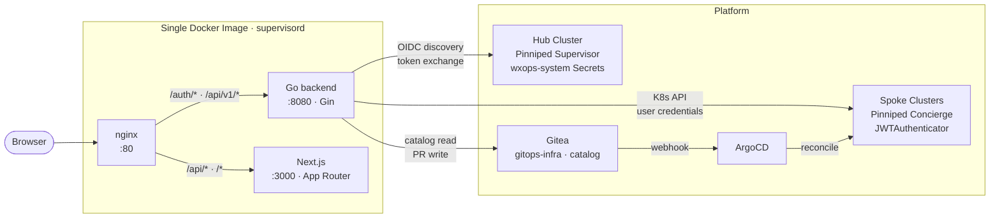
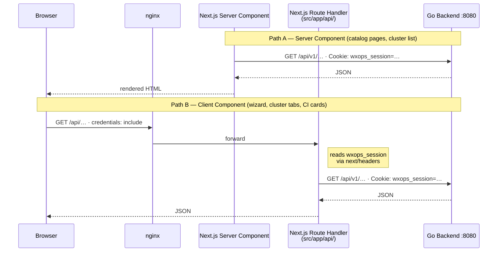

# Codebase Overview

> **Audience:** contributors. How the portal's processes fit together and which packages own what.
> For the auth model, hub-spoke topology and request routing in prose, read
> [../concepts/architecture.md](../concepts/architecture.md) first; for local setup, see
> [local-development.md](local-development.md).

## Process layout

Everything ships as **one container image**: nginx, the Go backend, and the Next.js server run under
supervisord and talk to each other over loopback. There is no separate frontend container.

## BFF proxy

The browser cannot reach the Go backend directly (it is a loopback address inside the container) and
cannot read the `HttpOnly` `wxops_session` cookie. Server Components call the backend at render time
and forward the cookie themselves; Client Components go through Next.js Route Handlers in
`src/app/api/`, which read the cookie server-side and proxy to Go. The prose version, with code, is in
[architecture.md](../concepts/architecture.md#bff-proxy-pattern).

## Frontend (`frontend/`)

| Layer | Package | Role |
|---|---|---|
| Framework | Next.js 16 (App Router), React 19 | Server components, streaming, file-based routing |
| UI primitives | `@base-ui/react` | Unstyled, accessible headless components |
| Styling | Tailwind CSS v4 | All visual design — utility classes only, no CSS modules |
| Variants | `class-variance-authority` | `cva()` for button/badge size and color variants |
| Class merge | `clsx` + `tailwind-merge` → `cn()` | Safe Tailwind class composition |
| Icons | `lucide-react` | SVG icon set — icons only, not a component library |
| Toasts | `sonner` | Notification system |
| Theme | `next-themes` | System-aware light/dark mode |
| Fonts | Geist Sans + Geist Mono | Loaded via `next/font/google` |
| Diagrams | `mermaid` v11 | Dependency graphs, sequence diagrams |
| OpenAPI | `swagger-ui-dist` | Imperative UMD mount — no React wrapper or peer dep issues |
| Markdown | `react-markdown` + `remark-gfm` | Doc viewer, RFC/ADR rendering |
| YAML | `js-yaml` | OpenAPI spec parsing, edit-config YAML preview |

`src/components/ui/` holds **source files owned by this repo** — they wrap Base UI primitives with
Tailwind styling. Generate additional ones with `npx shadcn@latest add <component>` (the `shadcn` CLI is
not in `package.json`; run it with `npx`).

## Backend (`backend/`)

| Layer | Package | Role |
|---|---|---|
| Framework | `gin-gonic/gin` | HTTP router, middleware, request binding |
| OIDC / Auth | `coreos/go-oidc/v3` + `golang.org/x/oauth2` | PKCE flow with Pinniped Supervisor as the IdP |
| Session | Custom AES-256-GCM encrypted cookie | Stateless — no Redis, no database; key is `SESSION_SECRET` |
| Kubernetes | `k8s.io/client-go` | Hub cluster Secret discovery + spoke cluster API calls |
| YAML | `gopkg.in/yaml.v3` | Manifest generation, catalog entity parsing |
| Config | `joho/godotenv` | `.env` file loader for local dev (real env vars win) |
| Swagger | `swaggo/gin-swagger` + `swaggo/swag` | Annotation-driven spec generation — disabled by default |

Library versions are pinned in `backend/go.mod` and `frontend/package.json`, not repeated here.

**Custom clients (no third-party SDK):**

| Client | Package | Notes |
|---|---|---|
| Gitea | `internal/gitea/` | Plain HTTP + JSON against the Gitea REST API |
| Vault | `internal/vault/` | KV v2 write-only — no Vault SDK; no reads or deletes |

**Internal packages:**

| Package | Responsibility |
|---|---|
| `internal/alertmanager/` | Read-only Alertmanager client behind the Runtime tab's active alerts (opt-in via `ALERTMANAGER_URL`) |
| `internal/auth/` | OIDC client, AES-256-GCM session manager, `RequireSession` middleware, safe login return paths |
| `internal/catalog/` | Entity store with 5-min in-process cache; local-dir and Gitea readers; completeness score |
| `internal/cluster/` | Cluster registry (static JSON or K8s Secret discovery), Pinniped token exchange, spoke client |
| `internal/config/` | All env var loading via `config.Load()` — single source of truth |
| `internal/gitea/` | Gitea API methods: repo CRUD, file commits, PR creation, CI/package queries, manifest cache |
| `internal/handlers/` | Gin route handlers: `auth`, `catalog`, `clusters`, `credentials` (the shared spoke-credential broker), `observability`, `scaffold`, `cli`, `health` |
| `internal/observability/` | Grafana / ArgoCD deep-link construction — pure string building, no network calls |
| `internal/scaffold/` | Manifest generators: XTenantApp, XTenantDatabase, ExternalSecret, Kustomize overlays, Image Updater CR, catalog entities |
| `internal/server/` | Gin engine setup, route registration, CORS middleware |
| `internal/vault/` | Vault KV v2 HTTP client — create/update only |

## CLI (`cli/`)

Standalone Go module (`github.com/wxops/wxops-cli`) — separate `go.mod`, cross-compiled for Linux and
macOS (amd64 / arm64). Command reference: [../cli/cli.md](../cli/cli.md).

| Layer | Package | Role |
|---|---|---|
| Commands | `spf13/cobra` | Subcommand tree, flag parsing, help text |
| File watching | `fsnotify/fsnotify` | Cross-platform inotify/kqueue watcher for `darlane sync` |
| Portal API | `internal/client/` | Plain HTTP + JSON client — shares the `wxops_session` cookie model |
| Auth | `internal/client/credentials.go` | Token stored at `~/.wxops/credentials.json`; `WXOPS_TOKEN` env var for CI |
| Session state | `~/.wxops/darlane-<service>-<env>.json` | Persists `--local`/`--remote`/`--exclude` across `sync`, `push`, `restart` |
| Sync transport | `kubectl exec tar xf -` pipe | No daemon — tar pipe into the pod via `kubectl exec`; requires `tar` in the image |
