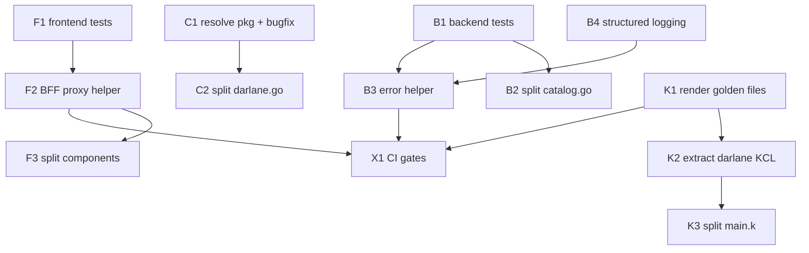

# Refactor & Hardening Release — Quality Substrate for What's Next

> **Status:** Plan — **this is the v0.6.0 release**. A behavior-preserving
> quality pass, scoped *after* observability is complete (v0.5.1) and *before*
> the repos are opened — so the code being published describes a finished
> capability rather than a partial one.
> **Spans:** `wxops-portal-v2` (backend, frontend, CLI) and `wxops-core` (KCL
> compositions). Core workstreams should be mirrored into `wxops-core/PLANS.md`
> when execution starts.
> **Companion docs:** [`RFC-010`](../rfc/RFC-010-enterprise-audit-trail.md) (the audit trail this
> unblocks), [`RFC-009`](../rfc/RFC-009-self-service-operations-portal-response.md) (the
> structured-logging sink downstream of B4).

## Why this release, and why now

The platform works and ships. But before we layer audit, scorecards, `XDarlane`, and
system intelligence on top, we should pay down the debt that would otherwise get
*multiplied* by that new work. Two of the fixes below are not merely hygiene — they are
**prerequisites** for the roadmap:

- **Structured logging** is what Track A's audit trail (`stdout → SIEM`) is built on.
  Shipping the intelligence future on top of `log.Printf` is not possible.
- **Extracting the KCL darlane module** is the on-ramp to the standalone `XDarlane` XRD —
  doing it as a behavior-preserving refactor first de-risks the XRD entirely.

The thesis for this release: **no new user-facing features; establish the quality
substrate — tests, structured logging, shared helpers, decomposed god-files — that every
later feature will stand on.** The only user-visible changes are bug fixes.

---

## The measured baseline

Everything below is counted from the current tree, not estimated.

| Area | Finding | Evidence |
|---|---|---|
| **Tests** | Zero test files in backend, CLI, and frontend | `find … -name '*_test.go'` → 0; `*.test.tsx` → 0 |
| **Backend god-file** | `handlers/catalog.go` is 2,764 lines spanning 6 concerns; `PromoteLifecycle` alone ~550 lines | `wc -l`, `grep '^func'` |
| **Error handling** | ~200 inline `c.JSON(http.Status…, gin.H{"error":…})` with no shared helper or error `code` | `grep -c` across handlers |
| **Logging** | 29× unstructured `log.Printf`; no request-id, no JSON | `grep 'log\.'` |
| **Frontend god-component** | `promotion-panel.tsx` 2,708 lines; `register-entity-form` 884; `entity-edit-panel` 783 | `wc -l` |
| **BFF duplication** | 20 `route.ts` handlers each re-implement session-cookie forwarding; no shared proxy | `grep -l wxops_session` |
| **CLI god-file + dup** | `darlane.go` 1,272 lines; ns/deployment derivation duplicated in `debug.go` and `darlane.go` | `wc -l`, `grep` |
| **CLI bug** | `debug.go` maps `platform-team` → ns `platform`; `darlane.go` omits it → wrong namespace | side-by-side of the two files |
| **Core god-file** | `kcl/tenant-app/main.k` 1,002 lines with darlane logic interwoven across ~20 fields/resources | `wc -l`, `grep darlane` |
| **Core safety net** | Good `validate`/`render`/`lint`/`kcl-check` targets exist, but no render-golden snapshot guarding refactors | `Makefile` targets |

---

## Guiding rules for the whole release

1. **Behavior-preserving.** Public API response shapes, manifest output, and CLI output
   do not change — except documented bug fixes and the *additive* error `code` field.
2. **Tests before (or with) every extraction.** Characterize the pure functions first so
   the decomposition has a safety net.
3. **Small, single-purpose PRs.** One god-file split or one dedup per PR. Never mix a
   refactor with a feature.
4. **Preserve the invariants.** Stateless, GitOps source of truth, no cluster writes,
   Vault create/update-only. This release strengthens them, never bends them.

---

## Workstreams

Grouped by surface. Each has the finding, the target state, and acceptance criteria.
IDs are referenced by the sequencing plan (§ Sequencing).

### Portal — Backend

#### B1 · Test foundation *(load-bearing — do first)*
**Now:** zero tests; refactors would be flying blind.
**Target:** table-driven unit tests for the pure, high-value functions that already exist
and are easy to pin — namespace/tenant derivation, the overlay validators
(`isValidOverlayHostname`, `isValidK8sQuantity`, `isValidK8sName`), tag parsers
(`parseArgoCDSourceTag`, `extractDateFromDevTag`), `isPortalPR`, `entityRelPath`. Then
`httptest`-based handler tests for the CRUD paths using a faked Gitea/catalog store.
- [ ] Test harness + a `make test` target wired into CI as a gate.
- [ ] Coverage floor established (start realistic, e.g. 40% on `internal/`, ratchet up).
- [ ] Every pure helper touched by a later workstream has a test *before* it is moved.

#### B2 · Decompose `catalog.go`
**Now:** 2,764 lines, 6 concerns in one file; `PromoteLifecycle` is a ~550-line function.
**Target:** split by concern into focused files on the same `CatalogHandler` (no behavior
change, just relocation):
| New file | Absorbs |
|---|---|
| `catalog_entities.go` | List/Get/Create/Update/Delete + ownership helpers |
| `catalog_content.go` | `GetEntitySpec`, `GetDocContent`, spec fetch/httpGet |
| `catalog_activity.go` | `ListActivity` + PR-team helpers |
| `catalog_observability.go` | CI, Releases, Versions, Packages |
| `promotion.go` | `PromoStatus`, `PromoteLifecycle`, `GetOverlayConfig`, overlay validators, `DeprecateEntity`, `SetupDarlane`, `cascadeLifecycle` |
- [ ] `PromoteLifecycle` broken into named steps (validate → build overlay → commit/PR →
      confirm), each independently testable.
- [ ] No file over ~500 lines; no exported behavior changes; tests green.

#### B3 · Shared error responses + error taxonomy
**Now:** ~200 inline error JSONs, inconsistent, no machine-readable code.
**Target:** one helper — `respond.Error(c, status, code, msg)` emitting
`{"error": msg, "code": code}` — and a small enum of codes (`unauthorized`, `forbidden`,
`not_found`, `upstream`, `validation`, …). Mechanical replacement of the inline calls.
- [ ] All handler error paths go through the helper.
- [ ] Response gains an additive `code`; existing `error` string preserved for
      backward compatibility.
- [ ] Frontend can branch on `code` instead of matching message strings.

#### B4 · Structured logging *(prerequisite for the audit trail)*
**Now:** 29× `log.Printf`, no request id, no JSON.
**Target:** standardize on `log/slog` with a JSON handler; add a Gin middleware that
injects a request id (trace id) into the context and every log line. This is the exact
sink the audit trail ([`RFC-010`](../rfc/RFC-010-enterprise-audit-trail.md)) and
system intelligence ([`RFC-009`](../rfc/RFC-009-self-service-operations-portal-response.md)) will emit into.
- [ ] Single logger constructed from config (level + format).
- [ ] Every request carries a correlatable `traceId`.
- [ ] `log.Printf` eliminated from `internal/`.
- [ ] Log shape documented so the SIEM/audit work can rely on it.

### Portal — Frontend

#### F1 · Test foundation
**Now:** zero tests.
**Target:** Vitest + React Testing Library. Start with `lib/utils.ts`, the new BFF proxy
helper (F2), and one representative form. Wire `npm test` into CI.
- [ ] Test runner + CI gate.
- [ ] The BFF proxy helper and `cn()`/formatting utils covered before broader UI tests.

#### F2 · Shared BFF proxy helper
**Now:** 20 `route.ts` files repeat "read `wxops_session` → forward as `Cookie` → return
`NextResponse.json`."
**Target:** one `lib/backend.ts` → `proxyToBackend(req, path, init?)` implementing the
canonical pattern once; every route handler becomes a two-line delegation.
- [ ] All 20 route handlers use the helper.
- [ ] Cookie handling, error passthrough, and `BACKEND_URL` resolution live in one place.
- [ ] Behavior (status codes, bodies) unchanged.

#### F3 · Decompose god-components
**Now:** `promotion-panel.tsx` 2,708 lines; several 500–880-line components.
**Target:** extract per-step subcomponents and a state hook (`usePromotionFlow`) out of
`promotion-panel`; do the same shape for `register-entity-form` and `entity-edit-panel`
(share form primitives where they overlap). Presentational vs stateful separation.
- [ ] No component over ~400 lines.
- [ ] Extracted hooks are unit-testable without rendering the whole panel.
- [ ] Visual output and interactions unchanged (spot-checked against current UI).

### CLI

#### C1 · Shared resolution package *(fixes the namespace bug)*
**Now:** ns/deployment derivation duplicated in `debug.go` and `darlane.go`; only
`debug.go` handles the `platform-team → platform` namespace case → real inconsistency.
**Target:** `internal/resolve` with one `NamespaceAndDeployment(entity, env)` used by both
commands, including the platform-team special case and env validation.
- [ ] Both commands call the shared resolver — divergence impossible.
- [ ] The `platform-team` namespace bug fixed (documented in the changelog).
- [ ] Unit tests cover org/team/env permutations incl. platform-team.

#### C2 · Split `darlane.go`
**Now:** 1,272 lines holding sync/push/logs/restart/status/exec/port-forward + shared
kubectl/session plumbing.
**Target:** one file per subcommand (`darlane_sync.go`, `darlane_logs.go`, …) plus
`darlane_shared.go` for the kubectl exec wrapper, session-file I/O, and pre-flight checks.
- [ ] No CLI file over ~400 lines.
- [ ] Shared kubectl/session logic lives in one place, tested.
- [ ] `wxops darlane …` behavior byte-for-byte unchanged.

### Core (`wxops-core`)

#### K1 · Render golden-file snapshots *(load-bearing — do first)*
**Now:** `make render`/`validate`/`kcl-check` exist, but no committed expected-output diff
to catch composition regressions.
**Target:** commit rendered output for the example claims and add `make render-check` that
diffs current render against the golden files. This is the safety net for K2/K3.
- [ ] Golden renders committed for `tenant-app`, `tenant-database`, `platform-database-clusters`.
- [ ] `make render-check` runs in CI and fails on unexpected diffs.

#### K2 · Extract the darlane KCL module *(on-ramp to `XDarlane`)*
**Now:** darlane logic (~20 fields, Deployment/SA/telemetry-svc/volumes) is interwoven in
`kcl/tenant-app/main.k` (1,002 lines).
**Target:** extract a reusable `kcl/darlane/` module that `tenant-app` imports for its
current `darlane.*` field — behavior-preserving. The standalone `XDarlane` XRD then
consumes the *same* module, so the two paths can never drift.
- [ ] `tenant-app` renders identically before/after (guarded by K1).
- [ ] The darlane module is import-ready for `XDarlane` with no further extraction.

#### K3 · Decompose `tenant-app/main.k`
**Now:** 1,002 lines across all composed resources.
**Target:** split along resource boundaries (deployment / service+ingress / secrets / rbac),
with darlane already extracted by K2.
- [ ] No KCL file over ~400 lines; render unchanged (K1 guards it).

### Cross-cutting

#### X1 · CI gates
Add the new test + coverage + render-check steps to both repos' pipelines so the safety
nets actually guard future PRs (portal CI, core CI).

#### X2 · Conventions note
A short `docs/development/conventions.md`: error-code taxonomy, logging shape, file-size
guideline, "no refactor+feature in one PR" rule. Keeps the gains from eroding.

---

## Sequencing

Safety nets first, then extract, then dedup. Structured logging is pulled early because
downstream roadmap work depends on it.

Suggested order of landing:

1. **Foundations (parallel):** B1, F1, K1, B4 — establish safety nets + the logging sink.
2. **Highest-leverage dedup/fixes:** C1 (ships a user-visible bug fix), B3, F2.
3. **Decomposition:** B2, C2, F3, K2 → K3.
4. **Lock it in:** X1 (CI gates), X2 (conventions).

`B4` and `K2` are the two items that unblock later roadmap work — prioritize them within
their phase even though nothing in *this* release strictly requires them.

---

## What this release is not

| Not doing | Why |
|---|---|
| Rewrites | Everything here is extraction + dedup + tests. A rewrite trades known debt for unknown bugs. |
| New features | The whole point is a clean base before the repos go public. Feature work resumes after this release, driven by what adopters ask for rather than a pre-written roadmap. |
| Architecture changes | Stateless, GitOps, no-cluster-writes, Vault-write-only stay exactly as they are. |
| Breaking API/output changes | Response shapes and manifest output are preserved; the error `code` is additive only. |
| Chasing 100% coverage | Establish a floor and ratchet. The goal is a net under the refactors, not a vanity number. |

---

## Definition of done

- [ ] `make test` (backend), `npm test` (frontend), CLI tests, and `make render-check`
      (core) all run in CI as gates.
- [ ] No source file over ~500 lines (backend/CLI) / ~400 lines (frontend/KCL).
- [ ] All backend error paths go through the shared helper; `log.Printf` eliminated.
- [ ] All 20 BFF routes use the shared proxy helper.
- [ ] The CLI namespace bug is fixed and covered by a test.
- [ ] The darlane KCL module is extracted and import-ready for `XDarlane`.
- [ ] `docs/development/conventions.md` exists and is linked from the docs index.

## Reference

- [`RFC-010`](../rfc/RFC-010-enterprise-audit-trail.md) — the audit trail (B4) this release unblocks
- [`RFC-006`](../rfc/RFC-006-darlane-next.md) — `XDarlane` (K2) this release unblocks
- [`RFC-009`](../rfc/RFC-009-self-service-operations-portal-response.md) — the structured-logging sink downstream of B4
- [../concepts/architecture.md](../concepts/architecture.md) — the invariants this release preserves
- `wxops-core/Makefile` — existing `validate`/`render`/`lint` targets that K1 extends
