# Golden Path Git Flow

Reference for the WxOps scaffolded project git workflow. Every project created from these templates follows this flow.

## Branch Model

| Branch | Purpose | Image tag | CI mode |
|---|---|---|---|
| `develop` | Active development | `dev-{YYYY-MM-DD_HH-MM-SS}-{sha7}` | Build |
| `staging` | Release candidates | `vX.Y.Z-rcN` | Promote (crane re-tag) |
| `main` | Production releases | `vX.Y.Z` | Promote (crane re-tag) |

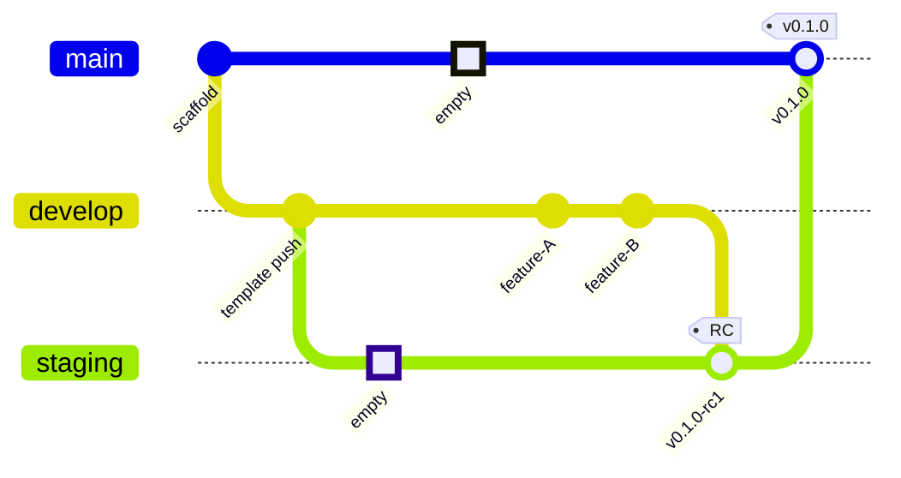

## CI Pipeline per Event

| Event | test | security | build | promote | release |
|---|---|---|---|---|---|
| push to `develop` | runs | runs | **builds dev-\* image** | — | — |
| PR to any branch | runs | runs | — | — | — |
| merge develop → staging | runs | runs | — | **crane re-tag → auto-RC** | — |
| push to `main` (no tag) | — | — | — | — | — |
| tag `v*` on main | runs | runs | — | **crane re-tag → semver** | **changelog + Gitea release** |
| hotfix on staging | runs | runs | **rebuilds → auto-RC (continues series)** | — | — |
| hotfix tag on main | runs | runs | **rebuilds → semver** | — | **changelog + Gitea release** |
| cherry-pick hotfix → staging | runs | runs | **rebuilds → auto-RC (continues series)** | — | — |
| cherry-pick hotfix → develop | runs | runs | **builds dev-\* image** | — | — |
| bot changelog `[skip ci]` | skip | skip | skip | skip | skip |
| scaffold (first push) | runs | runs | builds on develop | **skips gracefully** on staging | — |

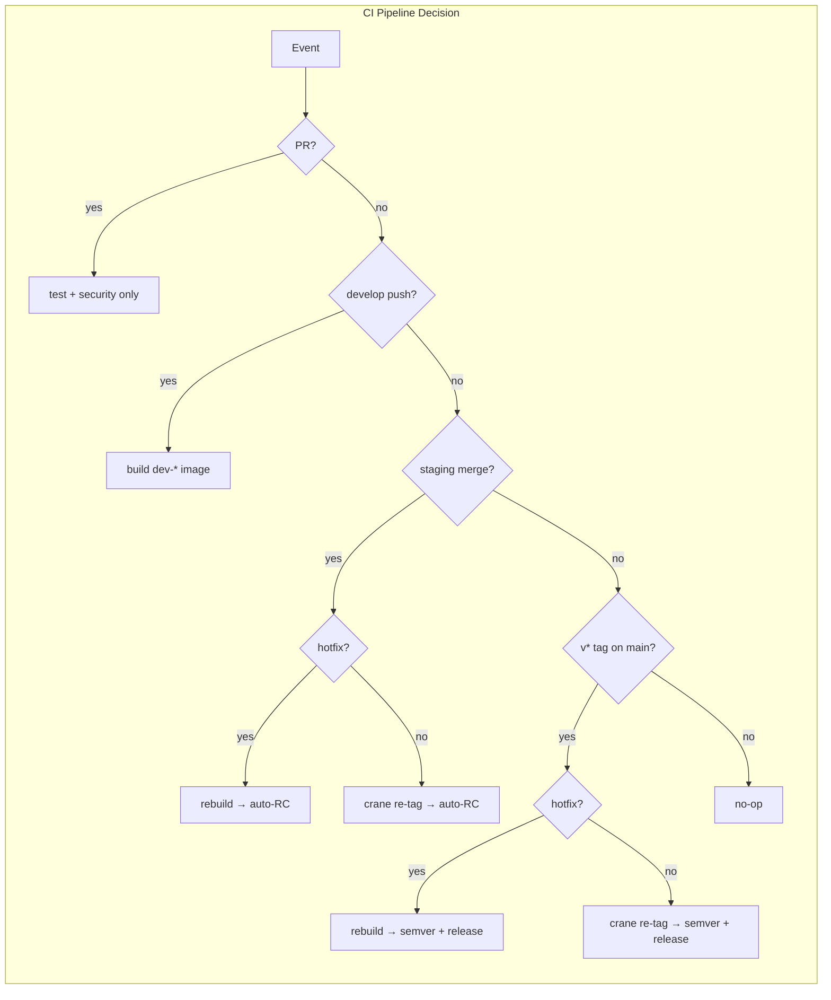

Key design decisions:
- **`main` is NOT in push triggers** — only `v*` tags trigger CI on main. This prevents double runs (push + tag) when promoting to production.
- **RC git tags are ignored** — if a `v*-rc*` git tag is created, the CI skips it (`mode=skip`). RC versions are image-only tags auto-assigned by the staging promote step. `make release` also rejects RC versions with a clear error.
- **Promote steps exit gracefully** when no source image exists (first scaffold, or out-of-order branch creation). They log `SKIP:` and exit 0, not fail.
- **PRs only run test + security** — the `build-and-push` job has `if: event_name == 'push' || event_name == 'create'`, so PRs never build or push images.
- **Hotfix detection** — the CI scans the latest commit message for `hotfix` or `hot-fix`. When detected on `staging`, it rebuilds with the next RC in the existing series (not a separate patch version) to avoid Image Updater semver conflicts.

## Git Workflows

### Feature

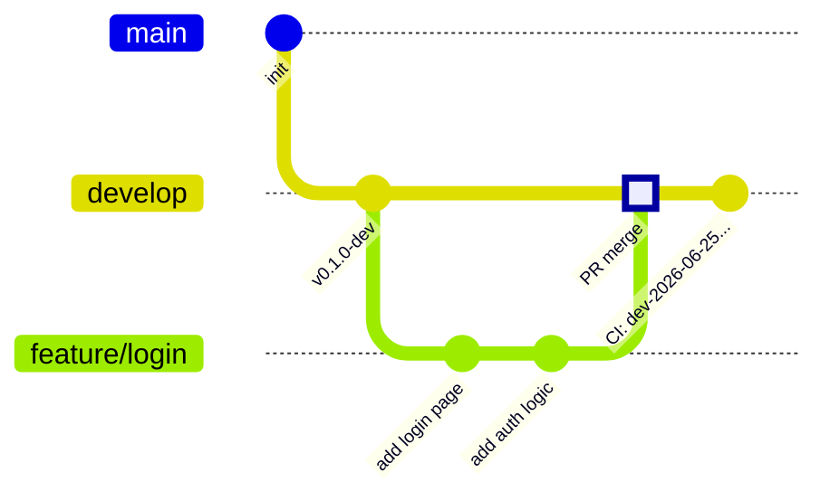

- Branch `feature/*`, `chore/*`, `ci/*`, `docs/*`, or `refactor/*` from `develop`
- Open PR to `develop`
- CI runs tests + security on the PR
- Merge triggers image build with `dev-*` tag

### Promotion

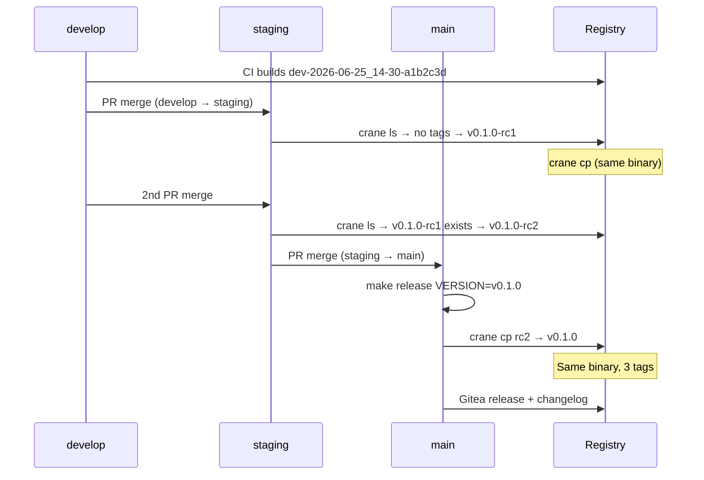

- Merge `develop → staging` via PR — CI auto-assigns the next RC version and crane re-tags the dev image
- Merge `staging → main` via PR, then `make release VERSION=vX.Y.Z` — crane re-tags the RC image as the semver
- Same binary flows through all three environments (no rebuild)

#### Auto-RC versioning (staging)

The CI automatically determines the next RC version on every merge to staging:

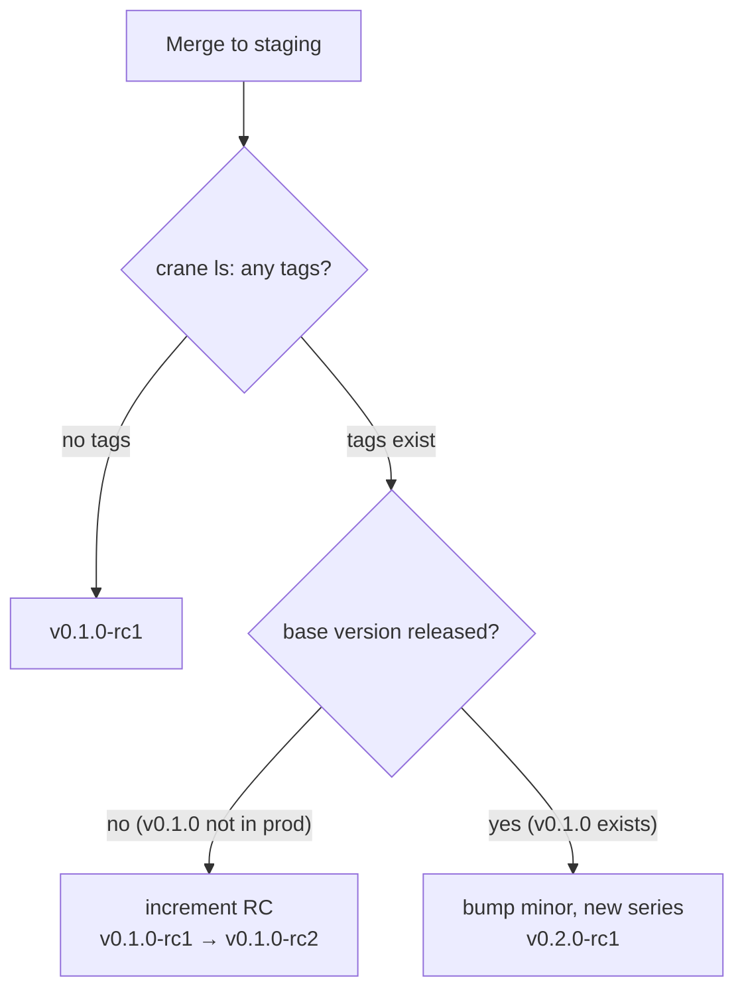

1. **No tags exist** → `v0.1.0-rc1`
2. **RCs exist, base version not yet released** → increment RC (`v0.1.0-rc2`, `v0.1.0-rc3`, ...)
3. **Base version already released to production** → bump minor, new series (`v0.2.0-rc1`)

The version is derived from image tags in the registry (via `crane ls`), not from git tags. Developers don't need to manually assign RC versions — the CI handles it.

### Hotfix (emergency — skip staging)

For critical production issues where staging validation is not feasible:

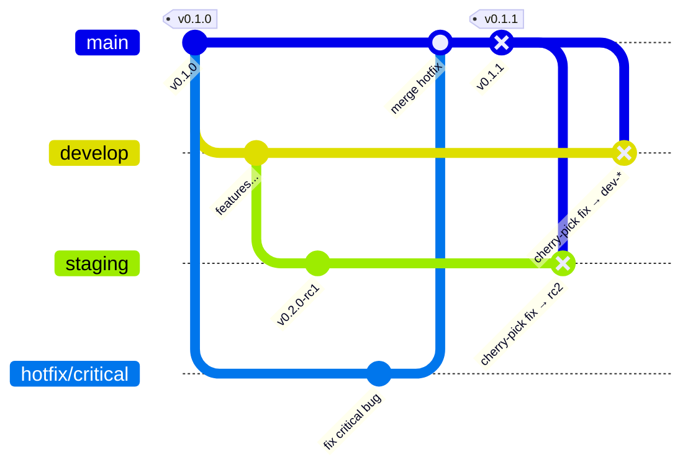

1. Branch `hotfix/*` from `main`
2. Fix, test locally
3. Merge to `main`, then `make release VERSION=v0.1.1`
4. CI detects hotfix on tag → **rebuilds** with `v0.1.1`, creates Gitea release
5. Cherry-pick the hotfix commit back to `staging` and `develop`:
   - **Staging**: commit message must include `hotfix` → CI **rebuilds** with next RC in existing series (e.g., `v0.2.0-rc2`), not a separate patch version — because staging now contains features + hotfix
   - **Develop**: normal push → CI builds a new `dev-*` image

### Hotfix (validated — through staging)

For important fixes that need staging validation before production:

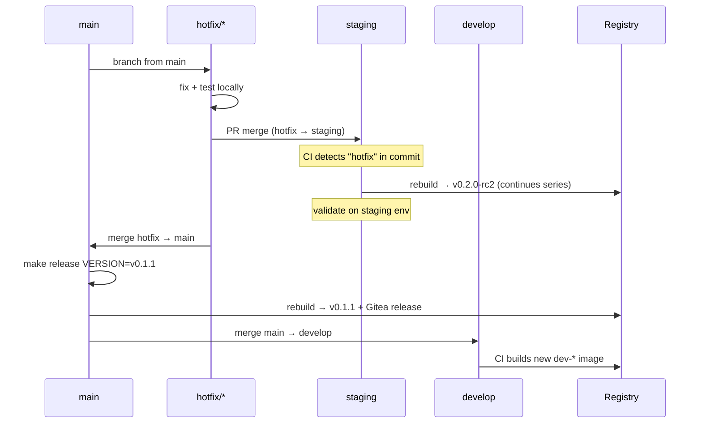

1. Branch `hotfix/*` from `main`
2. Open PR to `staging` — CI runs tests on the PR
3. Merge to `staging` — CI detects `hotfix` in commit, **rebuilds** with next RC in existing series
   - Staging has `v0.2.0-rc1` (features) → hotfix gets `v0.2.0-rc2` (continues series)
   - Image Updater deploys the new RC automatically
4. After validation, merge hotfix to `main`, then `make release VERSION=v0.1.1`
5. CI detects hotfix on tag → **rebuilds** with `v0.1.1`, creates Gitea release
6. Cherry-pick or merge `main` back to `develop`

#### Hotfix tagging logic

| Where | What happens | Tag |
|---|---|---|
| Staging (merge or cherry-pick) | **Rebuilds** — continues existing RC series | `v0.2.0-rc2` |
| Production (git tag) | **Rebuilds** — version from git tag | `v0.1.1` |
| Develop (cherry-pick) | **Builds** — normal dev image | `dev-*` |

Key rules:
- Hotfix on staging uses the **same auto-RC logic** as feature merges — no separate patch version. This prevents Image Updater conflicts (a patch-bumped RC would have lower semver than existing feature RCs).
- Hotfix on production always **rebuilds** (never re-tags) because the fix was not built on `develop`.
- The CI detects hotfixes by scanning the commit message for `hotfix` or `hot-fix`.
- The production version (`v0.1.1`) is chosen by the developer via `make release VERSION=v0.1.1` — it does not need to match the staging RC series.

### Partial Promotion

When only some features from `develop` should go to staging:

- Cherry-pick specific commits from `develop` onto `staging`
- CI re-tags the corresponding dev image as RC

### Rollback

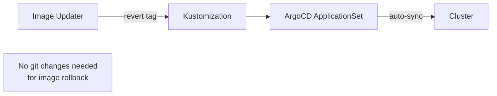

- Image Updater reverts the image tag on the target branch
- ApplicationSet auto-syncs the rollback
- No git changes needed for image rollback

## Branch Rules

| Rule | Detail |
|---|---|
| Feature branches | `feature/*`, `chore/*`, `ci/*`, `docs/*`, `refactor/*` — always from `develop` |
| Hotfix branches | `hotfix/*` — always from `main` |
| Who builds images | `develop` (all pushes) and hotfixes on `staging`/`main` (always rebuild) |
| Who promotes images | `staging` (normal merges) and `main` (tag) re-tag via crane (same binary, no rebuild) |
| Who creates releases | Only stable `v*` tags on `main` (no `-rc`) — RC git tags are ignored |
| Hotfix sync direction | After hotfix lands on main: merge main → staging, merge main → develop (never cherry-pick back) |
| Semver ownership | Only production gets semver git tags. Staging gets auto-assigned RC image tags (not git tags). Dev gets timestamped image tags. |

## Image Lifecycle

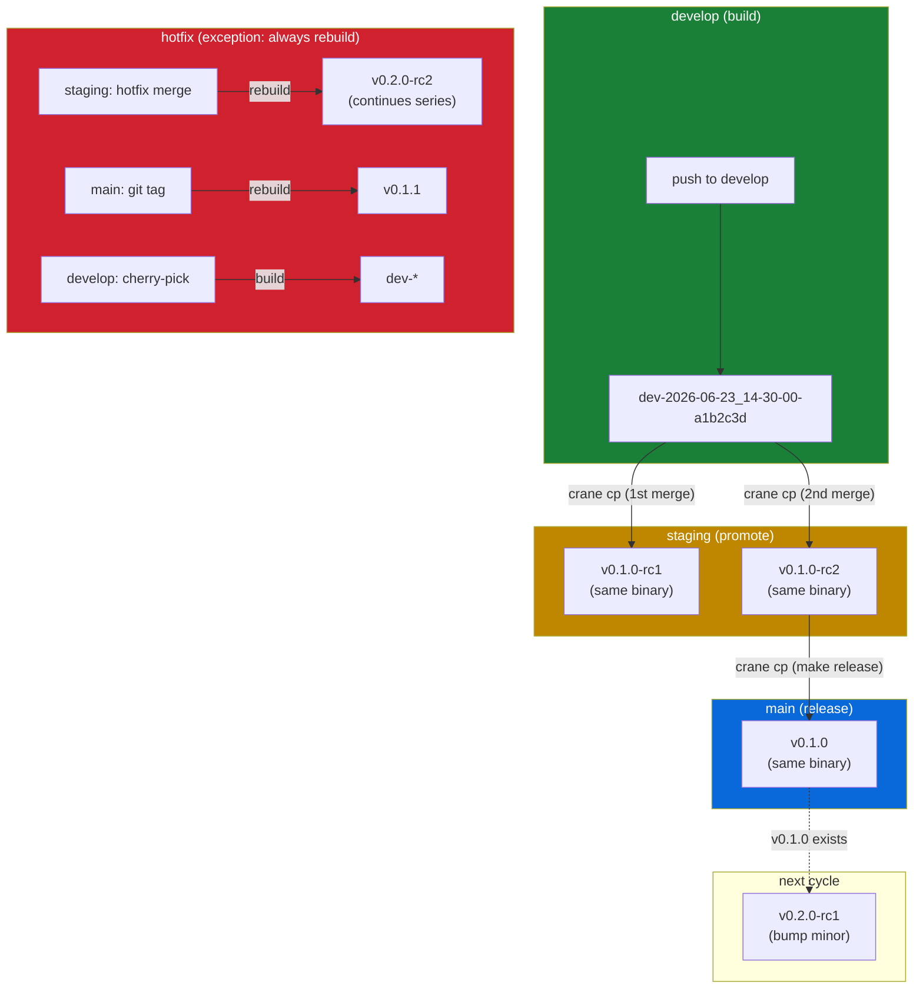

## Image Updater Tag Filtering

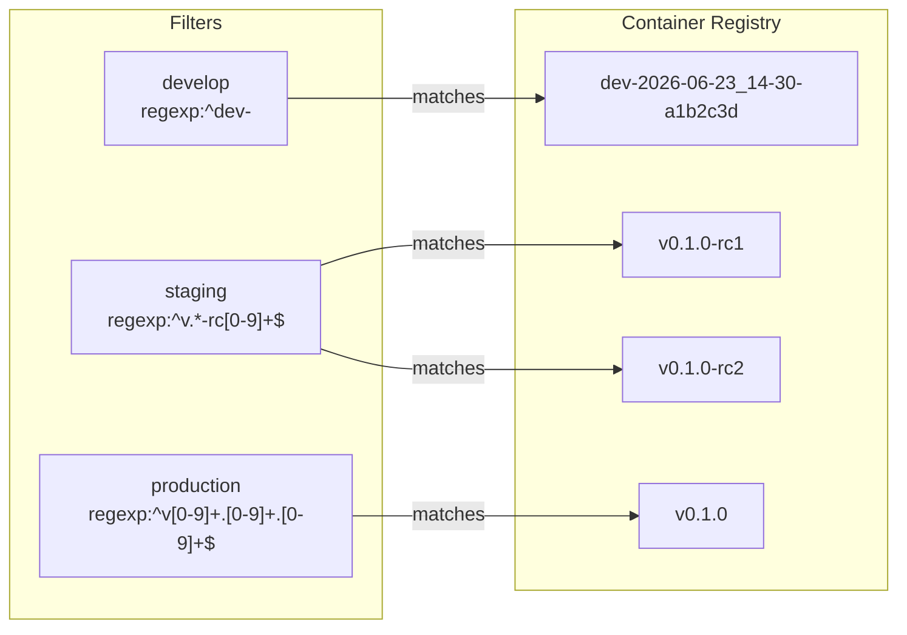

```yaml
# develop — accept only dev-* tags
argocd-image-updater.argoproj.io/app.allow-tags: regexp:^dev-

# staging — accept only RC tags
argocd-image-updater.argoproj.io/app.update-strategy: semver
argocd-image-updater.argoproj.io/app.allow-tags: regexp:^v[0-9]+\.[0-9]+\.[0-9]+-rc[0-9]+$

# production — accept only stable semver tags
argocd-image-updater.argoproj.io/app.update-strategy: semver
argocd-image-updater.argoproj.io/app.allow-tags: regexp:^v[0-9]+\.[0-9]+\.[0-9]+$
```

## Secrets Required per Scaffolded Repo

| Secret | Purpose |
|---|---|
| `REGISTRY_USERNAME` | Docker login to Gitea Packages |
| `REGISTRY_TOKEN` | Docker push + crane auth |
| `RELEASE_TOKEN` | Create Gitea release via `softprops/action-gh-release` |

## Release Notes

Release body is resolved in priority order:

1. `release-notes/<tag>.md` — hand-written notes for a specific version
2. `release-notes/template.md` — default template with `{{CLIFF_NOTES}}`, `{{VERSION}}`, `{{IMAGE}}` placeholders
3. Raw `git-cliff --current --strip all` output — fallback

The release job installs git-cliff via pip, regenerates `CHANGELOG.md`, commits with `[skip ci]`, then creates the Gitea release.

## Scaffold Integration

When the portal scaffolds a new project, it creates the repo with this branch structure:

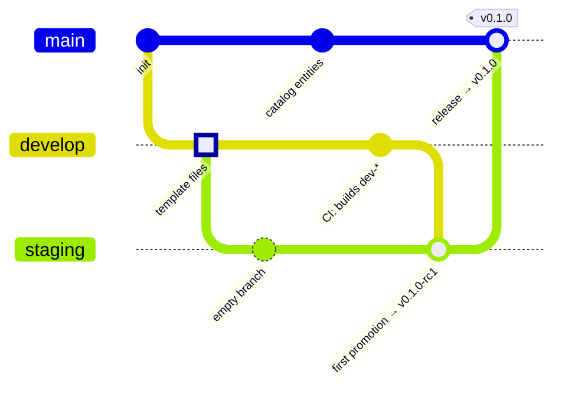

The portal creates branches in order: push template to `develop`, then create empty `staging` and `main` from it. Catalog entities (Component, System, Resources) are committed directly to `main`. Infrastructure manifests (XTenantApp, ExternalSecrets) go through a PR for platform review.

The first push to `develop` triggers CI to build the initial `dev-*` image. The promote step on `staging` and `main` skips gracefully (exit 0) since no source image exists yet. The team then follows the normal promotion flow:

1. Merge `develop → staging` (PR) — creates `v0.1.0-rc1`
2. Validate on staging environment
3. Merge `staging → main` (PR), tag `v0.1.0` — promotes to production, creates Gitea release
