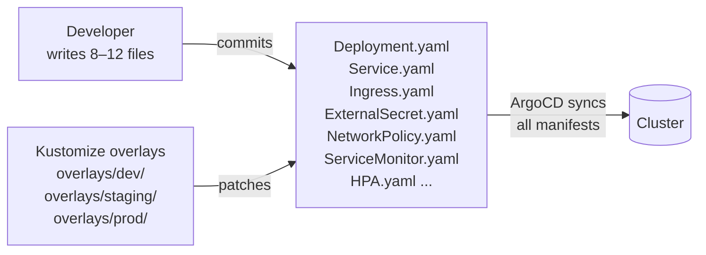
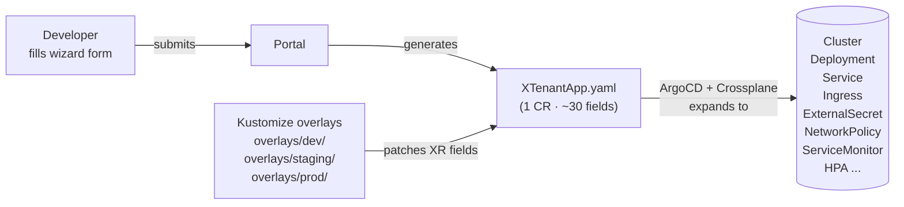

# Platform Engineering Rationale

> Why WxOps chose Crossplane + Portal + Golden Path over traditional GitOps,
> and why this model is the survival strategy for long-running projects
> in the AI era.

---

## The Problem We're Solving

Software teams face a paradox: AI makes building faster than ever, but the
systems we build are harder to understand than ever.

A developer with AI assistance can scaffold, implement, and ship a service
in one day. But three months later:

- The original developer moved to another project
- Two new team members joined who never saw the initial design
- The service has 15 dependencies nobody documented
- The CI pipeline was copy-pasted from another repo and nobody knows why
  half the steps exist
- Secrets are in Vault somewhere, but which path? Who has access?
- Is this service in staging? Production? Both? Neither?

The code exists. The understanding doesn't. **Knowledge decay is faster than
development speed.**

### What Dies Without a Platform

Without a golden path and a portal, every team reinvents:

| Concern | What happens | Cost |
|---------|-------------|------|
| Project structure | Every repo looks different | Onboarding takes weeks per service |
| CI/CD | Copy-paste from "that repo that works" | Pipelines drift, break silently |
| Secrets | Manual Vault setup, undocumented paths | Security incidents, access confusion |
| Monitoring | Some services have it, some don't | Blind spots in production |
| Documentation | Written once, never updated | Stale docs worse than no docs |
| Environment promotion | Ad-hoc scripts, manual deploys | "It works on my machine" at scale |
| Dependency tracking | Nobody knows what depends on what | Changes break unknown consumers |

A platform doesn't eliminate these problems. It makes them **someone's job**
(the platform team) instead of **everyone's problem** (every developer, everyA
sprint, every service).

---

## Two Architectures Compared

### Traditional GitOps (Kustomize + Raw Manifests)



### Crossplane + Portal (XR Abstraction)



---

## Tradeoff Analysis

### Complexity

| Dimension | Traditional GitOps | Crossplane + Portal |
|-----------|-------------------|-------------------|
| **What developers see** | 8-12 manifest files per service | 1 form in portal, 1 CR in git |
| **What platform team maintains** | Templates (scaffold output) | Compositions (platform logic) |
| **Where complexity lives** | Spread across every repo | Centralized in Compositions |
| **Debugging** | `kubectl get deployment` (familiar) | `kubectl get xtenantapp` (learning curve) |
| **Day-1 setup effort** | Low — write manifests | High — write Compositions |
| **Day-100 maintenance** | High — N repos × M manifests | Low — update 1 Composition |

**Verdict:** Crossplane front-loads complexity into the platform team's domain.
Traditional GitOps spreads it across every developer. For a small team building
a few services, traditional is simpler. For a platform serving many teams,
Crossplane scales better.

### Propagation

This is the critical differentiator.

| Scenario | Traditional GitOps | Crossplane |
|----------|-------------------|-----------|
| Change monitoring config | Update template → only new scaffolds get it | Update Composition → ALL services get it |
| Add security policy | Write NetworkPolicy → add to every repo | Add to Composition → every XR gets it automatically |
| Fix a Helm chart bug | Update chart → re-deploy each service | Fix Composition → Crossplane reconciles all |
| Enforce resource limits | PR to every service repo | Add defaulting to Composition |

Traditional: **template changes are forward-only.** Existing services stay
on the old template until someone manually updates them. With 50 services,
"update the monitoring config" means 50 PRs.

Crossplane: **Composition changes are retroactive.** Every existing XR
gets the updated behavior on the next reconciliation cycle. One change,
all services.

This matters more as the number of services grows:

```
Services:     5       20       50       100
              │        │        │         │
Traditional:  5 PRs    20 PRs   50 PRs   100 PRs  ← per platform change
Crossplane:   1 edit   1 edit   1 edit   1 edit   ← always
```

### Proximity (Developer Experience)

How close is the developer to the infrastructure?

```
                    Raw K8s          Kustomize         Crossplane + Portal
                    ──────────       ──────────        ─────────────────────

Developer sees:     All manifests    All manifests     A form + 1 CR
                    in full detail   with patches      with business fields

Developer knows:    Everything       Everything        "replicas: 3, vault: on"
                    (Deployment      (same, but        (no K8s details)
                    spec, probes,    patched per
                    tolerations...)  env)

When infra breaks:  Developer        Developer         Platform team
                    must fix it      must fix it       fixes Composition,
                                                       developer unaffected

Scaling from:       10 services      10 services       10 to 500 services
                    to 50: painful   to 50: painful    without developer
                                                       involvement
```

**Crossplane + Portal creates proximity to INTENT, not to INFRASTRUCTURE.**

The developer says: "I want a service with 3 replicas, vault secrets, and
an ingress." They don't say: "I want a Deployment with a readinessProbe
on /healthz with initialDelaySeconds 10 and a Service of type ClusterIP
on port 8080 with a..." That's the Composition's job.

### Cons of Crossplane

Crossplane is not free. Honest downsides:

| Con | Impact | Mitigation |
|-----|--------|-----------|
| **Learning curve** | Platform team must learn XR model, Compositions, Providers | Invest in one person deeply, document patterns |
| **Debugging is harder** | `kubectl describe xtenantapp` shows conditions, not the underlying Deployment | Portal shows XR status + managed resources |
| **Composition complexity** | Go-template-like patches in YAML, hard to test | Keep Compositions simple, one per use-case |
| **Provider maturity** | Not all infrastructure has a Crossplane provider | Use Compositions for what works, raw manifests for the rest |
| **Reconciliation lag** | Composition changes take seconds-to-minutes to propagate | Acceptable for platform changes (not hot-path) |
| **Single point of failure** | If Crossplane controller dies, no reconciliation | Standard K8s HA patterns (replicas, PDB) |

### Cons of Traditional GitOps (without Crossplane)

| Con | Impact | Mitigation |
|-----|--------|-----------|
| **Template drift** | Old services miss new platform improvements | Manual PRs per service (doesn't scale) |
| **Copy-paste culture** | Teams copy manifests they don't understand | Code review catches some, misses most |
| **No abstraction** | Every developer must understand K8s internals | Training, documentation (constant effort) |
| **Inconsistent standards** | Each repo implements monitoring/security differently | Linting, policy engines (OPA/Kyverno) |
| **Blast radius** | One bad template change affects only new services | Good for safety, bad for consistency |

---

## Why Golden Path Is the Survival Strategy

### The AI-Era Argument

AI changes the economics of software development:

```
Before AI:
  Writing code:      60% of time
  Understanding code: 20% of time
  Operations:        20% of time

After AI:
  Writing code:      10% of time  ← AI handles this
  Understanding code: 50% of time  ← THIS is the bottleneck
  Operations:        40% of time  ← more services = more ops
```

When writing code takes 10% of the time, teams ship 5-10x more services.
But each service needs CI/CD, monitoring, secrets, documentation, and
operational knowledge. Without a golden path, operational burden grows
linearly with the number of services. With a golden path, it grows
**logarithmically** — each new service reuses the same platform.

### What "Golden Path" Actually Means

It's not "one way to do everything." It's:

**A curated, automated, best-practice default that works out of the box —
with escape hatches for when you need them.**

```
Golden path provides:              Escape hatches allow:
────────────────────               ──────────────────────
Default project structure          Custom directory layout
Default CI/CD pipeline             Custom pipeline steps
Default monitoring setup           Custom metrics/dashboards
Default secret management          Custom vault paths
Default environment promotion      Custom approval workflows
Default documentation structure    Custom doc types

The portal enforces the path.      Git allows any deviation.
ArgoCD syncs whatever is in git.   Crossplane reconciles the XR.
```

Teams that follow the golden path get everything for free. Teams that
deviate own their deviations — but they start from a working baseline,
not from zero.

### Long-Running Project Survival

Projects die in three ways:

1. **Knowledge loss** — original team leaves, nobody knows how things work
2. **Technical debt** — shortcuts accumulate, maintenance becomes impossible
3. **Operational burden** — more services, same team size, everything breaks

The golden path + portal addresses all three:

| Risk | Golden Path Response |
|------|---------------------|
| Knowledge loss | Portal IS the documentation. RFC/ADR capture WHY. Catalog captures WHAT. Activity captures WHO/WHEN. |
| Technical debt | Templates encode best practices. Composition updates propagate fixes to all services retroactively. |
| Operational burden | One CI/CD pipeline, one monitoring setup, one secret pattern. Add a service in minutes, not days. |

### The Framework Argument

WxOps Portal is not a product with fixed features. It's a **framework**:

```
Framework pieces:                   What they enable:
─────────────────                   ─────────────────
Template system                     Any language, any framework, any runtime
Crossplane Compositions             Any infrastructure pattern
Pinniped auth                       Any number of clusters
Catalog entity model                Any service topology
Lifecycle state machine             Any promotion workflow
Documentation strategy              Any decision-tracking process
```

Each piece is independently useful and composable. The portal ties them
together into a coherent developer experience. But the pieces can evolve
independently:

- Change the Go template without touching the portal code
- Update a Composition without touching any template
- Add a cluster without touching anything except Pinniped config
- Add an entity kind without changing the catalog store

This is what makes it a **platform**, not a tool. Tools solve one problem.
Platforms solve classes of problems.

---

## Proving the Model

### What Needs to Be True for MVP

The platform justifies itself when ONE developer can:

1. Open the portal
2. Scaffold a service (3 minutes)
3. Push code (AI-assisted, 1 hour)
4. See CI pass (automatic)
5. See the service running in dev (ArgoCD auto-sync)
6. See it in the catalog with docs, status, dependencies (automatic)

If this works end-to-end with zero manual YAML, zero Slack questions, and
zero "ask Bob how to set up the pipeline" — the platform is proven.

### What Proves Crossplane Specifically

Crossplane justifies itself when the platform team can:

1. Change the monitoring sidecar version in ONE Composition
2. Every running service picks up the change automatically
3. No PRs, no developer action, no deployment

If this works, Crossplane is worth the complexity. If every change still
requires per-service PRs, Crossplane is just an extra layer.

### What Proves the Portal Specifically

The portal justifies itself when a new team member can:

1. Join on day 2
2. Open the portal
3. Understand what every service does, who owns it, what it depends on
4. See the full history of decisions and changes
5. Start contributing without a single catch-up meeting

If this works, the portal is worth the development effort. If developers
still ask in Slack "where is the config for X?" — the portal hasn't
replaced tribal knowledge yet.

### Incremental Proof (recommended order)

```
Step 1: One template that works perfectly
        Prove: scaffold → CI → deploy → observe

Step 2: One real team using it daily
        Prove: golden path saves time vs. manual setup

Step 3: One Composition update that propagates
        Prove: Crossplane's retroactive value

Step 4: One new team member onboards via portal
        Prove: context transfer without meetings

Step 5: Per-environment promotion via lifecycle
        Prove: enterprise readiness

Step 6: ArgoCD + Pinniped status in portal
        Prove: full visibility without cluster access
```

Each step proves value before the next one adds complexity.

---

## Platform as a Service in the AI Infrastructure Era

### The Shift

Traditional DevOps (2015-2022): "You build it, you run it."
Every team owns their infrastructure. Works with 5 services, collapses
at 50.

Platform Engineering (2022+): "You build it, the platform runs it."
A dedicated team provides the golden path. Developers focus on business
logic. The platform handles everything between "git push" and "running
in production."

AI-Assisted Development (2024+): "AI builds it, you guide it, the
platform runs it."
Development speed increases 5-10x. The number of services explodes.
Without a platform, operational burden explodes with it. The golden path
is no longer a nice-to-have — **it's the only way to scale.**

### Why This Matters for Business

```
Without platform:                    With platform:
─────────────────                    ──────────────
Each service: 2 weeks setup          Each service: 3 minutes scaffold
Each service: custom CI/CD           Each service: standard pipeline
Each service: unique monitoring      Each service: built-in observability
Each service: manual secrets         Each service: automated vault
New team member: 2 week onboarding   New team member: open portal, start coding
Platform change: N PRs               Platform change: 1 Composition update

Cost at 10 services:   ~same         Cost at 10 services:   ~same
Cost at 50 services:   5x ops team   Cost at 50 services:   same ops team
Cost at 100 services:  impossible    Cost at 100 services:  same ops team
```

The platform is an investment that **amortizes**. The first service is
more expensive than doing it manually. The tenth service is cheaper. The
fiftieth is free. The hundredth is impossible without it.

### What WxOps Brings to This Model

| Layer | WxOps Component | Alternative | WxOps Advantage |
|-------|----------------|-------------|-----------------|
| Developer Interface | Portal (Next.js + Go) | Backstage, Port, Cortex | Lightweight, K8s-native, no plugin ecosystem to maintain |
| Abstraction | Crossplane XRs | Helm charts, Operators | Retroactive propagation, declarative, K8s-native |
| Auth | Pinniped | OIDC proxy, Dex alone | One token for portal + all clusters, RBAC-scoped |
| GitOps | ArgoCD + ApplicationSet | Flux, Jenkins | Per-environment Applications from git structure |
| Secrets | Vault + ExternalSecrets | SOPS, Sealed Secrets | Write-only from portal, rotation handled by operator |
| CI/CD | Gitea Actions | GitHub Actions, GitLab CI | Self-hosted, same platform, no external dependency |
| Catalog | Backstage-compatible YAML | Backstage catalog, custom DB | No catalog server, git is the database |

The differentiator is **integration density**. Each component is standard
and replaceable, but they're wired together through the portal so the
developer sees one coherent experience, not seven tools.

---

## Summary

| Question | Answer |
|----------|--------|
| Is Crossplane + Kustomize redundant? | No — Kustomize varies config per env, Crossplane abstracts what config means |
| Is the portal over-engineering? | No — developers see a form, not infrastructure. Complexity is hidden. |
| Is the golden path restrictive? | No — it's a default with escape hatches. Follow it for free, deviate when needed. |
| Is this too much for a small team? | Start with one template, one team, prove value, then scale. |
| Why not just use Backstage? | Backstage requires plugins, a catalog server, and doesn't have K8s-native auth. WxOps is lighter and uses Pinniped for everything. |
| What's the business case? | First service costs more. Tenth costs less. Fiftieth is free. Hundredth is impossible without it. |
| What proves it works? | One developer scaffolds, ships, and a new member understands it next day — without Slack. |
