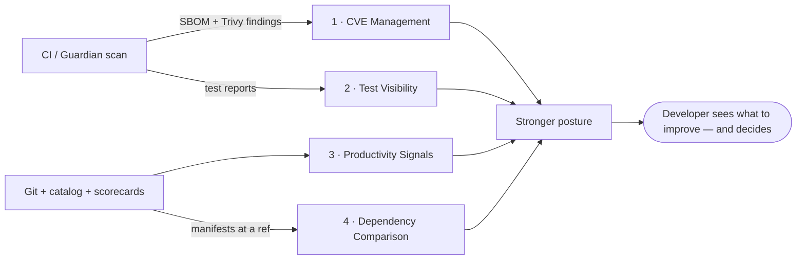

# DevEx Integrations — CVE, Tests, Productivity Signals, Dependency Comparison

> **Status:** Dev-ready spec. Extends [enterprise-roadmap.md](enterprise-roadmap.md)
> Track B (Security & Supply Chain) and Track C (Governance & Scorecards) with four
> concrete developer-experience features.
> **Invariant preserved throughout:** the portal stays a
> [passive reflector](../security/security-assurance.md) — read-only to clusters,
> advisory, human-gated. These features add *visibility and suggestion*, never new power.

Four integrations, one thread: **turn signals the platform already produces (or can
cheaply produce) into developer-facing feedback that improves security posture, quality,
and flow — without the portal taking any action a human did not approve.**



---

## 1. CVE Management — scan → issue → suggested patch

*Extends Track B. Builds on the SBOM index and Guardian's `guardian-scan`.*

### Problem

Vulnerabilities are found in CI logs nobody reads, or in a security tool a different team
owns. The developer who can fix it never sees it in the flow where they work. The gap is
not detection — it is **routing the finding to the owner with a concrete next step.**

### Design

```
Trivy (CI step or Guardian scan sidecar)
  → findings artifact (per image / per dependency manifest)
Portal internal/cve/  → ingest (read-only, TTL cache like SBOM/catalog)
  → surface on the Component page: findings by severity, fixed-in version
  → [Open fix issue]  → creates a Gitea issue on the project repo (RBAC-gated)
  → [Suggest patch]   → proposes the exact version bump (from fixed-in + SBOM)
```

Three deliberately-bounded capabilities:

1. **Surface** — a CVE panel on the Component detail page: package, severity,
   `installed → fixed-in`, and whether the finding is *new* (introduced since the last
   green baseline) vs. inherited from the base image. New findings are what matter.
2. **Open a fix issue** — one click creates a **Gitea issue on the project repo** with
   the finding, the fixed-in version, and a link back to the entity. This is a *project-repo*
   write (the same Gitea-write capability the portal already uses for scaffold PRs and
   labels) — **not** a cluster write, and RBAC-gated to the owning team.
3. **Suggest the patch** — compute the minimal version bump that clears the finding
   (`fixed-in` ∧ SBOM current version) and render it as a copy-paste manifest diff
   (`go.mod` / `package.json` / `requirements.txt`). The developer applies it in a PR.
   **The portal never applies it** — suggestion, not action.

### Portal surface

```
internal/cve/                 NEW — Trivy/Grype findings parser + in-memory index (mirrors internal/sbom/)
internal/handlers/security.go  + CVE panel data + issue creation
internal/gitea/                + CreateIssue(owner, repo, title, body) — project-repo issue
```

```
GET  /api/v1/catalog/entities/:kind/:name/cve            findings for a component
POST /api/v1/catalog/entities/:kind/:name/cve/:id/issue  open a fix issue (RBAC-gated)
GET  /api/v1/catalog/entities/:kind/:name/cve/:id/patch  suggested version-bump diff
```

### Acceptance criteria

- [ ] Findings are read-only ingest with the SBOM/catalog TTL model; no CVE DB bundled —
      severity/fixed-in come from the scanner output (Trivy already resolves advisories).
- [ ] "New since baseline" is distinguished from inherited base-image findings.
- [ ] Issue creation is RBAC-gated to the owning team and writes only to the **project
      repo**, never gitops-infra, never a cluster.
- [ ] Patch suggestion is a rendered diff the developer applies via PR — the portal
      performs no code write.
- [ ] Absence of a scan artifact shows "not scanned", never an error.

**CI prerequisite:** a `trivy` step in `wxops-templates` emitting a findings artifact
(pairs with the SBOM `syft` step). **Effort:** M.

---

## 2. Test Visibility — developers own testing; the portal can showcase it

*Extends Track C. Read-only ingest; opt-in.*

### Problem & stance

Testing is, and stays, the **developer's responsibility** — it runs in CI, not the
portal. But test *results* are currently invisible outside the CI logs. If a team wants
to, the portal should let them **surface results as evidence** — a quality signal on the
entity, and material for case studies ("this service ships with 87% coverage and a green
suite"). Opt-in, never mandated, never a gate.

### Design

Read a test-report artifact (JUnit XML / coverage summary) from the CI run or Gitea
release — the same way CI/release cards already read Gitea Actions data. Render a compact
**Test panel** on the Component page: pass/fail counts, suite duration, coverage %, trend
over the last N runs. Nothing is computed by the portal; it displays what CI produced.

Opt-in via an annotation so teams choose visibility:

```yaml
metadata:
  annotations:
    wxops.cloud/test-report: junit          # junit | coverage | both | (absent = hidden)
```

Teams that opt in can also mark a run as a **case study** — a curated, shareable snapshot
(green suite + coverage + a note) that appears on the System page as evidence of maturity.

### Portal surface

```
internal/testreport/          NEW — JUnit/coverage parser (read-only, from CI artifacts)
internal/handlers/catalog.go   + GetEntityTests
```

```
GET /api/v1/catalog/entities/:kind/:name/tests    latest results + trend (opt-in)
```

### Acceptance criteria

- [ ] Fully opt-in via annotation; absent annotation → no panel, no nudge.
- [ ] Read-only ingest of CI-produced artifacts; the portal never runs or requires tests.
- [ ] Never a promotion gate — it is evidence, not enforcement. (A team *may* choose to
      feed it into their scorecard weighting under Track C, but the portal does not force it.)
- [ ] Case-study snapshots are curated by the team, not auto-published.

**Effort:** S–M (one parser + one panel), gated on CI emitting a report artifact.

---

## 3. Productivity Signals — a support tool, not a surveillance tool

*Extends Track C (DORA-lite + scorecards) with a developer/team lens.*

### The stance comes first (this one is easy to get wrong)

Developer "productivity metrics" can quietly become surveillance. That would betray the
platform's philosophy — *"W'xOps supports; the decision is yours."* So the design is
constrained by an explicit ethic **before** any feature:

| We measure | We do **not** measure |
|---|---|
| **Team / service** outcomes | **Individual** output or rankings |
| Flow health (lead time, deploy frequency, MTTR) | Lines of code, commit counts, hours, keystrokes |
| Posture & quality (scorecard, CVE burn-down, test trend) | Anything usable to stack-rank or discipline a person |
| Signals a team uses to **improve its own product** | Signals a manager uses as a **stick** |

The audience is the **team improving its own service**, not a manager evaluating a person.
No leaderboards. No individual attribution. If a metric can't help a team make their
product better, it doesn't belong here.

### Design

A **Team Health** view (on the Group page) and a per-service contribution to it,
composed entirely from data Track C already computes — no new collection, no new
tracking:

| Dimension | Signal | Source |
|---|---|---|
| **Flow** | Deployment frequency, lead time (PR open → prod tag), MTTR | DORA-lite (Track C) |
| **Quality** | Production-readiness scorecard, test trend (opt-in, §2) | Scorecard + test panel |
| **Security hardening** | Open CVE count + burn-down over time, posture score | CVE index (§1) + compliance posture |
| **Product maturity** | Catalog completeness, docs/runbook coverage, deprecations resolved | Catalog graph |

Rendered as a small set of **trends** (is it getting better?) rather than absolute
scores to rank against. The framing is always "here's where this team's *product* can
improve," never "here's how this team compares to that one."

### Portal surface

```
internal/scorecard/           EXTEND (Track C) — team-health aggregation over flow/quality/security/maturity
internal/handlers/catalog.go   + GetTeamHealth
```

```
GET /api/v1/catalog/groups/:team/health    team-health trends (team/service scope only)
```

### Acceptance criteria

- [ ] **No individual-level data anywhere** — scope is team/service; no per-person view exists.
- [ ] Composed from existing Track C / §1 / §2 signals — no new collection or tracking.
- [ ] Presented as trends and improvement prompts, not comparative rankings.
- [ ] A team can see its own health; cross-team comparison/leaderboards are out of scope.
- [ ] Nothing here gates promotion or is used punitively — it is a mirror for the team,
      by design.

**Effort:** M (aggregation + one view), gated on Track C scorecards + §1/§2.

---

## 4. Dependency Comparison — instant render, diff against a release

*Portal-only. No new data source, no CI prerequisite. Pairs with §1 — the same
manifests CVE findings attach to.*

### Problem

Two separate complaints, one cause.

**It renders slowly for data that barely moves.** `PackagesCard` is
`"use client"` + `useEffect`, so it shows a spinner on every visit.
`GetEntityPackages` (`internal/handlers/catalog.go`) has **no cache**, and
`DiscoverPackages` probes four known filenames in the repo root *and* in every
non-skipped subdirectory — up to `4 × (1 + N)` Gitea file reads per page view.
Dependency manifests change when someone merges a bump, perhaps weekly. The
portal re-derives them on every page load.

**You cannot ask what changed between releases.** `GetRepoFile` takes no `ref`
and always reads the default branch, so "which dependencies moved since v0.4.1?"
has no answer in the portal — the developer goes to Gitea and reads two `go.mod`
files side by side.

### Design

Four changes, in dependency order:

1. **Thread a `ref` through the read path.** `GetRepoFile` and `DiscoverPackages`
   take an optional ref; empty keeps today's default-branch behaviour. The
   `?ref=` query parameter is already used elsewhere in `internal/gitea/write.go`,
   so this follows an established pattern rather than inventing one.

2. **Cache by `owner/repo@ref`, with two TTLs.** A tag is immutable — `v0.4.1`
   resolves to the same tree forever — so it can be cached aggressively. The
   default branch moves and gets a short TTL. This distinction is the whole
   performance win: a compare against a release is a cache hit on the second
   request and every request after.

3. **Diff in Go, not in the browser.** `DiffManifests(base, head)` is a pure
   function over two `[]PackageManifest` — no I/O, trivially unit-testable, and
   it keeps the browser to one round-trip instead of two. It also avoids shipping
   two full 200-package manifests to the client to diff there.

4. **Server-render the default view; keep compare client-side.** The Component
   detail page is already a server component, so the initial manifests can be
   fetched during render and passed as props — the card paints with data instead
   of a spinner. Wrap it in `<Suspense>` so a cold cache streams rather than
   blocks, matching the dashboard treatment in v0.5.0. The compare dropdown stays
   a client component talking to the diff endpoint.

**Compare scope:** current default branch vs **one** selected release, chosen
from `ListReleases` (which already exists and backs the Releases card). Not
arbitrary pairs — "what changed since we shipped?" is the question people
actually ask, and one dropdown is a far lighter control than two.

**The diff shows only what changed** — added, removed, version-bumped — with
unchanged packages reduced to a count. A Go service carrying 200 indirect
dependencies produces three interesting rows; listing the other 197 buries them.

### Portal surface

```
internal/gitea/write.go       GetRepoFile(ctx, owner, repo, path, ref)     + ref
internal/gitea/packages.go    DiscoverPackages(ctx, c, owner, repo, ref)   + ref
internal/gitea/packages.go    DiffManifests(base, head) []ManifestDiff     NEW — pure, tested
internal/handlers/catalog.go  GetEntityPackages                            + ?ref=, + cache
internal/handlers/catalog.go  GetEntityPackageDiff                         NEW
```

```
GET /api/v1/catalog/entities/:kind/:name/packages?ref=v0.4.1
GET /api/v1/catalog/entities/:kind/:name/packages/diff?base=v0.4.1
```

```json
{
  "base": "v0.4.1",
  "head": "main",
  "manifests": [{
    "ecosystem": "go",
    "file": "go.mod",
    "unchanged": 197,
    "changes": [
      { "name": "github.com/gin-gonic/gin",     "status": "added",   "to": "1.10.0" },
      { "name": "github.com/coreos/go-oidc/v3", "status": "changed", "from": "3.11.0", "to": "3.12.0" },
      { "name": "old-lib/x",                    "status": "removed", "from": "2.1.0" }
    ]
  }]
}
```

### Acceptance criteria

- [ ] **`ref` is validated before it reaches a Gitea URL.** It is user-supplied
      and gets interpolated into an API path, so it must be constrained to a safe
      charset (or to the set `ListReleases` returned) — the same treatment
      `SafeReturnPath` applies to `return_to`. A ref containing `../` or a query
      separator must be rejected, not escaped-and-hoped.
- [ ] Tag reads and default-branch reads use **different TTLs**; a tag is
      immutable and must not be re-fetched on every compare.
- [ ] The card renders with data on first paint — no spinner on a warm cache.
- [ ] Omitting `ref` returns exactly today's behaviour, so existing callers and
      the BFF route are unaffected.
- [ ] `DiffManifests` has unit tests covering added / removed / changed / renamed
      files and an empty base (a release predating the manifest).
- [ ] A repo with no releases hides the compare control rather than erroring.
- [ ] A manifest that exists on one side only is reported as wholly added or
      removed, not silently skipped.
- [ ] Still read-only: no new write path, no new egress destination.

**Effort:** S–M. No CI prerequisite and no new dependency — the slowest part is
already-existing Gitea reads, which this makes cheaper rather than more
expensive.

---

## How these strengthen the security story

All four *increase security and quality visibility while adding zero portal power* —
which is exactly the [passive-reflector](../security/security-assurance.md) posture:

- CVE management **routes** findings and **suggests** fixes; the developer applies them
  via PR. The portal opens a project-repo issue at most — no cluster write, no auto-patch.
- Test visibility **displays** CI output; it never runs or requires anything.
- Productivity signals **mirror** existing data back to the team; they collect nothing new.
- Dependency comparison **reads** manifests already in Git at two refs and subtracts one
  from the other; it adds no data source and makes the existing reads cheaper.

Each is read-mostly, advisory, human-gated, and RBAC-scoped — so none of them widens the
blast radius the assurance doc defends.

---

## Reference

- [enterprise-roadmap.md](enterprise-roadmap.md) — Track B (SBOM/CVE) and Track C (scorecards/DORA) these extend
- [../security/security-assurance.md](../security/security-assurance.md) — the passive-reflector posture these preserve
- `wxops-core/docs/guardian.md` — `guardian-scan` (Trivy/Semgrep) as an alternative findings source to CI
- [system-intelligence.md](system-intelligence.md) — where CVE + test + posture signals feed agent diagnosis later
