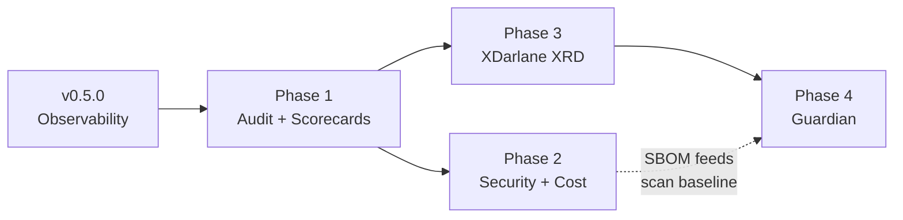

# Enterprise Adoption & Platform Evolution — Development Spec

> **Status:** Design / dev-ready spec. Nothing here is implemented yet.
> **Scope:** Portal (`wxops-portal-v2`) + cross-references into `wxops-core`
> (Crossplane packages) and `wxops-gitops-infrastructure`.
> **Audience:** Platform engineers scoping the enterprise track (unscheduled; begins after v0.6.0).

This document turns the scattered "Backlog — Enterprise & Intelligence" items in
[ROADMAP.md](../../ROADMAP.md) into development-ready specifications, and folds in the
two features that make the platform *enterprise-defensible*: promoting **Darlane** to
a first-class `XDarlane` XRD and layering **Guardian** (scan / audit / AI review) on
top of it.

---

## 0. The thesis — statelessness is the enterprise moat

The portal's defining constraints are usually framed as engineering discipline:

- **No database** — catalog source of truth is Git (Gitea); sessions are stateless AES-GCM cookies
- **No cluster writes** — every config change is a reviewed Gitea PR reconciled by ArgoCD
- **Vault create/update only** — never reads back, never deletes
- **RBAC is Pinniped/K8s-native** — no parallel permission system

For enterprise procurement these are the **product's strongest selling point**, because
the hardest requirements in an enterprise security review are already satisfied
*structurally*:

| Enterprise requirement | Usually the hardest part | Already true here because… |
|---|---|---|
| Immutable audit of config changes | Building a tamper-evident log | Every change is a signed Git commit + reviewed PR |
| Least-privilege / blast-radius limits | Proving the tool can't do damage | Portal is structurally read-only to clusters; can't read/delete secrets |
| No parallel authz to audit | Reconciling two RBAC systems | Authz is K8s RBAC via Pinniped — one system |
| Data residency / no exfiltration | Proving no data leaves the boundary | Portal holds no data; Guardian's AI runs in-cluster only |

**Design rule for every feature below: preserve statelessness.** The moment we add a
stateful audit DB or a secrets cache, we forfeit the thing that makes the security
review easy. Where a feature *seems* to need persistence, the answer is one of:
(1) emit structured events to the cluster's existing log/SIEM pipeline, (2) derive the
fact from Git history, or (3) compute it on demand over the already-cached catalog.

---

## 1. Release framing

> **Phases, not version numbers.** Everything below is unscheduled backlog,
> gated on OSS adoption and real user demand rather than a date. Pinning these
> to exact releases has already caused two renumbering passes as near-term
> plans shifted, so the phases carry no version label. They begin after the
> shipped and planned work in [ROADMAP.md](../../ROADMAP.md) — currently
> v0.5.0 (Runtime Observability, shipped), v0.5.1 (Observability Completion),
> v0.6.0 (Refactor & OSS Readiness). Nothing is versioned beyond that.

| Phase | Theme | Contents |
|---|---|---|
| **Prerequisite** | Runtime Observability *(shipped, v0.5.0)* | ArgoCD/Crossplane status via Pinniped, Alertmanager, LGTM deep links. Prerequisite for Track C scorecards. |
| **Phase 1** | **Enterprise: Governance & Trust** | Track A (Audit & Compliance) + Track C (Governance & Scorecards). These ship together — scorecards *consume* the compliance signals. |
| **Phase 2** | **Enterprise: Security & Cost** | Track B (Security & Supply Chain) + Track D (Cost / FinOps). Both are read-only ingest of external signals (SBOM, metrics). |
| **Phase 3** | **`XDarlane` XRD** | Promote Darlane from a `tenant-app` field to a standalone XRD. Portal manages multi-session workspace claims via GitOps. |
| **Phase 4** | **Guardian** | Scan / audit / AI-review sidecars on `XDarlane`. Portal surfaces findings. Depends on Phase 3. |

The ordering is dependency-driven, not preference-driven:



---

## 2. Track A — Audit & Compliance (SOC2)

**Roadmap items absorbed:** Audit trail (SOC2-ready), Compliance status (Vault policy
coverage, RBAC audit, pod security per namespace).

### 2.1 Problem

Two clicks in the portal — "Promote to staging", "Enable Darlane" — produce a Gitea PR
(attributable, reviewable). But three gaps remain for an auditor:

1. **Actor + intent at click-time** is not captured as a first-class event (only the
   resulting commit is, and its author may be the portal service account, not the human).
2. **Read/access events** (who viewed which secret-bearing entity, who downloaded a
   kubeconfig) are not recorded at all.
3. **Approval chain** (who reviewed and merged the gating PR) is not surfaced back in
   the portal next to the action.

### 2.2 Design — stateless audit

Introduce a new backend package `internal/audit/` exposing an `Emit(ctx, Event)` call.
Every **mutating** handler and every **sensitive read** calls it. Events are written as
**structured JSON to stdout** — captured by the cluster's existing Loki/enterprise SIEM
pipeline. No database, no portal-side retention.

```go
// internal/audit/event.go
type Event struct {
    Time     time.Time         `json:"time"`
    Actor    string            `json:"actor"`      // session username (Gitea login)
    Groups   []string          `json:"groups"`     // Pinniped groups at action time
    Action   string            `json:"action"`     // "promote", "scaffold", "darlane.enable", "kubeconfig.download", …
    Kind     string            `json:"kind"`       // "Component", "Cluster", "Secret", …
    Target   string            `json:"target"`     // entity name / cluster id
    Env      string            `json:"env,omitempty"`
    Result   string            `json:"result"`     // "ok" | "denied" | "error"
    Reason   string            `json:"reason,omitempty"` // denial reason / error class
    PRNumber int               `json:"prNumber,omitempty"` // gitops-infra PR when applicable
    TraceID  string            `json:"traceId"`    // request id for correlation
}
```

Wire it as Gin middleware for automatic coverage of the mutating routes, plus explicit
`audit.Emit` calls in the sensitive-read handlers (`GetKubeconfig`, `GetEntitySpec` for
Vault-annotated entities).

**Approval chain** is *derived*, not stored: when the portal shows an action in the
Activity feed, it fetches the merging PR's reviewers from the Gitea API
(`GET /repos/{owner}/{repo}/pulls/{n}/reviews`) and renders them as the approval chain.
The gitops-infra URL stays hidden (per the security model) — only reviewer usernames and
approval timestamps are surfaced.

### 2.3 Compliance posture panel

A read-only "Compliance" tab on the **Cluster** view and a per-namespace roll-up,
computed live via the user's Pinniped-scoped K8s credentials (never a portal service
account — the user only sees what their RBAC allows):

| Signal | Source | Read path |
|---|---|---|
| RBAC audit | `RoleBinding`/`ClusterRoleBinding` subjects in `tenant-{org}` | K8s API via Pinniped |
| Pod security | `pod-security.kubernetes.io/*` namespace labels + running pod `securityContext` | K8s API via Pinniped |
| Vault policy coverage | Which entities have a `wxops.cloud/vault-path` and a matching `ExternalSecret` | Catalog + K8s `ExternalSecret` status |
| Network policy coverage | Presence of the Kyverno-generated `NetworkPolicy` per namespace | K8s API via Pinniped |

This is **surfacing**, not enforcement. Enforcement stays in Kyverno on the cluster.

### 2.4 Backend surface

```
internal/audit/            NEW — Event type, Emit(), Gin middleware
internal/handlers/audit.go NEW — GET /compliance/:clusterId (posture roll-up)
internal/handlers/catalog.go   + emit on promote/deprecate/darlane/secrets
internal/handlers/clusters.go  + emit on kubeconfig download
internal/gitea/                + PullReviews(owner, repo, n) for approval chain
```

New routes under the existing `api := router.Group("/api/v1")` group (`server.go:181`):

```
GET  /api/v1/compliance/:clusterId              posture roll-up (Pinniped-scoped)
GET  /api/v1/catalog/entities/:kind/:name/approval-chain   PR reviewers for last gating action
```

### 2.5 Constraints & acceptance criteria

- [ ] **No new persistence.** Audit events go to stdout only; a redeploy loses nothing
      because the SIEM owns retention.
- [ ] Every mutating `/api/v1` route emits exactly one terminal audit event (ok/denied/error).
- [ ] Denied actions (role-gate failures) emit `result: "denied"` with a `reason` — an
      auditor can see *attempted* privilege escalation, not just successful actions.
- [ ] Compliance posture uses the caller's Pinniped credentials — a tenant developer
      sees only their namespace; platform-team sees all.
- [ ] Approval chain shows reviewer usernames + timestamps, **never** the gitops-infra PR URL.
- [ ] Audit event schema is versioned (`schemaVersion` field) so SIEM parsers are stable.

**Effort:** M (middleware + posture handler + one Gitea method + one frontend tab).

---

## 3. Track B — Security & Supply Chain

**Roadmap items absorbed:** SBOM linking (CycloneDX/SPDX), Dependency impact query,
(shares the compliance posture from Track A).

> **Concrete DevEx feature:** the Trivy scan → open-issue → suggest-patch workflow is
> specced in [devex-integrations.md § 1](devex-integrations.md#1-cve-management--scan--issue--suggested-patch).

### 3.1 Design

CI already produces images; extend the golden-path CI to also emit an **SBOM artifact**
(CycloneDX JSON via `syft`) attached to the Gitea release, alongside the existing
binaries. The portal ingests SBOMs the same way it ingests the catalog: **read from
Gitea, index in memory, TTL cache** — no database.

```
CI (wxops-templates)  → syft → sbom.cdx.json → attached to Gitea release
Portal internal/sbom/ → fetch on cache miss → parse → in-memory trigram index by (package, version)
```

### 3.2 Dependency impact query

The headline enterprise feature: **"Which services ship a vulnerable version of library X?"**
Answerable entirely from the in-memory SBOM index — the reverse of the catalog
dependency graph, at the package level.

```
GET /api/v1/security/impact?package=log4j-core&version=<2.17.0
→ [{ component, team, env, version, lifecycle }, …]
```

Pair with the existing catalog graph so a platform-team member can see both
*service-level* blast radius (who consumes this API) and *package-level* blast radius
(who ships this CVE) from one place.

### 3.3 Backend surface

```
internal/sbom/            NEW — CycloneDX/SPDX parser, in-memory index, TTL cache (mirror internal/catalog/)
internal/handlers/security.go  NEW — impact query, per-entity SBOM view
```

```
GET /api/v1/catalog/entities/:kind/:name/sbom      component's dependency table
GET /api/v1/security/impact?package=&version=       cross-catalog package blast radius
```

### 3.4 Constraints & acceptance criteria

- [ ] SBOM index is memory-only with the same 5-min TTL model as the catalog; a redeploy
      rebuilds it from Gitea artifacts.
- [ ] Impact query is a pure read over the index — no CVE database bundled (the portal
      reports *versions*, not verdicts; a CVE feed is a later, optional enrichment).
- [ ] SBOM ingestion degrades gracefully: a service with no SBOM artifact shows
      "not published" — never an error.
- [ ] Reuses the Gitea client + cache patterns from `internal/catalog/` — no new HTTP stack.

**Effort:** M (parser + index + two handlers). CI change in `wxops-templates` is the
prerequisite (one `syft` step).

---

## 4. Track C — Governance & Scorecards

**Roadmap items absorbed:** Catalog completeness score, Production-readiness scorecard /
maturity, PIC / ownership / collaboration mapping, Cross-tenant dependency + blast
radius, DORA-lite metrics.

> **Concrete DevEx features:** test-result visibility and the team-scoped productivity
> signals (with an explicit anti-surveillance guardrail) are specced in
> [devex-integrations.md §§ 2–3](devex-integrations.md#2-test-visibility--developers-own-testing-the-portal-can-showcase-it).

### 4.1 Design — pure computation, zero new data

Every item here is a **derivation over data the portal already has** (catalog graph +
CI/release data + compliance posture from Track A). No new data source; a new
`internal/scorecard/` package computes on demand and caches with the catalog.

### 4.2 Production-readiness scorecard

Per-Component score (0–100) across weighted checks. Scorecard is *advisory by default*;
a platform team can optionally **gate promotion** on a minimum score (a config flag,
enforced in the existing `PromoteLifecycle` handler).

| Check | Signal | Source |
|---|---|---|
| Has owner + PIC | `spec.owner`, `spec.pic` | Catalog |
| Has description + tags | metadata | Catalog |
| Has API spec (if exposes API) | linked `API` entity | Catalog graph |
| Has runbook | `Doc` with `docType: runbook` + `relatedTo` | Catalog graph |
| Has health endpoint | scaffold contract / annotation | Catalog |
| CI green on default branch | latest workflow run | Gitea Actions (existing) |
| Compliance posture clean | Track A posture | Compliance panel |
| No unresolved HIGH SBOM findings | Track B index | SBOM index |

### 4.3 Ownership & responsibility

Add `spec.pic` (Person In Charge) and `spec.collaboratesWith` (co-owning teams) to the
catalog schema — additive, backward-compatible. Portal renders a contact card (PIC with
Gitea profile link) and cross-team links. Feeds the scorecard and the cross-tenant
review routing.

### 4.4 Cross-tenant blast radius

Reverse the existing one-directional dependency edges:

- **"Consumed by"** on `API` entities — every Component (any tenant) that declares
  `consumesApis` at this API.
- **"Used by"** on `Resource` entities — every Component that `dependsOn` this resource.
- **Deprecation blast radius** — when platform-team marks an API/Resource `deprecated`,
  compute "N components across M teams" *before confirming*. Pure graph query over the
  cached catalog.

### 4.5 DORA-lite

Two metrics from data already collected: **deployment frequency** (successful prod
workflow runs / week) and **lead time** (PR open → merge → prod image tag). Rendered on
the Group and System detail pages.

### 4.6 Backend surface

```
internal/scorecard/            NEW — score computation over catalog + CI + posture
internal/handlers/catalog.go   + reverse-dependency resolvers ("consumed by", "used by")
internal/catalog/              + spec.pic, spec.collaboratesWith parsing
```

```
GET /api/v1/catalog/entities/:kind/:name/scorecard      readiness score + breakdown
GET /api/v1/catalog/entities/:kind/:name/consumers       reverse dependency (blast radius)
GET /api/v1/catalog/dora?team=                           deployment frequency + lead time
```

### 4.7 Constraints & acceptance criteria

- [ ] Scorecard is computed on demand from cached data — no new fetch per page load beyond
      what the catalog already caches.
- [ ] Promotion gating on score is **opt-in per platform** (default off) — never changes
      the existing role-gate semantics, only adds an optional score threshold.
- [ ] Reverse-dependency queries traverse the in-memory catalog graph — O(N) over entities,
      no new index.
- [ ] `spec.pic` / `spec.collaboratesWith` are optional; absence never breaks rendering.
- [ ] Cross-tenant graph edges are **opt-in visible** (a tenant can suppress exposing its
      internal topology) — respect the existing gitops-infra-URL-hiding principle.

**Effort:** M–L (scorecard engine + graph reversal + schema additions + several UI panels).

---

## 5. Track D — Cost / FinOps

**Roadmap item absorbed:** Cost tracking per environment.

### 5.1 Design

Read-only ingest from **OpenCost** (or Prometheus `kubecost`/`opencost` metrics). The
portal never computes cost — it queries the cost API scoped to `tenant-{org}` namespaces
derived from the user's groups, and renders showback per team/env. Configured via a new
`OPENCOST_URL` env var; absent → the cost panel is simply hidden.

### 5.2 Backend surface

```
internal/cost/                 NEW — OpenCost/Prometheus query client (read-only)
internal/handlers/cost.go      NEW — per-namespace / per-env cost roll-up
```

```
GET /api/v1/cost/namespace/:ns?window=7d     showback for a tenant namespace
GET /api/v1/cost/team/:team?window=7d         aggregated across the team's namespaces
```

### 5.3 Constraints & acceptance criteria

- [ ] Namespace scoping is derived from Pinniped groups (never `GET /namespaces`), same
      rule as the cluster views.
- [ ] Feature is fully optional — no `OPENCOST_URL` means the panel and routes are inert.
- [ ] Read-only; the portal issues only range queries, never writes to the cost system.
- [ ] Showback only (attribution), not chargeback (billing) — the portal displays,
      finance systems bill.

**Effort:** S–M (one query client + one handler + one panel), gated on OpenCost being
deployed cluster-side.

---

## 6. Darlane → `XDarlane` XRD (the platform-defining feature)

> **Cross-repo.** The XRD and composition live in **`wxops-core`**; the portal work is
> lifecycle management + surfacing. Both sides are specced here with a clear split.

### 6.1 Why now

Darlane today is a `darlane.*` block on `tenant-app` (v0.2.4). That model has a
structural ceiling (from `wxops-core/docs/darlane.md`):

| Current (`darlane.*` on `XTenantApp`) | Future (`XDarlane` standalone) |
|---|---|
| One Darlane per app | Multiple concurrent claims per app (dev + hotfix + agent) |
| Lifecycle tied to the app XR | Independent lifecycle, TTL-native |
| Every session edits the app spec | App XR never changes |
| Guardian wired manually | Guardian opt-in at claim level |

Standalone `XDarlane` is also the **hard prerequisite for Guardian** (§7) — Guardian's
sidecar lifecycle and status writeback require a dedicated XR.

### 6.2 wxops-core work (composition side)

New package `package/darlane/` following the established layout
(`composition.yaml`, `crossplane.yaml`, `kustomization.yaml`, `xrd.yaml`, `README.md`)
with a KCL composition in `kcl/darlane/`, and a `VERSIONS.yaml` entry:

```yaml
  darlane:
    package:
      current: v0.1.0
    api:
      served: [v1alpha1]
      storage: v1alpha1
    description: Standalone ephemeral developer workspace mirroring an XTenantApp — fileSync, DAP debug port, feature flags, A/B traffic, Guardian sidecars, mandatory TTL.
```

XRD group/kind: `platform.wxops.cloud/v1alpha1`, `XDarlane`. Schema (from the design doc):

```yaml
spec:
  parameters:
    appRef: { name, namespace }     # the XTenantApp this workspace mirrors
    ttl: "8h"                        # MANDATORY — ephemeral by design
    fileSync: { enabled, mountPath, initFromImage }
    debugPort: { enabled, protocol: dap, port, language }  # NEW vs current darlane
    featureFlags: [{ name, value }]
    traffic: { weight, stickySession: { enabled, cookieName } }
    guardian: { enabled, scanning, audit, ai, ecosystem }  # see §7
    rbac: { subjects: [{ kind, name }] }
```

Reuse the existing `providers/policies/darlane-ttl.yaml` Kyverno pattern — but now the
cleanup policy deletes the **`XDarlane` claim** on expiry (cleaner than the current
two-step Deployment-delete + XR-patch dance, because the claim *is* the unit).

### 6.3 Portal work (lifecycle + surfacing)

This is where the portal's "no cluster writes" constraint forces a specific design.

**Key decision — how the portal creates/destroys `XDarlane` claims.** The portal must
not write to the cluster directly. So claim lifecycle goes through **Git**, exactly like
today's darlane-enable overlay patch:

```
Portal → commit XDarlane claim YAML to gitops-infra
         (tenant-scoped path, direct commit — same trust model as Doc entities)
      → ArgoCD syncs → Crossplane reconciles → workspace pod appears
Portal → delete the claim YAML (or Kyverno TTL cleanup) → workspace torn down
```

- **Latency tradeoff (call it out honestly):** GitOps reconcile adds ~30–60s vs a direct
  `kubectl apply`. For an *ephemeral dev workspace* that's acceptable; for a *hotfix
  under incident pressure* it may not be. Options, in preference order:
  1. **Direct commit to a tenant workspace path** (recommended default) — preserves the
     no-cluster-writes invariant; reconcile latency accepted.
  2. A dedicated `wxops-workspaces` ApplicationSet with aggressive sync (5–10s) to shrink
     the gap without breaking GitOps.
  3. *Not recommended:* a portal→cluster write path for claims only. This breaks the
     single most valuable enterprise-security property — **do not do this** without an
     explicit, documented exception and a compensating audit control.

**Multi-session model.** Because claims are independent, the portal lists/creates/deletes
per-user workspaces:

```
GET    /api/v1/darlane/workspaces?service=&env=     list active XDarlane claims (RBAC-scoped)
POST   /api/v1/darlane/workspaces                    create a claim (commit YAML via Git)
DELETE /api/v1/darlane/workspaces/:name              delete a claim (commit removal via Git)
GET    /api/v1/darlane/workspaces/:name/status       read XR .status (via Pinniped)
```

**CLI.** Promote the deferred CLI items to first-class here:
`wxops darlane new` (create a claim), `wxops darlane rm`, `wxops darlane ls` — the CLI
becomes the primary driver for the agent workflows the design doc describes (SRE agent,
AI coding agent each hold their own claim).

### 6.4 Acceptance criteria

- [ ] Portal creates/destroys `XDarlane` claims **only** through Git commits — the
      no-cluster-writes invariant is preserved and stated in the handler doc comment.
- [ ] Multiple concurrent claims per app render as distinct rows, each with owner + TTL
      countdown (drive the "expiring in 30 min" banner off the existing
      `wxops.cloud/darlane-ttl-warning` annotation).
- [ ] The current `darlane.*` path on `tenant-app` keeps working — migration is additive,
      never forced (matches the wxops-core design doc's compatibility promise).
- [ ] Claim status (`.status`) is read with the caller's Pinniped credentials.
- [ ] TTL cleanup deletes the claim via Kyverno `ClusterCleanupPolicy`; no orphaned pods.

**Effort:** L (new XRD + KCL composition in wxops-core; new portal handler group + Git
commit path + multi-session UI + CLI verbs).

---

## 7. Guardian — platform-injected safety

> **Cross-repo.** Sidecars + composition live in **`wxops-core`**
> (`wxops-core/docs/guardian.md`). Portal work is **surfacing findings**. Depends on §6.

### 7.1 Phasing (mirrors the Guardian design doc)

| Phase | wxops-core delivers | Portal surfaces |
|---|---|---|
| **1 — Tooling + scanning** | `guardian-tools` init container; `guardian-scan` sidecar (Trivy/Grype + Semgrep on file changes) | Scan status badge + findings list on the workspace panel (from `guardian.wxops.cloud/*` pod annotations / XR status) |
| **2 — Audit** | `guardian-audit` sidecar → structured JSON per session event → SIEM | **Reuses Track A's audit pipeline** — Guardian session events are audit events at the pod layer; same sink, same schema family |
| **3 — AI guardrail** | `guardian-ai` sidecar, **in-cluster LLM only** (no external API — the pod holds prod secrets) | Real-time review findings as portal notifications; advisory, never blocking |

### 7.2 The unifying insight

Track A audit (portal-layer: who clicked promote) and Guardian audit (pod-layer: what ran
in a steal-mode session) are the **same pattern at two altitudes** — structured JSON to
the same SIEM. Spec them with a shared event schema family (`schemaVersion` + `layer:
"portal" | "workspace"`) so an auditor gets one correlated timeline: *who opened the
workspace (portal) → what they executed in it (Guardian) → what PR resulted (Git)*.

That end-to-end chain — click → session activity → merged PR, all attributable — is the
single most compelling artifact to put in front of an enterprise security reviewer.

### 7.3 XR status surfacing

Guardian writes results to `XDarlane` `.status.guardian`:

```yaml
status:
  guardian:
    lastScanAt: "2026-07-10T08:30:00Z"
    highFindings: 0
    criticalFindings: 0
    auditActive: true
```

Portal reads this (Pinniped-scoped) and renders it; Kyverno enforces policy (e.g.
`guardian.audit: true` required for `productionOverride` steal-mode sessions) —
enforcement stays on the cluster, portal only displays.

### 7.4 Constraints & acceptance criteria

- [ ] Guardian is **additive, never blocking** — the portal shows findings; it never
      gates a session (enforcement is Kyverno's job, at the cluster).
- [ ] Phase 3 AI runs **in-cluster only** — the portal never proxies session data to an
      external LLM; document this as a hard invariant.
- [ ] Guardian audit events share Track A's schema family and sink — one SIEM query spans
      both layers.
- [ ] Portal reads `.status.guardian` with the caller's credentials; no portal service
      account escalation.

**Effort:** L, and gated on §6 (`XDarlane`) shipping first.

---

## 8. Cross-cutting summary

### New backend packages (portal)

| Package | Track | Responsibility |
|---|---|---|
| `internal/audit/` | A | Event type, `Emit()`, Gin middleware — stdout→SIEM |
| `internal/sbom/` | B | CycloneDX/SPDX parse + in-memory index (mirrors `internal/catalog/`) |
| `internal/scorecard/` | C | Readiness score computed over catalog + CI + posture |
| `internal/cost/` | D | Read-only OpenCost/Prometheus query client |

### New route groups (added under `api := router.Group("/api/v1")`, `server.go:181`)

| Route | Track |
|---|---|
| `GET /compliance/:clusterId` | A |
| `GET /catalog/entities/:kind/:name/approval-chain` | A |
| `GET /catalog/entities/:kind/:name/sbom`, `GET /security/impact` | B |
| `GET /catalog/entities/:kind/:name/scorecard`, `.../consumers`, `GET /catalog/dora` | C |
| `GET /cost/namespace/:ns`, `GET /cost/team/:team` | D |
| `GET/POST/DELETE /darlane/workspaces...` | §6 |

### New config (env vars)

| Var | Track | Effect if absent |
|---|---|---|
| `OPENCOST_URL` | D | Cost panel + routes inert |
| `SIEM_*` (or rely on stdout + cluster log pipeline) | A / Guardian | Events still emit to stdout; SIEM is the cluster's concern |

### Catalog schema additions (additive, backward-compatible)

- `spec.pic` — Person In Charge (Track C)
- `spec.collaboratesWith` — co-owning teams (Track C)

### wxops-core work

- `package/darlane/` — new `XDarlane` XRD + KCL composition + `VERSIONS.yaml` entry (§6)
- Guardian sidecars + composition wiring on `XDarlane` (§7)
- Extend `providers/policies/darlane-ttl.yaml` to clean up `XDarlane` claims

### wxops-templates work

- One `syft` CI step emitting an SBOM artifact per release (Track B prerequisite)

---

## 9. Sequencing & dependencies

0. **Runtime Observability** (shipped, v0.5.0) — landed ArgoCD/Crossplane status +
   posture plumbing that Track A's compliance panel and Track C's scorecard both consume.
1. **Phase 1** — Track A first (audit middleware is small and unblocks the "trust" story),
   then Track C (scorecard consumes A's posture signal). Ship together.
2. **Phase 2** — Track B (needs the `syft` CI step first) + Track D (needs OpenCost
   deployed). Independent of each other; parallelizable.
3. **Phase 3 `XDarlane`** — wxops-core XRD + composition, then portal lifecycle + CLI.
4. **Phase 4 Guardian** — strictly after `XDarlane`; its own internal stages 1→2→3
   incrementally, with stage 2 reusing Track A's audit sink.

---

## 10. Open decisions & risks

| # | Decision / risk | Recommendation |
|---|---|---|
| 1 | `XDarlane` claim creation latency (GitOps reconcile vs direct apply) | Default to direct-commit-via-Git (§6.3 option 1). Only revisit for incident hotfix flows, and never with a portal→cluster write path without a documented exception. |
| 2 | SBOM without a CVE feed only reports versions, not verdicts | Ship version-level impact first (high value, zero external dependency); add an optional CVE-feed enrichment later. |
| 3 | Scorecard-gated promotion could block teams unexpectedly | Opt-in per platform, default off; never alter the existing role-gate. |
| 4 | Guardian Phase 3 needs in-cluster LLM infra | Phases 1–2 have no LLM dependency and carry most of the audit value — treat Phase 3 as independently schedulable. |
| 5 | Audit retention / tamper-evidence lives outside the portal | Correct and intended — the SIEM (and Git history) own retention; the portal stays stateless. Document this explicitly for the security review. |

---

## Reference

- [ROADMAP.md](../../ROADMAP.md) — Backlog: Enterprise & Intelligence (source items)
- [docs/architecture.md](../concepts/architecture.md) — auth model, security constraints these specs preserve
- `wxops-core/docs/darlane.md` — Darlane model, `XDarlane` XRD design (§6 source)
- `wxops-core/docs/guardian.md` — Guardian architecture (§7 source)
- `wxops-core/VERSIONS.yaml` — package + XRD version conventions
