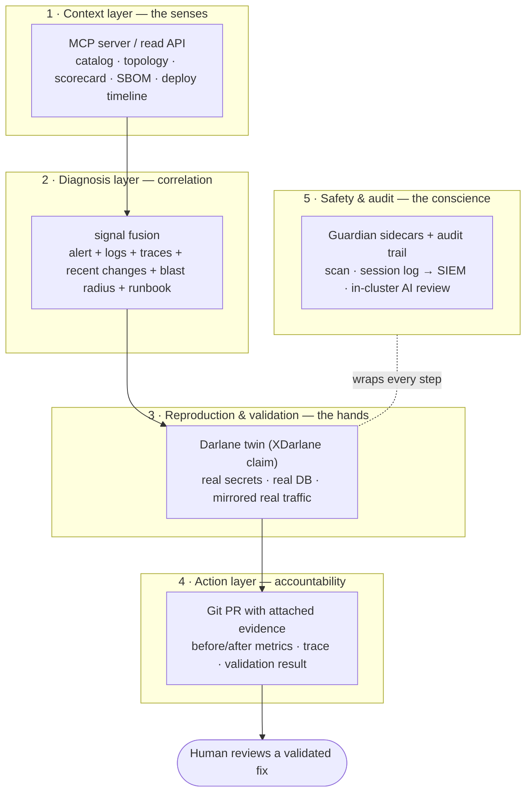
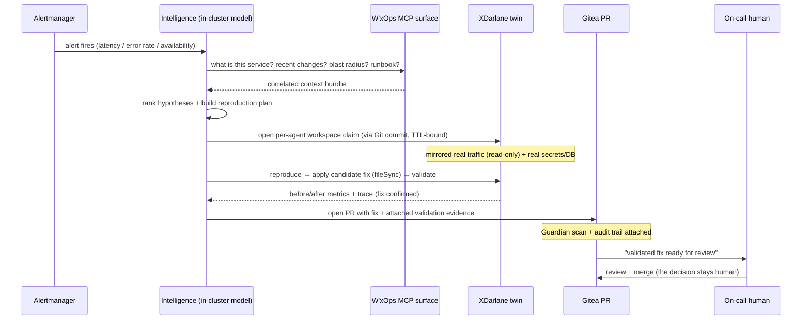

# System Intelligence — A Darlane-Native Approach to Incident Response

> **Status:** Vision + dev-ready framing. Nothing here is implemented yet.
> **Depends on:** `XDarlane` XRD (v0.8.0), Guardian (v0.9.0), Runtime Observability
> (v0.5.0), and the stateless audit trail (v0.6.0) — see
> [enterprise-roadmap.md](enterprise-roadmap.md).
> **Audience:** Platform engineers and anyone deciding how far W'xOps should go
> toward autonomous operations.

This document summarizes where the platform already stands, then lays out the
**intelligence future**: how system intelligence combined with Darlane can compress
the slowest phases of incident response — *understanding, reproduction, and validation* —
for on-call and hotfix work, without ever taking the decision out of human hands.

---

## 0. Summary

W'xOps was built on one thesis: **legibility over control.** The intelligence future
applies that same thesis to AI operations.

> **W'xOps does not ship a brain. It ships the safest possible body for one.**
> The catalog is the memory. Darlane is the hands. Guardian is the conscience.
> The pull request is the accountability. The model is bring-your-own, and it runs
> in-cluster.

Most "AIOps" tooling lands in one of two disappointing places: it either *correlates
alerts and stops at a dashboard* (useful, but the human still does all the hard work),
or it *takes autonomous action in production* (fast, but it terrifies every security
team that has to sign off on it). W'xOps can occupy the defensible middle:

**Intelligence that diagnoses and validates autonomously — in a safe twin — but never
mutates production. The human owns the decision, through a PR, with the evidence
already attached.**

The thing that makes this possible and *safe* is Darlane. An agent does not guess in
production; it reproduces in a parallel pod that has the real secrets, the real
database, and a read-only copy of real traffic. That is the difference between "AI that
might break prod" and "AI that hands you a fix it already proved works."

---

## 1. Where we are today (the pieces already in place)

The intelligence future is not a from-scratch build. Five load-bearing pieces already
exist or are specced:

| Piece | State | Role in the intelligence story |
|---|---|---|
| **Darlane** (`darlane.*` on `XTenantApp`) | Shipped | The safe execution substrate — a production twin with real context, isolation by default. |
| **SRE Agent workflow** (`wxops-core/docs/darlane.md`) | Designed | The end-to-end loop: alert → hypothesis → inject fix into twin → validate against mirrored traffic → open PR. |
| **Guardian** (`wxops-core/docs/guardian.md`) | Designed | The safety layer — scan / audit / in-cluster AI review sidecars on a Darlane session. |
| **MCP server / agent surface** (brainstorm) | Idea | The context+action API an agent uses — catalog, status, logs, safe workspace control. |
| **Stateless audit trail** ([enterprise-roadmap.md](enterprise-roadmap.md) Track A) | Specced | Every agent action attributable, structured JSON → SIEM, correlated with Git history. |

W'xOps also already holds the **correlation keys** that make diagnosis tractable —
something a generic observability stack does not have in one place:

```
service ─▶ namespace ─▶ team ─▶ env ─▶ dependencies ─▶ recent PRs ─▶ runbook Doc ─▶ scorecard
```

That chain is the catalog. It is exactly what an on-call engineer reconstructs by hand
at 3am, and exactly what an agent needs to reason well.

---

## 2. The thesis — intelligence that diagnoses, never decides

The single most important design commitment:

> **The intelligence's output is a validated pull request, not a production change.**

This is *legibility over control* restated for AI. It buys three things at once:

- **Security review passes by construction.** The agent cannot mutate a cluster — it
  writes to Git like every other actor. Its "power" is the ability to *reproduce and
  validate*, not to *deploy*. That is a fundamentally smaller blast radius to defend.
- **The human stays accountable.** Someone merges the PR. "The decision is yours"
  survives the arrival of AI. The agent makes the decision *cheaper and better-informed*,
  not *absent*.
- **Trust is earned incrementally.** Because every result is a reviewable artifact with
  attached evidence, you can measure the agent's precision before granting it any
  autonomy — and the autonomy you eventually grant is "open a PR unprompted," never
  "change prod unprompted."

---

## 3. The five layers of the system



**1 — Context layer (senses).** A structured surface — an MCP server is the natural
form — that exposes the catalog graph, service status (ArgoCD/Crossplane via v0.5.0),
recent deploy timeline, active alerts, scorecards, and SBOM. This is what turns
*"context is hard"* into a tractable query. The agent's first move on any alert is
"what changed, who's affected, what's the runbook" — three MCP calls, not three humans.

**2 — Diagnosis layer (correlation).** The intelligence fuses scattered signals into a
**ranked hypothesis with a reproduction plan**. W'xOps is uniquely able to feed this
because it holds the correlation keys (§1): it can say *"error rate spiked on
payment-api-prod 8 minutes after PR #412 merged; three teams consume its API; a
runbook exists; the change touched the DB pool config"* — in one structured bundle.

**3 — Reproduction & validation (hands).** The agent opens its **own `XDarlane` claim**
(TTL-bound, per-agent), reproduces the issue with mirrored real traffic (read-only,
zero production risk), applies a candidate fix via `fileSync`, and measures the result
against the *same Prometheus stack* production uses. This is the phase that makes the
whole thing trustworthy — the fix is proven against real request shapes before anyone
sees it.

**4 — Action layer (accountability).** The validated fix becomes a **PR with evidence
attached**: before/after error rate and latency, the reproducing trace, the
mirrored-traffic validation summary. A human reviews a *validated fix, not a
hypothesis*. Never a direct cluster write.

**5 — Safety & audit (conscience).** Guardian scans the agent's changes (SAST/CVE),
logs every command/file/network event in the session to the SIEM, and — with an
**in-cluster model only** — provides a second-set-of-eyes review. The audit trail
correlates the whole thing: *who/what opened the workspace → what ran in it → which PR
resulted*. That end-to-end chain is the artifact you put in front of a compliance team.

---

## 4. The incident loop, end to end



The compression is deliberate: the phases that traditionally eat **45–90 minutes** of
an incident — reconstructing context, reproducing the bug, and validating a fix — are
exactly the phases this loop automates. Detection stays with your monitoring; the
*deploy decision* stays with your human. Everything expensive in between gets faster.

---

## 5. Why W'xOps is uniquely positioned

Two assets almost nobody else has together:

1. **It already holds the correlation keys.** The catalog *is* the map from a symptom
   (a failing service) to everything you need to reason about it (owner, dependencies,
   recent changes, runbook, blast radius). A generic LLM plus a Grafana API would spend
   its first ten minutes rebuilding what the catalog hands over in one call.

2. **It has a safe place to be wrong.** This is the real moat. Intelligence is only as
   deployable as its failure mode. An agent reasoning over dashboards can only *suggest*;
   an agent with cluster write access is a liability. An agent with a **Darlane twin**
   can *act and be wrong safely* — a bad hypothesis wastes a mirrored request, not a real
   user's checkout. That safety is what lets the intelligence be genuinely useful instead
   of genuinely dangerous.

Put simply: **the catalog makes the agent smart; Darlane makes the agent safe.** You
need both, and W'xOps is the only layer that has both.

---

## 6. Maturity phases — earn autonomy, don't assume it

Intelligence ships as a progression, not a switch. Each phase is independently
valuable and gates the next on measured precision.

| Phase | Name | What the intelligence does | Human role | Autonomy |
|---|---|---|---|---|
| **0** | **Assist** | Answers "what changed / who's affected / what's the runbook" via the MCP surface. Pure context retrieval. | Drives everything | None |
| **1** | **Diagnose** | Correlates signals into a ranked hypothesis + a proposed reproduction plan. | Approves the plan | Suggests |
| **2** | **Validate** | Opens a Darlane twin, reproduces, tests a candidate fix against mirrored traffic, attaches evidence to a PR. | Reviews + merges the PR | Acts in the twin only |
| **3** | **Guarded autonomy** | For a *narrow, well-understood* incident class (pool exhaustion, a bad config value, a known-pattern regression), runs the full loop and opens a PR unprompted. Guardian audits. | Reviews + merges the PR | Opens PRs unprompted; still never deploys |

**The autonomy ceiling is Phase 3, permanently.** "Open a validated PR without being
asked" is as far as it goes. "Change production without a human merge" is explicitly
not on this roadmap — that line is where the security story, and the *"the decision is
yours"* philosophy, both live.

---

## 7. On-call & hotfix playbooks

### On-call triage (Phase 0–1, highest near-term value)

The most common on-call reality is not "I need a fix written" — it's *"I was paged, I
have no context, and the clock is running."* Phase 0–1 attacks exactly that:

```
Page fires → intelligence posts a triage bundle to the incident channel:
  • service, owner team, current lifecycle + env
  • what deployed in the last 2h (deploy timeline)
  • blast radius: N services across M teams consume this
  • firing alerts + the linked runbook
  • ranked hypotheses ("most likely: PR #412 changed pool config 8m before onset")
```

No twin, no fix — just the context an engineer would spend 15 minutes assembling,
delivered in seconds. This alone is a large MTTR win and carries almost no risk, which
is why it should ship first.

### Hotfix under pressure (Phase 2–3 + Guardian)

The scenario the Darlane docs already name: CI is bypassed, an engineer (or agent) is
patching directly in a steal-mode session because the incident can't wait for the
normal pipeline. This is the **most dangerous moment in the whole system** — and the
one where intelligence + Guardian earn their keep:

- The fix is developed and **validated in the Darlane twin against mirrored real
  traffic** before any user sees it.
- **Guardian AI is the second set of eyes** precisely when normal PR review is
  unavailable — flagging a SQL-injection pattern or a hardcoded secret introduced in
  the rush.
- Every action is **audited to the SIEM**, making `productionOverride: true` steal-mode
  defensible after the fact.
- The result is still a **PR with evidence** — the incident produces an auditable trail,
  not a mystery change someone made at 4am.

### Deep analysis (post-incident)

Because the twin can replay mirrored traffic and the catalog holds the dependency
graph, the same machinery supports *deep* analysis beyond the immediate fix: reproduce
the failure with full tracing (`OTEL_TRACES_SAMPLER=always_on` in the twin), walk the
blast radius, and attach findings to a runbook or ADR Doc entity — turning an incident
into durable, catalog-legible institutional memory.

---

## 8. Hard problems & guardrails (the honest section)

| Risk | Guardrail |
|---|---|
| **Hallucinated / plausible-but-wrong fixes** | Validation against real mirrored traffic is **mandatory before a PR exists**. No evidence, no PR. The human reviews proof, not prose. |
| **Not everything reproduces** (heisenbugs, infra faults, multi-service failures) | The intelligence must **declare when it cannot reproduce** and fall back to Phase 0 triage. Same honesty as the darlane doc's "when to reach outside Darlane." It is a diagnostician, not a magician. |
| **Data exfiltration via the model** | The model runs **in-cluster only** (Guardian's hard rule — the twin holds prod secrets). Guardian audit flags any external call. This is non-negotiable and must be stated as an invariant. |
| **Latency of GitOps for a hotfix twin** | The `XDarlane`-claim-via-Git latency tension from [enterprise-roadmap.md §6.3](enterprise-roadmap.md) applies here; use the fast-sync ApplicationSet path, never a portal→cluster shortcut. |
| **Over-trust / automation complacency** | Autonomy is capped at "open a PR." Precision is measured per phase before advancing. A wrong PR is cheap; a wrong deploy is not — and the system structurally cannot do the latter. |
| **Noisy or gamed signals** | Diagnosis is advisory and ranked, never a single confident answer. The human sees the reasoning and the alternatives. |

---

## 9. What this needs (dependencies)

Intelligence is the capstone, not the foundation. It composes existing/planned work:

| Dependency | From | Why intelligence needs it |
|---|---|---|
| **Runtime Observability** | v0.5.0 | The signal inputs — ArgoCD/Crossplane status, Alertmanager alerts, LGTM deep links. |
| **`XDarlane` XRD** | v0.8.0 | Per-agent, TTL-bound, multi-session workspace claims — the safe execution substrate. |
| **Guardian** | v0.9.0 | Scan + audit + in-cluster AI review wrapping every agent session. |
| **Audit trail (Track A)** | v0.6.0 | Attributable, SIEM-bound record of every agent action, correlated with Git. |
| **MCP surface** | new | The context+action API the model consumes; inherits Pinniped RBAC + audit. |
| **Scorecards + blast radius (Track C)** | v0.6.0 | Blast-radius and readiness signals that sharpen diagnosis. |

**Architectural stance to hold throughout:** W'xOps ships the *substrate* — the MCP
surface, the validation harness, the twin, the audit — and stays **model-agnostic and
stateless**. The model is deployed by the platform team, in-cluster, and is
replaceable. W'xOps never becomes "the AI vendor"; it becomes the safest place to point
whatever model you trust.

---

## 10. What we will not do

| Tempting | Why we refuse |
|---|---|
| Let the agent write to a cluster directly to "save time in an incident" | It destroys the one property that makes the entire system deployable in a regulated environment. The twin + PR path is the product. |
| Call an external LLM API from a session holding prod secrets | Data exfiltration path. In-cluster only, always — Guardian enforces and audits it. |
| Ship a bundled model and become the intelligence vendor | Keeps W'xOps stateless, model-agnostic, and out of the lock-in business. BYO in-cluster model. |
| Auto-merge validated PRs "because the evidence is good" | The human merge is the accountability. Removing it removes the thesis. Autonomy stops at "open the PR." |
| Present a single confident diagnosis | Over-trust is the failure mode of AIOps. Always ranked, always with reasoning and alternatives visible. |

---

## Reference

- `wxops-core/docs/darlane.md` — Darlane model + the SRE-Agent workflow this builds on
- `wxops-core/docs/guardian.md` — Guardian scan/audit/AI-review architecture
- [enterprise-roadmap.md](enterprise-roadmap.md) — `XDarlane` XRD, Guardian phasing, audit trail
- [../concepts/architecture.md](../concepts/architecture.md) — read-only + GitOps invariants this vision preserves
- [../concepts/platform-engineering-rationale.md](../concepts/platform-engineering-rationale.md) — the "legibility over control" thesis, extended here to AI
